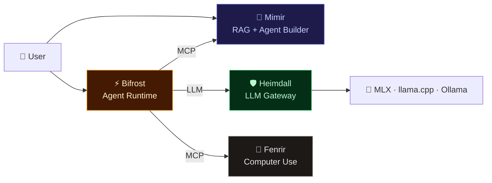

# 🏰 Asgard AI Platform

> *The realm of the gods — a self-hosted AI agent platform built on Apple Silicon*

**Asgard** is an open ecosystem of AI services designed to run entirely on local hardware (Mac Mini M4 Pro, 64GB). From LLM inference to autonomous agent execution and computer control — everything runs on-premises with zero cloud dependency.

Originally built to power AI NPCs for **Ragnarok Online**, Asgard has evolved into a general-purpose AI platform for healthcare, knowledge management, and autonomous workflows.

---

## 🏗️ Architecture

> 📐 **[Full Architecture Documentation →](docs/architecture.md)** — Detailed system diagrams, data flow, component specs

---

## 📦 Components

| Component | Description | Tech Stack | Repo |
|:--|:--|:--|:--|
| 🧠 **[Mimir](https://github.com/megacare-dev/Mimir)** | RAG Pipeline, Agent Builder, Dashboard | Rust (Axum), Next.js, SQLite | Private |
| 🛡️ **[Heimdall](https://github.com/megacare-dev/Heimdall)** | LLM Gateway — multi-backend proxy with auth & metrics | Rust (Axum) | Private |
| ⚡ **[Bifrost](https://github.com/megacare-dev/Bifrost)** | Agent Runtime Engine — ReAct loop, tool execution, sessions | Python (FastAPI) | Private |
| 🐺 **[Fenrir](https://github.com/megacare-dev/Fenrir)** | Computer-Use Agent — browser, shell, screen control | Rust (ZeroClaw-based) | Private |
| 🏰 **Asgard** *(this repo)* | Ecosystem docs, architecture, roadmap | — | **Public** |

---

## 🎯 Mission

Build a **self-hosted AI platform** that enables:

1. 📚 **Knowledge Management** — Ingest, chunk, embed, and search documents with RAG
2. 🤖 **Autonomous Agents** — Create and deploy agents that reason, use tools, and take actions
3. 🌐 **Computer Control** — Agents that browse the web, fill forms, extract data
4. 🎮 **AI NPCs** — Intelligent characters for Ragnarok Online with memory and personality
5. 🏥 **Healthcare AI** — Medical knowledge assistants with domain-specific models

---

## 🔧 Hardware

| Component | Spec |
|:--|:--|
| **Machine** | Mac Mini M4 Pro (or any Apple Silicon) |
| **Memory** | 64GB Unified Memory |
| **Storage** | 1TB+ SSD |
| **OS** | macOS 15+ (Sequoia) |

> All LLM inference runs locally via MLX, llama.cpp, or Ollama — zero cloud dependency.

---

## 🗺️ Roadmap

### Phase 1: Foundation ✅
- [x] Heimdall — LLM Gateway with multi-backend support
- [x] Mimir — RAG Pipeline with document ingestion
- [x] Mimir — Agent Builder (CRUD, templates, chat)
- [x] Dashboard — Next.js admin UI
- [x] Multi-model benchmarking (Qwen, Gemma, MedGemma)

### Phase 2: Agent Runtime 🚧
- [ ] Bifrost — Agent Executor (ReAct loop)
- [ ] MCP tool integration
- [ ] Session management + memory bank

### Phase 3: Computer Use
- [ ] Fenrir — ZeroClaw fork + Heimdall integration
- [ ] Browser automation · Form filling · Data extraction

### Phase 4: AI NPCs for Ragnarok Online 🎮
- [ ] NPC personality system + dynamic dialogue
- [ ] Quest generation + game event integration

---

## 🏛️ Norse Naming

| Name | Origin | Role |
|:--|:--|:--|
| **Asgard** | Realm of the gods | The platform |
| **Mimir** | God of wisdom | Knowledge & RAG |
| **Heimdall** | Guardian of Bifrost | LLM Gateway |
| **Bifrost** | Rainbow bridge | Agent Runtime |
| **Fenrir** | The great wolf | Computer use |

---

  <strong>🏰 Asgard AI Platform</strong>
   
  <em>Self-hosted AI. Norse-inspired. Built on Apple Silicon.</em>
    
  <a href="https://github.com/megacare-dev/Mimir">Mimir</a> ·
  <a href="https://github.com/megacare-dev/Heimdall">Heimdall</a> ·
  <a href="https://github.com/megacare-dev/Bifrost">Bifrost</a> ·
  <a href="https://github.com/megacare-dev/Fenrir">Fenrir</a>

