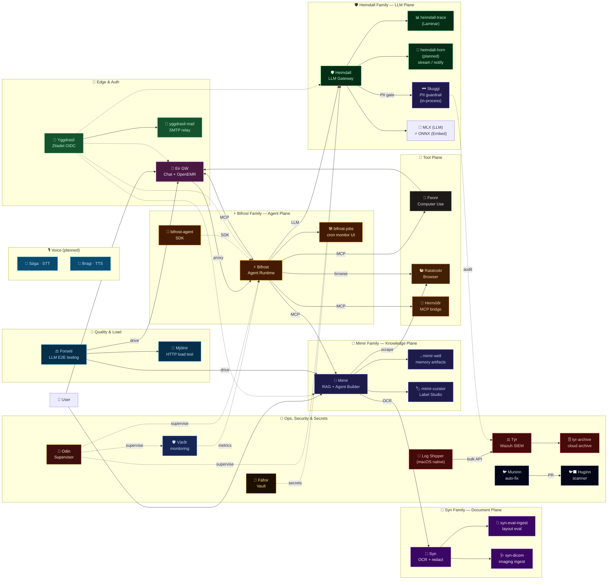

# 🏰 Asgard AI Platform

[](LICENSE)
[](COMMERCIAL.md)
[](CODE_OF_CONDUCT.md)
[](SECURITY.md)

> **Asgard เป็นของทุกคนแล้ว — Asgard belongs to everyone.**

> *The realm of the gods — a self-hosted AI agent platform built on Apple Silicon & NVIDIA GPU*

**Asgard** is an open ecosystem of AI services designed to run entirely on local hardware. From LLM inference to autonomous agent execution and computer control — everything runs on-premises with zero cloud dependency.

Originally built to power AI NPCs for **Ragnarok Online**, Asgard has evolved into a general-purpose AI platform for healthcare, knowledge management, and autonomous workflows.

**📚 [Full Documentation →](docs/README.md)** | **🏥 [Architecture Plan →](docs/roadmap/MultiAgent_Architecture_Plan.md)** | **🎨 [Studio Design →](docs/roadmap/MultiAgent_Studio_Design.md)** | **🗓️ [Sprint Plan →](docs/roadmap/MultiAgent_Sprint_Plan.md)** | **🔍 [Gap Analysis →](docs/roadmap/MultiAgent_Gap_Analysis.md)**

---

## 🏗️ Architecture

> Components are grouped into **5 active families** (parent + submodules under `<parent>-<submodule>` naming). Voice components (Sága/Bragi) and `heimdall-horn` are planned.


```mermaid
graph LR
    User["👤 User"]

    subgraph EdgeAuth["🚪 Edge & Auth"]
        EirGW["🏥 Eir GW<br/>Chat + OpenEMR"]
        Yggdrasil["🌳 Yggdrasil<br/>Zitadel OIDC"]
        YggMail["📧 yggdrasil-mail<br/>SMTP relay"]
    end

    subgraph HeimdallFam["🛡️ Heimdall Family — LLM Plane"]
        Heimdall["🛡️ Heimdall<br/>LLM Gateway"]
        HTrace["📊 heimdall-trace<br/>(Laminar)"]
        HHorn["📣 heimdall-horn<br/>(planned)<br/>stream / notify"]
        Skuggi["🕶️ Skuggi<br/>PII guardrail<br/>(in-process)"]
        LLM["🍎 MLX (LLM)<br/>⚡ ONNX (Embed)"]
    end

    subgraph BifrostFam["⚡ Bifrost Family — Agent Plane"]
        Bifrost["⚡ Bifrost<br/>Agent Runtime"]
        BAgent["🤖 bifrost-agent<br/>SDK"]
        BJobs["🛠️ bifrost-jobs<br/>cron monitor UI"]
    end

    subgraph MimirFam["🧠 Mimir Family — Knowledge Plane"]
        Mimir["🧠 Mimir<br/>RAG + Agent Builder"]
        MWell["💧 mimir-well<br/>memory artifacts"]
        MCurator["🏷️ mimir-curator<br/>Label Studio"]
    end

    subgraph SynFam["🩻 Syn Family — Document Plane"]
        Syn["🩻 Syn<br/>OCR + redact"]
        SEval["📐 syn-eval-ingest<br/>layout eval"]
        SDicom["🩺 syn-dicom<br/>imaging ingest"]
    end

    subgraph Tools["🔧 Tool Plane"]
        Fenrir["🐺 Fenrir<br/>Computer Use"]
        Ratatoskr["🐿️ Ratatoskr<br/>Browser"]
        Hermodr["📨 Hermóðr<br/>MCP bridge"]
    end

    subgraph Voice["🎙️ Voice (planned)"]
        Saga["📜 Sága · STT"]
        Bragi["🎵 Bragi · TTS"]
    end

    subgraph Quality["🧪 Quality & Load"]
        Forseti["⚖️ Forseti<br/>LLM E2E testing"]
        Mjolnir["🔨 Mjölnir<br/>HTTP load test"]
    end

    subgraph Ops["📡 Ops, Security & Secrets"]
        Odin["🔱 Odin<br/>Supervisor"]
        Vardr["🛡️ Várðr<br/>monitoring"]
        Tyr["⚖️ Týr<br/>Wazuh SIEM"]
        TArchive["🗄️ tyr-archive<br/>cloud archive"]
        Huginn["🐦‍⬛ Huginn<br/>scanner"]
        Muninn["🐦 Muninn<br/>auto-fix"]
        Fafnir["🐉 Fáfnir<br/>Vault"]
        LogShipper["📡 Log Shipper<br/>(macOS native)"]
    end

    User --> EirGW
    User --> Mimir
    EirGW --> |"proxy"| Bifrost
    Bifrost --> |"LLM"| Heimdall
    Bifrost --> |"MCP"| Mimir
    Bifrost --> |"MCP"| Fenrir
    Bifrost --> |"MCP"| Hermodr
    Bifrost --> |"MCP"| EirGW
    Mimir --> |"scrape"| Ratatoskr
    Bifrost --> |"browse"| Ratatoskr
    Fenrir --> EirGW

    Heimdall --> |"PII gate"| Skuggi
    Heimdall --> HTrace
    Heimdall --> HHorn
    Heimdall --> LLM
    BAgent -.-> |"SDK"| Bifrost
    Mimir --> MWell
    Mimir --> MCurator
    Syn --> SEval
    Syn --> SDicom
    Mimir --> |"OCR"| Syn
    Bifrost --> BJobs

    Yggdrasil -.-> Heimdall
    Yggdrasil -.-> Mimir
    Yggdrasil -.-> Bifrost
    Yggdrasil -.-> EirGW
    Yggdrasil --> YggMail
    Fafnir -.-> |"secrets"| Heimdall

    Vardr -.-> |"metrics"| Bifrost
    LogShipper --> |"bulk API"| Tyr
    Skuggi -.-> |"audit"| Tyr
    Tyr --> TArchive
    Odin -.-> |"supervise"| Vardr
    Odin -.-> |"supervise"| Bifrost
    Odin -.-> |"supervise"| Heimdall
    Muninn --> |"PR"| Huginn
    Forseti --> |"drive"| EirGW
    Forseti --> |"drive"| Mimir
    Forseti --> Mjolnir

    style Heimdall fill:#052e16,stroke:#4ade80,color:#bbf7d0
    style HTrace fill:#052e16,stroke:#4ade80,color:#bbf7d0
    style HHorn fill:#052e16,stroke:#4ade80,color:#bbf7d0
    style Skuggi fill:#1e1b4b,stroke:#a78bfa,color:#ddd6fe
    style Bifrost fill:#451a03,stroke:#f59e0b,color:#fef3c7
    style BAgent fill:#451a03,stroke:#f59e0b,color:#fef3c7
    style BJobs fill:#451a03,stroke:#f59e0b,color:#fef3c7
    style Mimir fill:#1e1b4b,stroke:#818cf8,color:#c7d2fe
    style MWell fill:#1e1b4b,stroke:#818cf8,color:#c7d2fe
    style MCurator fill:#1e1b4b,stroke:#818cf8,color:#c7d2fe
    style Syn fill:#3b0764,stroke:#c084fc,color:#f3e8ff
    style SEval fill:#3b0764,stroke:#c084fc,color:#f3e8ff
    style SDicom fill:#3b0764,stroke:#c084fc,color:#f3e8ff
    style Yggdrasil fill:#14532d,stroke:#86efac,color:#bbf7d0
    style YggMail fill:#14532d,stroke:#86efac,color:#bbf7d0
    style EirGW fill:#4a1942,stroke:#e879f9,color:#fae8ff
    style Fenrir fill:#1c1917,stroke:#a8a29e,color:#e7e5e4
    style Ratatoskr fill:#422006,stroke:#fb923c,color:#fed7aa
    style Hermodr fill:#422006,stroke:#fb923c,color:#fed7aa
    style Saga fill:#0c4a6e,stroke:#38bdf8,color:#bae6fd
    style Bragi fill:#0c4a6e,stroke:#38bdf8,color:#bae6fd
    style Odin fill:#3f0f0f,stroke:#fcd34d,color:#fef3c7
    style Forseti fill:#082f49,stroke:#0ea5e9,color:#bae6fd
    style Mjolnir fill:#082f49,stroke:#0ea5e9,color:#bae6fd
    style Vardr fill:#172554,stroke:#3b82f6,color:#bfdbfe
    style Tyr fill:#450a0a,stroke:#f87171,color:#fecaca
    style TArchive fill:#450a0a,stroke:#f87171,color:#fecaca
    style LogShipper fill:#450a0a,stroke:#f87171,color:#fecaca
    style Huginn fill:#020617,stroke:#94a3b8,color:#e2e8f0
    style Muninn fill:#020617,stroke:#94a3b8,color:#e2e8f0
    style Fafnir fill:#1c0f00,stroke:#fbbf24,color:#fde68a
```

---

## 📦 Components

| Component | Description | Tech Stack | Tests | Status | Access |
|:--|:--|:--|:--|:--|:--|
| 🧠 **[Mimir](https://github.com/MegaWiz-Dev-Team/Mimir)** | RAG Pipeline, Agent Builder, Dashboard | Rust (Axum), Next.js 14, MariaDB, Qdrant | 255+ | ✅ Sprint 38 | 🌐 Public |
| 🛡️ **[Heimdall](https://github.com/MegaWiz-Dev-Team/Heimdall)** | LLM Gateway — multi-backend proxy | Rust (Axum) + MLX + fastembed | Benchmarked | ✅ Sprint 38 | 🌐 Public |
| ⚡ **[Bifrost](https://github.com/MegaWiz-Dev-Team/Bifrost)** | Multi-Agent Orchestrator — ReAct, MCP, Skills, Memory | **Rust (Axum + rig.rs)** | 146 | ✅ Sprint 35 | 🌐 Public |
| 🐺 **[Fenrir](https://github.com/MegaWiz-Dev-Team/Fenrir)** | Computer-Use Agent — Browser Automation + FHIR + Docker Sandbox | Rust + Python sidecar | 47 | ✅ Sprint 1.5 | 🌐 Public |
| 🏥 **[Eir](https://github.com/MegaWiz-Dev-Team/Eir)** | Rust API Gateway + OpenEMR, Chat UI, MCP Server | Rust (Axum) + PHP | 47 | ✅ Sprint 3 | 🌐 Public |
| 🌳 **Yggdrasil** | Auth Service — Zitadel OIDC + JWT + FastAPI Auth | Zitadel (Go) + Python | 31 | ✅ Sprint 2 | 🔒 Private |
| 🛡️ **[Várðr](https://github.com/MegaWiz-Dev-Team/Vardr)** | Monitoring Dashboard — health, logs, native macOS Log Shipper | Rust (Axum) + Python | 5 | ✅ Sprint 38 | 🌐 Public |
| ⚖️ **Týr** | Enterprise SIEM & XDR — Wazuh log parsing, threat hunting | Wazuh + OpenSearch | — | ✅ Sprint 38 | 🔒 Private |
| 🐉 **Fáfnir** | K3s HashiCorp Vault Secrets Manager | Vault / HCL | — | ✅ Sprint 38 | 🔒 Private |
| 🐦‍⬛ **Huginn** | Security Scanner + AI Pentest Agent + Performance Test | Rust (Axum) | 51 | ✅ Active | 🔒 Private |
| 🐦 **Muninn** | Issue Watcher + LLM Auto-Fixer | Rust (Axum) | 60 | ✅ Active | 🔒 Private |
| 🐿️ **[Ratatoskr](https://github.com/MegaWiz-Dev-Team/Ratatoskr)** | Shared Browser Service — headless Chromium REST API | Rust (Axum) | — | ✅ Sprint 1 | 🌐 Public |
| 📨 **[Hermóðr](https://github.com/MegaWiz-Dev-Team/Hermodr)** | Universal MCP Sidecar — JSON-RPC bridge for legacy REST | Rust | — | ✅ v0.1.0 | 🌐 Public |
| ⚖️ **[Forseti](https://github.com/MegaWiz-Dev-Team/Forseti)** | LLM-Powered E2E Testing Service — multi-project, auto-report | Python | 147 | ✅ Sprint 6 | 🌐 Public |
| 🔨 **[Mjölnir](https://github.com/MegaWiz-Dev-Team/Mjolnir)** | HTTP Load Testing Service — MCP-compatible, Forseti linked | Rust (Axum) | — | ✅ Active | 🌐 Public |
| 🩻 **Syn** | Document OCR & PII redaction — handwriting, layout, DICOM | Rust + Python (MLX VLM) | — | ✅ Active | 🔒 Private |
| 🏰 **Asgard** *(this repo)* | K3s Deployment (OrbStack), docs, strategy, 🔱 Odin (Supervisor) | — | — | ✅ Active | 🌐 Public |

> 🔒 **Private** components are commercial / security-sensitive (cyber-security suite, auth, secrets, OCR with PHI) and are not browsable publicly. 🌐 **Public** components are open-core under AGPL-3.0. See [`DATA_LICENSE.md`](https://github.com/MegaWiz-Dev-Team/Mimir/blob/main/DATA_LICENSE.md) in Mimir for medical-terminology data licensing (SNOMED CT / ICD-10-TM / TMT / LOINC / DrugBank — code references only, never redistributed release data).

### Active Submodules

> Norse names are reserved for top-level components. New capabilities extend a parent as `<parent>-<submodule>` with a plain-English label.

| Family | Submodule | Purpose | Status |
|:--|:--|:--|:--|
| 🛡️ **Heimdall** | `heimdall-trace` *(Laminar)* | LLM call tracing & observability | 🚧 Absorbing |
| 🛡️ **Heimdall** | `heimdall-horn` | Streaming/notification fan-out | 📋 Planned |
| 🧠 **Mimir** | `mimir-well` *(Mímisbrunnr)* | Tulving 3-tier memory artifacts + PROV-AGENT | 🚧 Sprint 56 (schemas applied 2026-05-23) |
| 🧠 **Mimir** | `mimir-curator` | Label Studio embed for OCR-GT + oracle-review | 📋 Planned |
| 🌳 **Yggdrasil** | `yggdrasil-mail` | SMTP relay / notification email | 📋 Planned |
| 🩻 **Syn** | `syn-eval-ingest` | Region-detection / layout eval (mAP, Rust) | ✅ Active |
| 🩻 **Syn** | `syn-dicom` | DICOM ingest pipeline | 🚧 Skeleton (PR #18, Syn) |
| ⚡ **Bifrost** | `bifrost-agent` | Agent SDK / client crate | ✅ Active |
| ⚡ **Bifrost** | `bifrost-jobs` | GitHub-Actions-style cron monitor UI | 📋 Planned |
| ⚖️ **Týr** | `tyr-archive` | ISO-27001 cloud archive daemon (Rust) | ✅ v1 shipped 2026-05-20 |

> **600+ tests** across the platform · **MCP** for tool calls · **A2A** for task delegation · **Odin's Ravens** for security

---

## 🎯 Mission

Build a **self-hosted AI platform** that enables:

1. 📚 **Knowledge Management** — Ingest, chunk, embed, and search documents with RAG
2. 🤖 **Autonomous Agents** — Create and deploy agents that reason, use tools, and take actions
3. 🌐 **Computer Control** — Agents that browse the web, fill forms, extract data
4. 🎮 **AI NPCs** — Intelligent characters for Ragnarok Online with memory and personality
5. 🏥 **Healthcare AI** — Medical knowledge assistants with domain-specific models

---

## 🔧 Hardware

#### 🍎 Apple Silicon (MLX / llama.cpp / Ollama)

| Tier | Hardware | Users | Model Size |
|:--|:--|:--|:--|
| Starter | Mac Mini M4 (16GB) | 1-5 | 7B |
| Standard | Mac Mini M4 Pro (36GB) | 10-20 | 14B |
| Pro | Mac Mini M4 Pro (64GB) | 20-50 | 30B+ |
| Max | Mac Studio M4 Ultra (192GB) | 50-200 | 70B+ |

#### 🟢 NVIDIA (vLLM + CUDA)

| Tier | Hardware | Users | Model Size |
|:--|:--|:--|:--|
| DGX Spark | NVIDIA DGX Spark (128GB) | 50-200 | 70B+ |
| DGX Station | NVIDIA DGX Station | 200+ | Multi-model |

> All LLM inference runs locally — zero cloud dependency.

---

## 🔑 Authentication

Auth is **dual-mode**, so the open-core services run **without** the (private)
Yggdrasil auth service. Each service inspects the bearer token: a JWT (starts
with `ey`) is validated via JWKS; anything else is treated as a static API key.

**1. Static API key — default, no identity provider needed**

Leave `YGGDRASIL_ISSUER` / `JWT_AUDIENCE` unset and configure a static key.
Services log `JWT disabled … static API_KEYS only` and run as-is — ideal for
self-hosted, single-user, and dev setups.

```bash
# no issuer/audience set → static-key mode
export API_KEYS="my-secret-key"
curl -H "Authorization: Bearer my-secret-key" http://localhost:8080/...
```

**2. Bring your own OIDC provider — multi-user / SSO**

Point the services at *any* OIDC issuer (Keycloak, Auth0, your own Zitadel —
not just Yggdrasil). They fetch the issuer's JWKS and validate RS256 JWTs.

```bash
export YGGDRASIL_ISSUER="https://id.example.com"   # any OIDC issuer URL
export JWT_AUDIENCE="heimdall"                       # per-service audience
```

The only contract is a RS256 JWT carrying the expected claims (e.g.
`urn:zitadel:iam:org:id` → `tenant_id`).

> 🔒 Yggdrasil is private and provides only the **turnkey multi-tenant SSO
> provisioning** (a commercial convenience on top of [Zitadel](https://github.com/zitadel/zitadel), Apache-2.0).
> It is **not** required to run or self-host the open-core platform.

---

## 🗺️ Roadmap

> **[Full Roadmap with Gantt Chart →](docs/strategy/roadmap.md)**

### Phase 1: Foundation ✅
- [x] Heimdall — LLM Gateway (Sprint 38, Native ONNX + MLX Backend stabilized)
- [x] Mimir — RAG Pipeline + Agent Builder + Dashboard (Sprint 38, Agentic RAG Telemetry)
- [x] Bifrost — Agent Runtime (Sprint 4, ReAct + MCP + PSO, 99 tests)
- [x] Eir — Rust API Gateway + OpenEMR (Sprint 3, 47 tests)
- [x] Fenrir — Computer-Use Agent scaffold + OpenEMR Messaging (Sprint 1.5, 47 tests)
- [x] Yggdrasil — Auth Service (Sprint 2, Zitadel + JWT + FastAPI Auth, 31 tests)
- [x] Várðr — Monitoring Dashboard (v0.4.0, K3s integration + Native macOS Agent)
- [x] Týr — Security Information & Event Management (Wazuh SIEM, ISO 27001 Log Archiving, macOS Log Shipper)
- [x] Unified K3s Cluster Deployment — OrbStack integration for 15+ microservices
- [x] AGPL-3.0 licensing + CLA
- [x] Bifrost Sprint 35 — Skills system, long-term memory, context engineering (146 tests)
- [x] Asgard `skills/` — 5 built-in skills (DeerFlow-compatible SKILL.md format)

### Phase 2: Integration & Growth 🚧
- [x] Developer Preview — core repos public on GitHub under AGPL-3.0 (open-core; security/auth/OCR repos remain private)
- [x] Skuggi W1 — Text Tier 1 PII guardrail shipped in Heimdall (ADR-007, 2026-05-09)
- [x] S1 RefGraph — insurance retrieval baseline (Hit Rate@3 = 93.3%, gate PASS 2026-05-19)
- [x] Sprint 51e secret rotation — 7/8 rotations complete across the platform
- [x] `tyr-archive` v1 — Rust daemon for ISO-27001 cloud archive (2026-05-20)
- [ ] **S52-54 Insurance Launch** — multi-insurer underwriting (asgard_insurance tenant, Skuggi-gated cloud)
- [ ] **S55 Mimir Guideline Lineage** — HL7 FHIR CPG-IG + Neo4j subgraph + MAGICapp ingest
- [ ] **S56 Mimir Well** — Mímisbrunnr memory artifacts + Tulving 3-tier + PROV-AGENT → Tyr
- [ ] **S57-58 Living Evidence** — UI + eval + scale + deep research + feedback
- [ ] `heimdall-trace` absorption (Laminar → submodule)
- [ ] `bifrost-jobs` cron monitor UI
- [ ] `mimir-curator` Label Studio embed
- [ ] `syn-dicom` ingest pipeline

### Phase 3: Living Clinical Evidence 🩺
Reposition from "Open Medical Platform" → **"Living Clinical Evidence, On Your Premises"**. Borrows Cochrane/Elliott 2014 living-systematic-review model; commercial space empty. Tracked in Asgard PR #74 (Sprint 55-58 sequence).

### Phase 4: Community Launch
- [ ] v1.0 Community Edition
- [ ] Product Hunt / HackerNews launch
- [ ] 3-5 Design Partners

### Enterprise Edition 💰
- [ ] SSO (SAML, OIDC, LDAP) via Zitadel
- [ ] Usage Analytics + Cost Dashboard
- [ ] HA Clustering (multi-node)
- [ ] Priority Support + SLA

---

## 🏛️ Norse Naming

| Name | Origin | Role | Edition |
|:--|:--|:--|:--|
| **Asgard** | Realm of the gods | The platform | Community |
| **Mimir** | God of wisdom | Knowledge & RAG | Community |
| **Heimdall** | Guardian of Bifrost | LLM Gateway | Community |
| **Heimdall-trace** *(Laminar)* | Heimdall submodule | LLM tracing / observability | Community ‡ |
| **Skuggi** | "Shadow" (Old Norse) | PII/DLP guardrail — in-process middleware | Community † |
| **Bifrost** | Rainbow bridge | Agent Runtime | Community |
| **Fenrir** | The great wolf | Computer use | Community |
| **Eir** | Goddess of healing | Clinic management (Gateway + OpenEMR) | Community |
| **Yggdrasil** | The world tree | Auth service | 🔒 Private |
| **Várðr** | The guardian | Monitoring dashboard | Community |
| **Týr** | God of justice & war | Enterprise SIEM & XDR (Wazuh) | 🔒 Odin's Ravens |
| **Fáfnir** | Dragon hoarding treasure | K3s HashiCorp Vault — secrets manager | 🔒 Private |
| **Huginn** | Odin's raven (Thought) | Security Scanner + AI Pentest Agent | 🔒 Odin's Ravens |
| **Muninn** | Odin's raven (Memory) | Issue Watcher + Auto-Fixer (LLM) | 🔒 Odin's Ravens |
| **Syn** | Goddess of watchfulness | Document OCR & PII redaction | 🔒 Private |
| **Ratatoskr** | The squirrel on Yggdrasil | Shared Browser Service | Community |
| **Hermóðr** | Messenger of the gods | Universal MCP Sidecar | Community |
| **Forseti** | God of justice & reconciliation | LLM-Powered E2E Testing Service | Community |
| **Mjölnir** | Thor's hammer | HTTP Load Testing Service | Community |
| **Sága** | Seeress & chronicler | Speech-to-Text (STT) | Community ‡ |
| **Bragi** | God of poetry & eloquence | Text-to-Speech (TTS) | Community ‡ |
| **Odin** | The All-Father | Platform Supervisor | Community |

> 🔒 = private repository (commercial / security-sensitive). **Odin's Ravens** = the cyber-security suite (Huginn · Muninn · Týr).
>
> † **Skuggi** is not a standalone repo — it is in-process Rust middleware. **W1 Text Tier 1 (regex + audit, ADR-007) shipped 2026-05-09** inside Heimdall (`gateway/src/skuggi.rs`) and Mimir's benchmarks. **W2 (image-tier model gating cloud OCR), W3 (NER), W4** still pending. Product-specific applications are private (Underwriter/Iris patient-name masking, Týr archive redaction).
>
> ‡ **Planned** — not yet built; no repository exists yet. Intended to be open-core (public) when created. Laminar is being absorbed as the `heimdall-trace` submodule rather than a new top-level service.
>
> **Iris** (Greek: messenger goddess) is the **Underwriter product's** multi-agent orchestrator and lives in the private `asgard-underwriter` repo — a commercial product component, not part of the open-core platform, hence not listed above.

> **[Huginn & Muninn Roadmap →](docs/roadmap/huginn-muninn.md)**

---

## 📄 License

- **Community**: [AGPL-3.0](LICENSE)
- **Enterprise**: [Commercial License](COMMERCIAL.md)
- **Contributing**: [CLA](CLA.md)

---

<p align="center">
  <strong>🏰 Asgard เป็นของทุกคนแล้ว — Asgard belongs to everyone.</strong>
  <br/>
  <em>Self-hosted AI. Norse-inspired. Built on Apple Silicon & NVIDIA GPU.</em>
  <br/><br/>
  <a href="https://github.com/MegaWiz-Dev-Team/Mimir">Mimir</a> ·
  <a href="https://github.com/MegaWiz-Dev-Team/Heimdall">Heimdall</a> ·
  <a href="https://github.com/MegaWiz-Dev-Team/Bifrost">Bifrost</a> ·
  <a href="https://github.com/MegaWiz-Dev-Team/Fenrir">Fenrir</a> ·
  <a href="https://github.com/MegaWiz-Dev-Team/Eir">Eir</a> ·
  <a href="https://github.com/MegaWiz-Dev-Team/Vardr">Várðr</a> ·
  <a href="https://github.com/MegaWiz-Dev-Team/Ratatoskr">Ratatoskr</a> ·
  <a href="https://github.com/MegaWiz-Dev-Team/Hermodr">Hermóðr</a> ·
  <a href="https://github.com/MegaWiz-Dev-Team/Forseti">Forseti</a> ·
  <a href="https://github.com/MegaWiz-Dev-Team/Mjolnir">Mjölnir</a>
</p>
