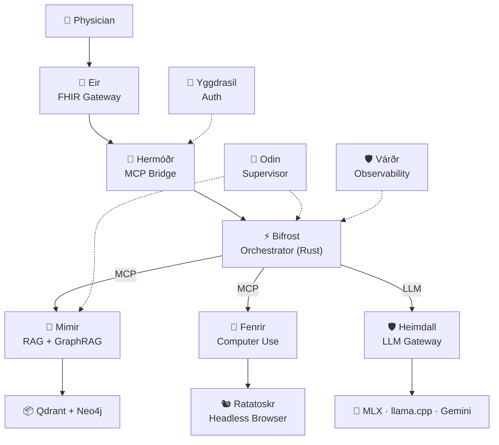

# 📚 Asgard AI Platform — Documentation

> Consolidated documentation for developers, partners, and investors.

---

## 📋 Table of Contents

### Strategy & Planning

| Document | Description |
|:--|:--|
| 🎯 [Product Direction](strategy/product-direction.md) | Vision, design principles, anti-goals, strategic priorities |
| 📊 [Platform Review](strategy/platform-review.md) | Platform overview, strengths, gap analysis, licensing |
| 🗺️ [Roadmap](strategy/roadmap.md) | Development roadmap with Gantt chart and milestones |
| 🎯 [Competitor & Target Market Analysis](strategy/competitor-analysis.md) | 8 competitors analyzed, market gaps, positioning |
| 🗺️ [Gap → Project Mapping](strategy/gap-mapping.md) | Maps every gap to a specific project for implementation |
| 🚀 [MVP v1.0 Scope](strategy/mvp-v1.0.md) | MoSCoW prioritization, done criteria, launch checklist |

### Business

| Document | Description |
|:--|:--|
| 💰 [Pricing Strategy](business/pricing-strategy.md) | Community vs Enterprise tiers, competitive benchmark |
| 📈 [Business Plan](business/business-plan.md) | Market sizing, financial projections, team, funding |
| 🚀 [Go-to-Market](business/go-to-market.md) | Launch phases, adoption funnel, community & enterprise sales |

### Architecture & Technical

| Document | Description |
|:--|:--|
| 🏗️ [Architecture Overview](architecture.md) | System architecture, data flow, component specs |
| 🌳 [Yggdrasil Auth Selection](technical/yggdrasil-auth-selection.md) | Auth platform comparison — Yggdrasil selected |
| 🔧 [ADK-Rust Evaluation](technical/adk-rust-evaluation.md) | ADK-Rust analysis, workflow builder decision, A2A protocol |

### Legal & Community

| Document | Description |
|:--|:--|
| 📜 [LICENSE](../LICENSE) | AGPL-3.0 — Community Edition |
| 🏢 [COMMERCIAL.md](../COMMERCIAL.md) | Enterprise licensing information |
| 📝 [CLA.md](../CLA.md) | Contributor License Agreement |
| 👥 [CONTRIBUTORS.md](../CONTRIBUTORS.md) | Contributor list |
| 🤝 [CONTRIBUTING.md](../CONTRIBUTING.md) | How to contribute |
| 📜 [CODE_OF_CONDUCT.md](../CODE_OF_CONDUCT.md) | Community standards |

### Roadmap & Multi-Agent Architecture

| Document | Description |
|:--|:--|
| 🏥 [Multi-Agent Architecture Plan](roadmap/MultiAgent_Architecture_Plan.md) | Medical AI Agent ecosystem blueprint — 15 sections |
| 🎨 [Multi-Agent Studio Design](roadmap/MultiAgent_Studio_Design.md) | Visual canvas design for agent team orchestration |
| 🗓️ [Multi-Agent Sprint Plan](roadmap/MultiAgent_Sprint_Plan.md) | 5 phases × 15 sprints starting April 2026 |
| 🔍 [Multi-Agent Gap Analysis](roadmap/MultiAgent_Gap_Analysis.md) | Ecosystem readiness metrics and critical path |

---

## 🏰 Platform Overview — Multi-Agent Ecosystem

| Component | Role | Tech | Status |
|:--|:--|:--|:--|
| ⚡ **Bifrost** | Multi-Agent Orchestrator | **Rust (Axum + rig.rs)** | 🚧 Migrating to Rust |
| 📨 **Hermóðr** | Universal MCP Sidecar | Rust | ✅ v0.1.0 |
| 🏥 **Eir** | FHIR Gateway + Context Router | Rust (Axum) | ✅ v0.4.0 |
| 🧠 **Mimir** | Knowledge Engine (Curator + Researcher) | Rust (Axum) + Next.js | ✅ Sprint 29 |
| 🐺 **Fenrir** | Computer Use Agent | Rust + Python sidecar | ✅ v0.3.0 |
| 🐿️ **Ratatoskr** | Shared Headless Browser | Rust (Axum) | ✅ Active |
| 🛡️ **Heimdall** | LLM Gateway + Step-up Router | Rust (Axum) | ✅ Production |
| 🌳 **Yggdrasil** | Identity & Auth (SSO/JWT) | Go (Zitadel) | ✅ v0.5.0 |
| 🔱 **Odin** | Platform Supervisor | Rust (Axum) | 📋 Planned |
| 🛡️ **Várðr** | Monitoring & Tracing | Rust | 📋 Planned |

---

## 💼 For Investors

Recommended reading order:

1. **[Platform Review](strategy/platform-review.md)** — Understand the platform, roadmap, and licensing
2. **[Competitor Analysis](strategy/competitor-analysis.md)** — Market landscape and differentiation
3. **[COMMERCIAL.md](../COMMERCIAL.md)** — Business model and Enterprise features

---

## 📞 Contact

- 📧 Email: paripol@megawiz.co
- 🏢 Organization: [MegaWiz](https://github.com/MegaWiz-Dev-Team)

---

© 2026 MegaWiz — Licensed under AGPL-3.0
