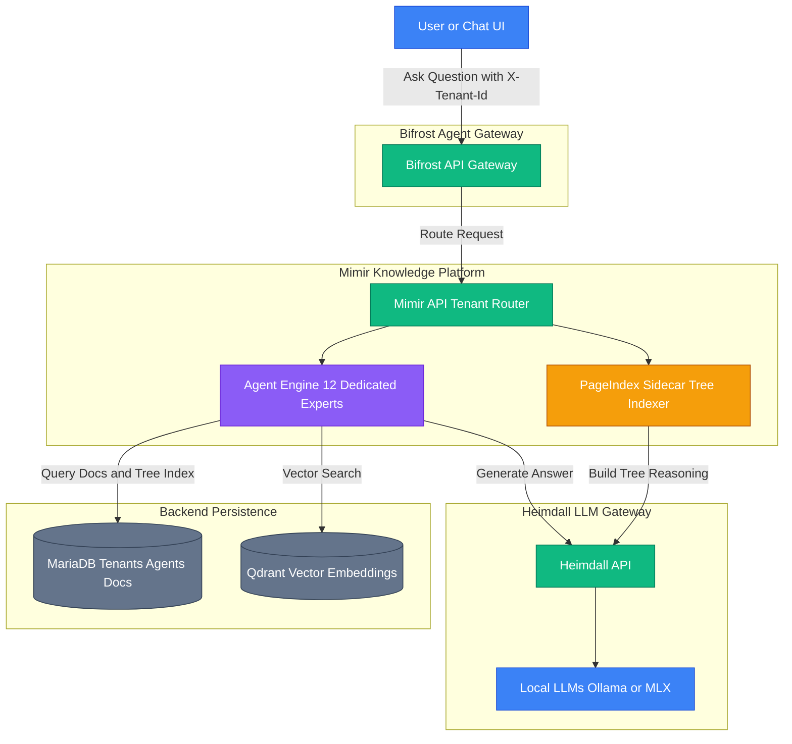
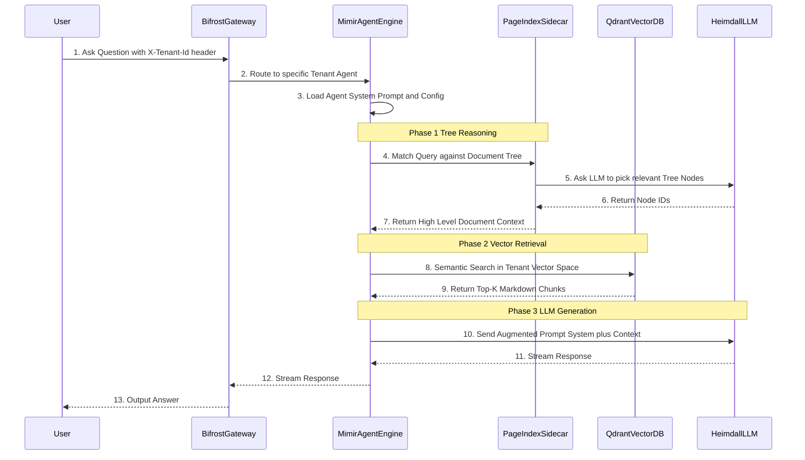

# 🤖 Asgard Agent & Multi-Tenant Architecture

This document describes the multi-tenant agent architecture implemented across the 12 core services of the **Asgard AI Platform**.

## Platform Tenancy Model

To ensure proper data isolation, knowledge management, and access control, the Asgard platform divides its entire ecosystem into **12 isolated Tenants** within the Mimir API. 

Each tenant maps 1:1 with an Asgard service. 

| Tenant ID | Service Name | Role / Description |
| :--- | :--- | :--- |
| `mimir` | Mimir | Knowledge Platform & RAG Engine |
| `bifrost` | Bifrost | AI Agent Runtime Gateway |
| `heimdall` | Heimdall | LLM Proxy Gateway |
| `ratatoskr` | Ratatoskr | Shared Headless Browser Service |
| `fenrir` | Fenrir | Computer Use & Browser Automation |
| `forseti` | Forseti | E2E Testing & Compliance Dashboard |
| `huginn` | Huginn | Security Pentest Scanner |
| `muninn` | Muninn | Auto-Fixer & Code Issue Watcher |
| `eir` | Eir | FHIR Healthcare API Gateway |
| `vardr` | Vardr | Monitoring, Metrics & Logs |
| `yggdrasil`| Yggdrasil | Identity & Authentication (Zitadel) |
| `asgard` | Asgard | Platform Orchestrator |

---

## 📚 Knowledge Indexing (PageIndex)

Every service manages its own knowledge base (ISO 29110 documents and READMEs). Mimir uses a reasoning-based RAG enhancement called **PageIndex**.

When a document is ingested:
1. Mimir API receives the markdown content.
2. Mimir calls the `pageindex-sidecar` (`POST /build-tree`).
3. The sidecar uses an LLM (via Heimdall) to generate a hierarchical tree index of the document's headers and structure.
4. Mimir stores the document + tree index in the `tenant_documents` table under the specific `tenant_id`.

When an agent queries the knowledge base:
1. The question is evaluated against the `tree_index` by an LLM to quickly locate relevant sections before standard chunk-based vector retrieval.

---

## 🤖 The 12 "Expert" Agents

Within each tenant, there is a dedicated **Expert Agent**. These agents are configured to securely access their respective tenant's indexed knowledge base using RAG.

### Agent Configuration (`[service]_expert`)
- **System Prompt:** *"You are an expert assistant for the [Service] service within the Asgard AI Platform. Answer questions using the documentation in your knowledge base."*
- **Model:** Auto-routed via Heimdall (`ollama` provider)
- **Features:** RAG enabled (`use_rag: true`), Temperature `0.3`, Max Tokens `2048`.

---

## 🏛️ Architecture Flow

## Summary of Execution

1. **Isolation:** A user chatting with `mimir_expert` (using `X-Tenant-Id: mimir`) will **only** retrieve RAG context from Mimir's ISO documentation and README.
2. **Specialization:** Each agent acts as the dedicated SME (Subject Matter Expert) for its domain, lowering hallucination rates by bounding the context window to its specific tenant documentation.
3. **Platform Scale:** Bifrost and Eir clients can dynamically route chat requests to any of the 12 expert agents by simply shifting the `X-Tenant-Id` header.

## 🔍 Zoomed-In: Agent RAG and PageIndex Flow

This sequence diagram illustrates exactly how a single Agent processes a user query, interacting with the Mimir RAG pipeline, PageIndex, and Heimdall.

