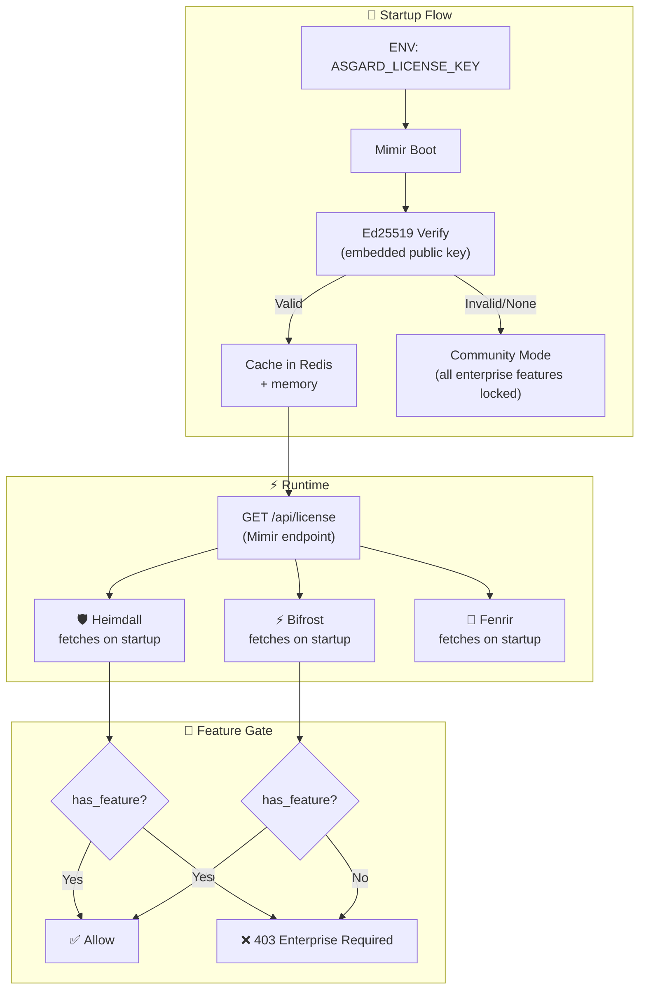

# 🔑 Asgard License Key System — Technical Specification

> Last updated: March 2026

---

## Overview

ระบบ License Key สำหรับแยก Community vs Enterprise features ใน Asgard Platform

| Decision | Choice |
|----------|--------|
| **Architecture** | Centralized ที่ Mimir (License Authority) |
| **Validation** | Offline-only (Ed25519 signature, ไม่ต้อง internet) |
| **Key Format** | JWT-like signed payload |
| **Enforcement** | Feature gate middleware + Docker profiles |

---

## Architecture



**Flow:**
1. Mimir อ่าน `ASGARD_LICENSE_KEY` จาก env var ตอน boot
2. Verify ด้วย Ed25519 public key ที่ embed มาใน binary (offline, ไม่ต้อง internet)
3. Cache license info ใน Redis + memory
4. Services อื่นดึง license info จาก `GET /api/license` ตอน startup แล้ว cache ไว้
5. ทุก request ที่เข้า enterprise endpoint → check feature gate

---

## License Key Format

### Structure
```
ASGARD-<base64url_payload>.<base64url_ed25519_signature>
```

### Payload (JSON before encoding)
```json
{
  "v": 1,
  "iss": "megawiz",
  "sub": "org-uuid-here",
  "org": "Sojitz Thailand",
  "tier": "professional",
  "features": [
    "sso",
    "rbac",
    "analytics",
    "audit",
    "ha",
    "whitelabel",
    "advanced_agents",
    "huginn",
    "muninn"
  ],
  "max_nodes": 5,
  "iat": 1711900800,
  "exp": 1743523200
}
```

### Field Reference

| Field | Type | Description |
|-------|------|-------------|
| `v` | int | Key format version (always `1`) |
| `iss` | string | Issuer (always `"megawiz"`) |
| `sub` | string | Customer organization ID |
| `org` | string | Organization display name |
| `tier` | string | `"starter"` / `"professional"` / `"custom"` |
| `features` | string[] | Explicit list of unlocked feature codes |
| `max_nodes` | int | Maximum nodes allowed in HA cluster |
| `iat` | int | Issued-at timestamp (Unix) |
| `exp` | int | Expiration timestamp (Unix) |

### Tier → Features Mapping

| Tier | Features Included |
|------|-------------------|
| `community` | *(no key needed)* — Mimir, Heimdall, Bifrost, Fenrir, Eir, Yggdrasil, Várðr, Ratatoskr |
| `starter` | `sso`, `rbac`, `analytics`, `priority_support` |
| `professional` | All starter + `audit`, `ha`, `whitelabel`, `advanced_agents` |
| `custom` | All professional + `huginn`, `muninn` + custom features |

---

## Cryptography

### Key Pair
- **Algorithm:** Ed25519 (Curve25519)
- **Private key:** Megawiz เก็บ (ใช้ sign license keys)
- **Public key:** Embed ใน Asgard binary ทุกตัว (ใช้ verify)

### Why Ed25519?
1. **Fast** — verify ใน microseconds
2. **Small** — key 32 bytes, signature 64 bytes
3. **Offline** — ไม่ต้อง call server, verify ได้เลย
4. **Secure** — ลูกค้าไม่สามารถ forge key ได้ถ้าไม่มี private key

### Key Generation (one-time by Megawiz)
```bash
# Generate Ed25519 keypair
openssl genpkey -algorithm Ed25519 -out megawiz.ed25519.key
openssl pkey -in megawiz.ed25519.key -pubout -out megawiz.ed25519.pub

# Store safely:
#   megawiz.ed25519.key → Vault / secure storage (NEVER share)
#   megawiz.ed25519.pub → embed in Asgard source code
```

---

## Implementation Guide

### 1. Shared Rust Crate: `packages/asgard-license/`

```
packages/asgard-license/
├── Cargo.toml
├── src/
│   ├── lib.rs           # Public API
│   ├── key.rs           # Key parsing & Ed25519 verification
│   ├── tier.rs          # Tier & feature definitions
│   └── error.rs         # Error types
└── tests/
    ├── valid_key.rs
    ├── expired_key.rs
    └── invalid_sig.rs
```

**Cargo.toml:**
```toml
[package]
name = "asgard-license"
version = "0.1.0"
edition = "2021"

[dependencies]
ed25519-dalek = "2"
base64 = "0.22"
serde = { version = "1", features = ["derive"] }
serde_json = "1"
thiserror = "2"
chrono = { version = "0.4", features = ["serde"] }
```

**Public API (lib.rs):**
```rust
pub struct LicenseInfo {
    pub org: String,
    pub tier: Tier,
    pub features: Vec<String>,
    pub max_nodes: u32,
    pub expires_at: DateTime<Utc>,
}

pub enum Tier {
    Community,  // no key
    Starter,
    Professional,
    Custom,
}

impl LicenseInfo {
    /// Parse and verify a license key string
    /// Returns Community if key is empty/None
    pub fn from_env() -> Result<Self, LicenseError> {
        match std::env::var("ASGARD_LICENSE_KEY") {
            Ok(key) if !key.is_empty() => Self::verify(&key),
            _ => Ok(Self::community()),
        }
    }

    /// Verify key signature using embedded public key
    fn verify(key: &str) -> Result<Self, LicenseError> {
        let (payload_b64, sig_b64) = key
            .strip_prefix("ASGARD-")
            .ok_or(LicenseError::InvalidFormat)?
            .split_once('.')
            .ok_or(LicenseError::InvalidFormat)?;

        let payload_bytes = base64_url_decode(payload_b64)?;
        let signature = base64_url_decode(sig_b64)?;

        // Verify Ed25519 signature with embedded public key
        let public_key = PublicKey::from_bytes(MEGAWIZ_PUBLIC_KEY)?;
        let sig = Signature::from_bytes(&signature)?;
        public_key.verify(&payload_bytes, &sig)?;

        // Parse & validate
        let payload: LicensePayload = serde_json::from_slice(&payload_bytes)?;
        if payload.is_expired() {
            return Err(LicenseError::Expired);
        }

        Ok(Self::from_payload(payload))
    }

    pub fn has_feature(&self, feature: &str) -> bool {
        self.features.iter().any(|f| f == feature)
    }

    pub fn is_enterprise(&self) -> bool {
        !matches!(self.tier, Tier::Community)
    }
}

// Embedded public key (compile-time constant)
const MEGAWIZ_PUBLIC_KEY: &[u8; 32] = include_bytes!("../keys/megawiz.ed25519.pub.raw");
```

---

### 2. Mimir — License Authority

**Add to Mimir's `Cargo.toml`:**
```toml
[dependencies]
asgard-license = { path = "../../Asgard/packages/asgard-license" }
```

**New module: `src/license/mod.rs`**
```rust
use asgard_license::LicenseInfo;
use axum::{Router, Json, middleware};
use std::sync::Arc;

pub struct LicenseState {
    pub info: LicenseInfo,
}

impl LicenseState {
    pub fn init() -> Arc<Self> {
        let info = LicenseInfo::from_env().unwrap_or_else(|e| {
            tracing::warn!("License: {e}, running in Community mode");
            LicenseInfo::community()
        });
        tracing::info!("License: {} ({})", info.tier, info.org);
        Arc::new(Self { info })
    }
}

// API endpoint — other services call this
pub async fn get_license(
    State(state): State<Arc<LicenseState>>,
) -> Json<LicenseResponse> {
    Json(LicenseResponse {
        tier: state.info.tier.as_str().to_string(),
        org: state.info.org.clone(),
        features: state.info.features.clone(),
        max_nodes: state.info.max_nodes,
        expires_at: state.info.expires_at.to_rfc3339(),
    })
}

// Feature gate middleware
pub async fn require_feature(
    feature: &'static str,
) -> impl Fn(State<Arc<LicenseState>>, Request, Next) -> impl Future {
    move |State(state), req, next| async move {
        if state.info.has_feature(feature) {
            next.run(req).await
        } else {
            (StatusCode::FORBIDDEN, Json(json!({
                "error": "enterprise_required",
                "feature": feature,
                "message": format!("{} requires Enterprise license", feature),
                "upgrade_url": "https://asgardai.dev/enterprise"
            }))).into_response()
        }
    }
}
```

**Usage in Mimir routes:**
```rust
// src/routes/mod.rs
let app = Router::new()
    // Community routes (always available)
    .route("/api/documents", get(list_documents))
    .route("/api/agents", get(list_agents))
    .route("/api/license", get(license::get_license))    // ← NEW

    // Enterprise routes (feature-gated)
    .route("/api/sso/config", get(sso_config)
        .layer(middleware::from_fn(require_feature("sso"))))
    .route("/api/analytics/usage", get(usage_analytics)
        .layer(middleware::from_fn(require_feature("analytics"))))
    .route("/api/audit/logs", get(audit_logs)
        .layer(middleware::from_fn(require_feature("audit"))))

    .with_state(license_state);
```

---

### 3. Bifrost — License Client (Python)

**New file: `bifrost/license.py`**
```python
import httpx
import logging
from functools import wraps
from fastapi import HTTPException

logger = logging.getLogger(__name__)

class LicenseClient:
    """Fetches license info from Mimir (License Authority)"""

    def __init__(self, mimir_url: str):
        self.mimir_url = mimir_url
        self._cache: dict | None = None

    async def refresh(self):
        """Fetch license from Mimir on startup"""
        try:
            async with httpx.AsyncClient() as client:
                resp = await client.get(
                    f"{self.mimir_url}/api/license",
                    timeout=5.0
                )
                self._cache = resp.json()
                logger.info(f"License: {self._cache.get('tier')} ({self._cache.get('org')})")
        except Exception as e:
            logger.warning(f"License fetch failed: {e}, running Community mode")
            self._cache = {"tier": "community", "features": []}

    def has_feature(self, feature: str) -> bool:
        if not self._cache:
            return False
        return feature in self._cache.get("features", [])

    @property
    def tier(self) -> str:
        return self._cache.get("tier", "community") if self._cache else "community"


# Global instance
license_client = LicenseClient(mimir_url="")


def require_feature(feature: str):
    """Decorator for enterprise-only endpoints"""
    def decorator(func):
        @wraps(func)
        async def wrapper(*args, **kwargs):
            if not license_client.has_feature(feature):
                raise HTTPException(
                    status_code=403,
                    detail={
                        "error": "enterprise_required",
                        "feature": feature,
                        "message": f"{feature} requires Enterprise license",
                    }
                )
            return await func(*args, **kwargs)
        return wrapper
    return decorator
```

**Usage in Bifrost endpoints:**
```python
# bifrost/routes/agents.py
from bifrost.license import require_feature

@router.post("/agents/multi-agent")
@require_feature("advanced_agents")
async def multi_agent_run(request: MultiAgentRequest):
    """Multi-agent orchestration (Enterprise only)"""
    ...

@router.post("/agents/pso-optimize")
@require_feature("advanced_agents")
async def pso_optimize(request: PSORequest):
    """PSO optimization (Enterprise only)"""
    ...
```

**Startup initialization:**
```python
# bifrost/main.py
from bifrost.license import license_client

@app.on_event("startup")
async def startup():
    license_client.mimir_url = settings.mimir_url
    await license_client.refresh()
```

---

### 4. Heimdall — Same Pattern (Rust)

```rust
// heimdall/src/license.rs
use asgard_license::LicenseInfo;

/// Fetch license info from Mimir on startup
pub async fn fetch_license(mimir_url: &str) -> LicenseInfo {
    match reqwest::get(format!("{mimir_url}/api/license")).await {
        Ok(resp) => resp.json::<LicenseResponse>().await
            .map(|r| r.into())
            .unwrap_or_else(|_| LicenseInfo::community()),
        Err(e) => {
            tracing::warn!("Cannot reach Mimir for license: {e}");
            LicenseInfo::community()
        }
    }
}
```

---

### 5. License Key Generator (Internal Tool)

**`scripts/asgard-license-gen.py`** — Megawiz internal use only

```python
#!/usr/bin/env python3
"""
Asgard License Key Generator — Internal Tool (Never ship to customers)

Usage:
  python scripts/asgard-license-gen.py \
    --org "Sojitz Thailand" \
    --tier professional \
    --max-nodes 5 \
    --expires 2027-03-20 \
    --private-key keys/megawiz.ed25519.key

Output:
  ASGARD-eyJ2IjoxLC....<signature>
"""
import argparse
import json
import base64
import time
from datetime import datetime
from cryptography.hazmat.primitives.asymmetric.ed25519 import Ed25519PrivateKey
from cryptography.hazmat.primitives import serialization

TIER_FEATURES = {
    "starter": ["sso", "rbac", "analytics", "priority_support"],
    "professional": [
        "sso", "rbac", "analytics", "priority_support",
        "audit", "ha", "whitelabel", "advanced_agents"
    ],
    "custom": [
        "sso", "rbac", "analytics", "priority_support",
        "audit", "ha", "whitelabel", "advanced_agents",
        "huginn", "muninn"
    ],
}

def generate_key(args):
    # Load private key
    with open(args.private_key, "rb") as f:
        private_key = serialization.load_pem_private_key(f.read(), password=None)

    # Build payload
    features = TIER_FEATURES.get(args.tier, [])
    if args.extra_features:
        features.extend(args.extra_features)

    payload = {
        "v": 1,
        "iss": "megawiz",
        "sub": args.org_id or f"org-{int(time.time())}",
        "org": args.org,
        "tier": args.tier,
        "features": features,
        "max_nodes": args.max_nodes,
        "iat": int(time.time()),
        "exp": int(datetime.strptime(args.expires, "%Y-%m-%d").timestamp()),
    }

    # Encode payload
    payload_json = json.dumps(payload, separators=(",", ":")).encode()
    payload_b64 = base64.urlsafe_b64encode(payload_json).rstrip(b"=").decode()

    # Sign with Ed25519
    signature = private_key.sign(payload_json)
    sig_b64 = base64.urlsafe_b64encode(signature).rstrip(b"=").decode()

    # Output
    license_key = f"ASGARD-{payload_b64}.{sig_b64}"
    
    print(f"\n{'='*60}")
    print(f"  Asgard License Key Generated")
    print(f"{'='*60}")
    print(f"  Org:      {args.org}")
    print(f"  Tier:     {args.tier}")
    print(f"  Features: {', '.join(features)}")
    print(f"  Nodes:    {args.max_nodes}")
    print(f"  Expires:  {args.expires}")
    print(f"{'='*60}")
    print(f"\n{license_key}\n")

    return license_key

if __name__ == "__main__":
    parser = argparse.ArgumentParser(description="Generate Asgard License Key")
    parser.add_argument("--org", required=True, help="Organization name")
    parser.add_argument("--org-id", help="Organization ID (auto-generated if omitted)")
    parser.add_argument("--tier", required=True, choices=["starter", "professional", "custom"])
    parser.add_argument("--max-nodes", type=int, default=1, help="Max HA nodes")
    parser.add_argument("--expires", required=True, help="Expiration date (YYYY-MM-DD)")
    parser.add_argument("--extra-features", nargs="*", help="Additional feature codes")
    parser.add_argument("--private-key", required=True, help="Path to Ed25519 private key PEM")
    
    args = parser.parse_args()
    generate_key(args)
```

---

### 6. Docker Compose Changes

**`.env.example` — add:**
```env
# ═══════════════════════════════════════
# 🔑 ASGARD LICENSE
# ═══════════════════════════════════════
# Leave empty for Community Edition (free)
# Enterprise customers: paste license key from Megawiz
ASGARD_LICENSE_KEY=
```

**`docker-compose.yml` — changes:**
```yaml
services:
  # Add to ALL existing services:
  mimir-api:
    environment:
      ASGARD_LICENSE_KEY: ${ASGARD_LICENSE_KEY:-}   # ← ADD

  bifrost:
    environment:
      ASGARD_LICENSE_KEY: ${ASGARD_LICENSE_KEY:-}   # ← ADD

  # Enterprise-only services (new):
  huginn:
    profiles: [enterprise]
    build:
      context: ../Huginn
      dockerfile: Dockerfile
    container_name: asgard_huginn
    restart: unless-stopped
    ports:
      - "${HUGINN_PORT:-8400}:8400"
    environment:
      ASGARD_LICENSE_KEY: ${ASGARD_LICENSE_KEY}
      MIMIR_URL: http://mimir-api:8080
      HEIMDALL_URL: http://host.docker.internal:${HEIMDALL_PORT:-8080}
      HEIMDALL_API_KEY: ${HEIMDALL_API_KEY:-}
    depends_on:
      - mimir-api
    networks:
      - asgard

  muninn:
    profiles: [enterprise]
    build:
      context: ../Muninn
      dockerfile: Dockerfile
    container_name: asgard_muninn
    restart: unless-stopped
    ports:
      - "${MUNINN_PORT:-8500}:8500"
    environment:
      ASGARD_LICENSE_KEY: ${ASGARD_LICENSE_KEY}
      MIMIR_URL: http://mimir-api:8080
      HEIMDALL_URL: http://host.docker.internal:${HEIMDALL_PORT:-8080}
      HEIMDALL_API_KEY: ${HEIMDALL_API_KEY:-}
    depends_on:
      - mimir-api
    networks:
      - asgard
```

**Usage:**
```bash
# Community (default — no key needed)
docker compose up -d

# Enterprise (with key)
docker compose --profile enterprise up -d
# requires ASGARD_LICENSE_KEY set in .env

# Full (Community + OpenEMR + Enterprise)
docker compose --profile full --profile enterprise up -d
```

---

### 7. Dashboard UI — License Status

**Mimir Dashboard (Next.js) — Settings page เพิ่ม License section:**

```tsx
// components/settings/LicenseStatus.tsx
export function LicenseStatus({ license }: { license: LicenseInfo }) {
  if (license.tier === "community") {
    return (
      <Card>
        <Badge variant="outline">🆓 Community Edition</Badge>
        <p>คุณใช้ Asgard ฟรีภายใต้ AGPL-3.0</p>
        <Button href="https://asgardai.dev/enterprise">
          อัพเกรดเป็น Enterprise →
        </Button>
      </Card>
    );
  }

  return (
    <Card>
      <Badge variant="premium">💎 {license.tier} Enterprise</Badge>
      <p>Organization: {license.org}</p>
      <p>Nodes: {license.max_nodes}</p>
      <p>หมดอายุ: {formatDate(license.expires_at)}</p>
      <div>
        <h4>Features:</h4>
        {license.features.map(f => <Badge key={f}>{f}</Badge>)}
      </div>
    </Card>
  );
}
```

---

## Feature Gate Matrix

| Feature | Feature Code | Gate Location | Gate Type | Tier |
|---------|-------------|--------------|-----------|------|
| SSO (SAML/OIDC/LDAP) | `sso` | Mimir API | Route middleware | Starter+ |
| Advanced RBAC | `rbac` | Mimir API | Route middleware | Starter+ |
| Usage Analytics | `analytics` | Mimir API + Dashboard | API + UI flag | Starter+ |
| Audit Logging | `audit` | All services | Log middleware | Professional+ |
| HA Clustering | `ha` | Mimir | Config validation | Professional+ |
| White-Label | `whitelabel` | Mimir Dashboard | UI flag | Professional+ |
| Advanced Agents | `advanced_agents` | Bifrost | Endpoint decorator | Professional+ |
| Huginn | `huginn` | Docker profile | Service-level | Custom |
| Muninn | `muninn` | Docker profile | Service-level | Custom |
| Priority Support | `priority_support` | N/A (contractual) | — | Starter+ |

---

## Implementation Checklist

- [ ] **Step 1:** Generate Ed25519 keypair (one-time)
- [ ] **Step 2:** Create `packages/asgard-license/` Rust crate
- [ ] **Step 3:** Add `src/license/` module to Mimir + `GET /api/license` endpoint
- [ ] **Step 4:** Add feature gate middleware to Mimir enterprise routes
- [ ] **Step 5:** Create `bifrost/license.py` license client
- [ ] **Step 6:** Add `@require_feature` decorators to Bifrost enterprise endpoints
- [ ] **Step 7:** Add license client to Heimdall
- [ ] **Step 8:** Update `.env.example` + `docker-compose.yml`
- [ ] **Step 9:** Create `scripts/asgard-license-gen.py`
- [ ] **Step 10:** Add License Status to Mimir Dashboard Settings
- [ ] **Step 11:** Write tests (valid key, expired key, invalid sig, community mode)
- [ ] **Step 12:** Generate test license key + verify full flow

---

## API Response Examples

### Community (no key)
```bash
curl http://localhost:3000/api/license
```
```json
{
  "tier": "community",
  "org": "",
  "features": [],
  "max_nodes": 1,
  "expires_at": null
}
```

### Enterprise
```json
{
  "tier": "professional",
  "org": "Sojitz Thailand",
  "features": ["sso", "rbac", "analytics", "audit", "ha", "whitelabel", "advanced_agents"],
  "max_nodes": 5,
  "expires_at": "2027-03-20T00:00:00Z"
}
```

### Accessing gated feature without license
```bash
curl http://localhost:3000/api/sso/config
```
```json
{
  "error": "enterprise_required",
  "feature": "sso",
  "message": "sso requires Enterprise license",
  "upgrade_url": "https://asgardai.dev/enterprise"
}
```

---

*📅 Created: March 2026 · Decisions: Centralized@Mimir, Offline-only Ed25519*
