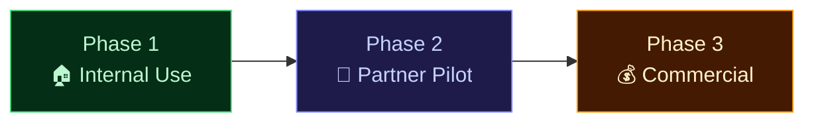
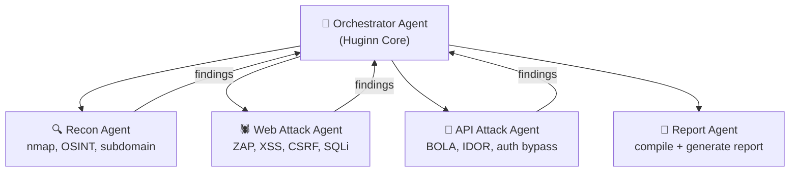
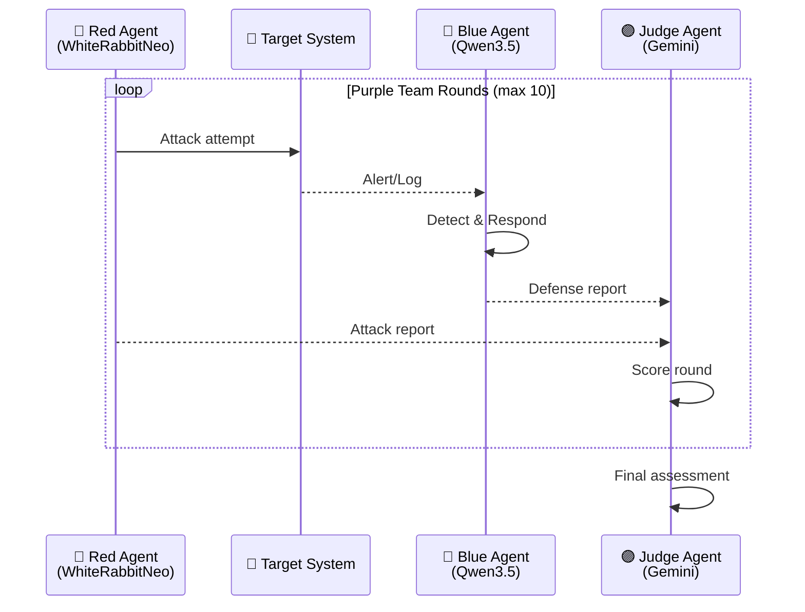
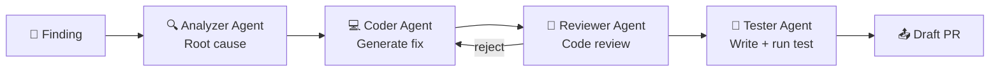
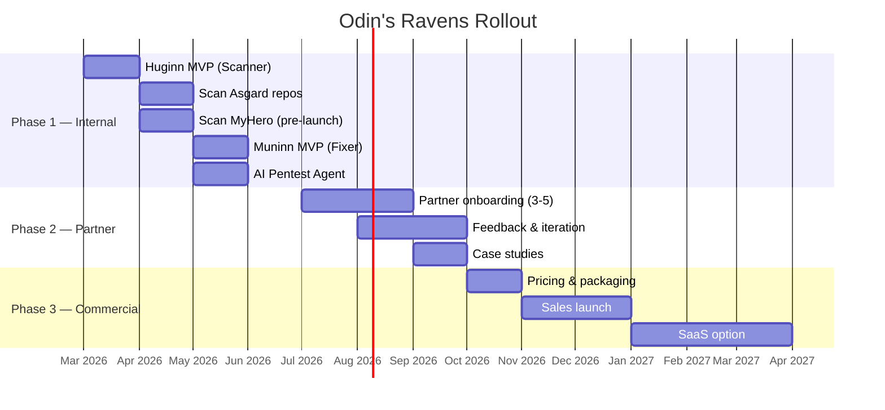

# 🐦‍⬛🐦 Odin's Ravens — Business Requirements Document

> Version 2.1 · March 2026 · AI/LLM Strategy + Security Review

---

## 1. Product Vision

**Odin's Ravens** คือชุดเครื่องมือ AI-powered สำหรับ Security, Performance Testing และ Automated Issue Fixing — ส่ง report ผ่าน GitHub repo และแนะนำวิธีแก้ไขอัตโนมัติ

| Product | Codename | Mission |
|:--|:--|:--|
| 🐦‍⬛ **Huginn** | Thought | สำรวจและวิเคราะห์: scan URL, pentest, performance test → สร้าง report |
| 🐦 **Muninn** | Memory | จดจำและแก้ไข: watch GitHub issues, วิเคราะห์ root cause, สร้าง PR fix |

---

## 2. Business Objectives

### Phase 1: Internal Use (Now → Q3 2026)

| Goal | Target Systems | KPI |
|:--|:--|:--|
| ใช้ scan product ของตัวเอง | Asgard (10 repos) + MyHero | ลด vulnerability > 80% |
| สร้าง report อัตโนมัติ | ทุก commit/PR | 0 Critical findings ไม่ถูกพบ |
| ทดสอบก่อน MyHero launch | cloud-super-hero | ผ่าน OWASP Top 10 check |

**Internal Targets:**

| System | Type | URL/Repo | Scan Mode |
|:--|:--|:--|:--|
| Asgard Platform | Self-hosted | 10 repos (Mimir, Bifrost, etc.) | White-box (code scan) |
| MyHero | Cloud (GCP) | MegaWiz-Dev-Team/cloud-super-hero | **Both** (blind + code) |
| Mimir API | API service | http://localhost:3000 | Black-box (pentest) + API Top 10 |
| Eir Gateway | API Gateway | http://localhost:8300 | Black-box (pentest) + API Top 10 |
| Heimdall LLM | LLM Gateway | http://localhost:8080 | LLM security (FR-H08) |
| Bifrost Agent | Agent Runtime | http://localhost:8100 | Agent safety (FR-H09) |

### Phase 2: Partner Pilot (Q3–Q4 2026)

| Goal | Target | KPI |
|:--|:--|:--|
| ให้ partner 3-5 ราย ลองใช้ฟรี | MegaWiz clients | Partner satisfaction > 80% |
| เก็บ feedback ปรับปรุง | — | PRD v2 from feedback |
| สร้าง case study | — | 2+ published case studies |

### Phase 3: Commercial (Q1 2027+)

| Goal | Target | KPI |
|:--|:--|:--|
| ขาย subscription service | SMB/Mid-Enterprise | 10+ paying customers Year 1 |
| SaaS + self-hosted options | Regulated industries | $5K-20K/yr per customer |
| Brand แยกจาก Asgard | Stand-alone product | Own landing page + docs |

---

## 3. Legal & Authorization Framework

> [!CAUTION]
> Pentest ที่ scan โดยไม่มี authorization = **ผิด พ.ร.บ.คอมพิวเตอร์ มาตรา 5-8** — Section นี้จำเป็นก่อนเริ่ม scan ใดๆ

### FR-L01: Rules of Engagement (RoE)

| Requirement | Description |
|:--|:--|
| **RoE Template** | ลูกค้าต้อง sign authorization form ก่อน scan — ระบุ scope, timeline, ข้อจำกัด |
| **Scope Definition** | Whitelist IP, domain, port ที่ได้รับอนุญาต — scan นอก scope = blocked |
| **Safe Harbor Agreement** | คุ้มครอง tester จากความรับผิดทางกฎหมาย |
| **Emergency Contact** | ต้องระบุ contact ของ target owner กรณี system ล่ม |
| **Time Window** | กำหนดช่วงเวลาที่อนุญาตให้ scan (เช่น off-peak hours) |

### FR-L02: Scan Authorization Enforcement

| Feature | Description |
|:--|:--|
| **Mandatory Approval** | ต้อง approve RoE ในระบบก่อนเริ่ม scan |
| **Scope Lock** | Huginn จะไม่ scan URL/IP ที่อยู่นอก approved scope |
| **Audit Trail** | บันทึกว่าใครอนุมัติ scan, เมื่อไหร่, scope อะไร |
| **Legal Disclaimer** | แสดง disclaimer ทุกครั้งก่อนเริ่ม active scan |

---

## 4. Functional Requirements

### 4.1 🐦‍⬛ Huginn — Scanner + Pentest Agent

#### FR-H01: Scan Modes (สำคัญมาก)

| Mode | ชื่อไทย | Description | ต้องการ source code? |
|:--|:--|:--|:--|
| **Black-box** (Blind Test) | ทดสอบแบบไม่ดู code | Scan จาก URL ภายนอก เหมือนผู้โจมตีจริง | ❌ ไม่ต้อง |
| **White-box** (Code Scan) | ดู code แล้วหาจุดอ่อน | Clone repo → SAST + dependency audit + secret scan | ✅ ต้อง access repo |
| **Grey-box** | ผสม | Black-box + รู้ API spec (เช่น OpenAPI doc) | 🔶 บางส่วน |

#### FR-H02: Black-box Scans (Blind Test)

| Scan | Tool | Output |
|:--|:--|:--|
| **Web Vulnerability** | OWASP ZAP (passive + active) | XSS, SQL injection, CSRF, etc. |
| **Port Scan** | nmap | Open ports, service versions |
| **SSL/TLS Check** | sslyze / testssl.sh | Certificate validity, protocol strengths |
| **HTTP Header Analysis** | Built-in | Security headers (CSP, HSTS, X-Frame-Options) |
| **Directory Discovery** | dirb / gobuster | Hidden paths, admin panels |
| **API Fuzzing** | Custom + ZAP | Edge case inputs, auth bypass attempts |

#### FR-H02b: OWASP API Security Top 10 (2023) ⚡ NEW

> Scan profile แยกสำหรับ API — รองรับ **authenticated testing** ด้วย Bearer token / API key / session cookie

| # | Vulnerability | Description | Scan Mode |
|:--|:--|:--|:--|
| API1 | **BOLA** | Broken Object Level Authorization — เข้าถึง resource ของ user อื่น | Authenticated |
| API2 | **Broken Authentication** | Auth bypass, credential stuffing, token weakness | Black-box |
| API3 | **Broken Object Property Level Auth** | Mass assignment, excessive data exposure | Authenticated |
| API4 | **Unrestricted Resource Consumption** | Rate limit bypass, DoS via heavy queries | Black-box |
| API5 | **Broken Function Level Auth** | Admin endpoint accessible by regular user | Authenticated |
| API6 | **Server-Side Request Forgery** | SSRF via API parameters | Black-box |
| API7 | **Security Misconfiguration** | CORS, verbose errors, default credentials | Black-box |
| API8 | **Lack of Protection from Automated Threats** | Bot/scraper abuse, credential stuffing | Black-box |
| API9 | **Improper Inventory Management** | Shadow APIs, deprecated endpoints still active | Grey-box |
| API10 | **Unsafe API Consumption** | Trusting third-party API responses without validation | White-box |

**Authenticated Scan Support:**
| Auth Method | Description |
|:--|:--|
| Bearer Token | JWT / OAuth2 access token |
| API Key | Header or query param |
| Session Cookie | Login flow → capture session |
| Custom Header | X-API-Key, X-Auth-Token etc. |

#### FR-H03: White-box Scans (Code Scan)

| Scan | Tool | Output |
|:--|:--|:--|
| **SAST** | Semgrep | Code-level vulnerabilities by language |
| **Secret Detection** | TruffleHog / gitleaks | Hardcoded API keys, passwords, tokens |
| **Dependency Audit** | `pip audit`, `cargo audit`, `npm audit` | Known CVEs in dependencies |
| **License Check** | Built-in | Incompatible license detection |
| **Dockerfile Scan** | Trivy | Container image vulnerabilities |
| **SBOM Generation** | CycloneDX / SPDX | Software Bill of Materials ⚡ NEW |
| **Dependency Confusion** | Custom | Private package name collision ⚡ NEW |
| **CI/CD Pipeline Scan** | Custom | GitHub Actions workflow injection ⚡ NEW |

#### FR-H04: Performance Testing

| Test | Tool | Metrics |
|:--|:--|:--|
| **Page Speed** | Lighthouse CLI | Performance, Accessibility, SEO, PWA scores |
| **Load Test** | k6 | Response time (p50/p95/p99), throughput, error rate |
| **Stress Test** | k6 | Breaking point, max concurrent users |

#### FR-H05: AI Pentest Agent

| Feature | Description |
|:--|:--|
| **Autonomous Planning** | LLM วางแผน pentest strategy จาก target |
| **Tool Execution** | เรียก nmap, ZAP, sqlmap อัตโนมัติ |
| **Adaptive Strategy** | ปรับแนวทางตามผลที่ได้ (ReAct loop) |
| **PoC Generation** | สร้าง proof-of-concept สำหรับ vulnerability ที่พบ |
| **Max Iterations** | จำกัด ReAct loop ≤ 20 iterations (safety limit) ⚡ NEW |

**Scan Safety Controls:** ⚡ NEW

| Control | Description |
|:--|:--|
| **Dry-run Mode** | Preview actions ก่อน execute จริง |
| **Production Guard** | ต้อง confirm 2 ครั้งก่อน scan production |
| **Blast Radius Limit** | จำกัด requests/sec (default: 50 req/s) |
| **Kill Switch** | หยุดทันทีเมื่อ target error rate > 10% |
| **Sandbox Mode** | Demo/training ใช้ DVWA / Juice Shop |
| **Max Duration** | Active scan timeout (default: 30 min) |

#### FR-H06: Report & Delivery

| Feature | Description |
|:--|:--|
| **Report Format** | Markdown + JSON + PDF (optional) |
| **GitHub Push** | Push report ไปยัง repo ที่กำหนด (e.g. `reports/`) |
| **Issue Creation** | สร้าง GitHub Issue อัตโนมัติสำหรับ Critical/High |
| **Fix Recommendations** | แต่ละ finding มี recommended fix + code example |
| **Severity Scoring** | CVSS-based: Critical / High / Medium / Low / Info |
| **Trend Comparison** | เปรียบเทียบกับ scan ครั้งก่อน (improved/regressed) |

**False Positive Management:** ⚡ NEW

| Feature | Description |
|:--|:--|
| **Triage Workflow** | Mark findings: Confirmed / False Positive / Accepted Risk |
| **Persistent Suppressions** | Suppress false positives ไม่ให้โผล่ซ้ำใน scan ถัดไป |
| **Confidence Score** | ทุก finding มี confidence: High / Medium / Low |
| **Verification Re-scan** | Scan ซ้ำเฉพาะ findings ที่ถูก mark ว่าแก้แล้ว |

**Report Integrity & Chain-of-Custody:** ⚡ NEW

| Feature | Description |
|:--|:--|
| **Digital Signature** | GPG / X.509 sign report — พิสูจน์ว่าไม่ถูกแก้ไข |
| **SHA-256 Hash** | Hash ของ report สำหรับ verify integrity |
| **Immutable Storage** | Append-only storage สำหรับ compliance reports |
| **Trusted Timestamp** | RFC 3161 timestamp authority |

**Incident Response Workflow:** ⚡ NEW

| Step | Action | SLA |
|:--|:--|:--|
| 1 | Huginn พบ Critical finding | — |
| 2 | สร้าง GitHub Issue อัตโนมัติ | ทันที |
| 3 | **ส่ง alert ทันที** (LINE / Slack / Email) | ≤ 1 นาที |
| 4 | **Block CI/CD deployment** (ถ้า integrate) | ทันที |
| 5 | **Track remediation SLA** | Critical: 24 ชม. / High: 72 ชม. |
| 6 | Auto re-scan หลังแก้ไข | ทันที |

#### FR-H07: Security Chatbot

| Feature | Description |
|:--|:--|
| **Interactive Q&A** | ถาม-ตอบเรื่อง scan results, CVE, remediation |
| **Command-driven** | สั่ง scan/pentest ผ่าน chat |
| **Thai + English** | รองรับ 2 ภาษา |

#### FR-H08: LLM Security Testing (OWASP Top 10 for LLM 2025)

> ทดสอบความปลอดภัยของ LLM systems เช่น Heimdall, Bifrost chat, Eir chatbot

| Test | OWASP LLM Ref | Description | Mode |
|:--|:--|:--|:--|
| **Prompt Injection** | LLM01 | ส่ง prompt อันตรายเพื่อ override system instructions | Black-box |
| **Sensitive Data Exposure** | LLM02 | LLM หลุดข้อมูล PII, API keys, training data | Black-box |
| **Supply Chain Vuln** | LLM03 | Model/plugin/dependency ที่ใช้มี CVE | White-box |
| **Data Poisoning** | LLM04 | RAG knowledge base ถูก inject ข้อมูลเท็จ | Grey-box |
| **Insecure Output** | LLM05 | LLM output ถูกใช้สร้าง XSS, SQL injection downstream | Black-box |
| **Excessive Agency** | LLM06 | LLM/Agent ทำ action เกินขอบเขตที่กำหนด | Black-box |
| **System Prompt Leakage** | LLM07 | System prompt extraction → expose business logic | Black-box |
| **Vector/Embedding Weakness** | LLM08 | Embedding injection, RAG manipulation | Grey-box |
| **Misinformation** | LLM09 | ตรวจสอบ hallucination rate / ข้อมูลเท็จ | Black-box |
| **Unbounded Consumption** | LLM10 | Token usage ไม่จำกัด → cost explosion | Grey-box |

**Additional LLM Tests:** ⚡ NEW

| Test | Description | Mode |
|:--|:--|:--|
| **RAG Poisoning via Upload** | Upload malicious document → LLM ตอบอันตราย | Grey-box |
| **Cross-tenant Data Leak** | LLM tenant A หลุดข้อมูล tenant B (multi-tenant RAG) | Black-box |
| **System Prompt Extraction** | Extract system prompt ผ่าน chat → expose business logic | Black-box |
| **Tool Call Injection** | Inject tool name/params ผ่าน user input → เรียก tool อันตราย | Black-box |

**Test Tools:**
| Tool | Use |
|:--|:--|
| [Garak](https://github.com/NVIDIA/garak) | LLM vulnerability scanner (prompt injection, jailbreak) |
| [PyRIT](https://github.com/Azure/PyRIT) | Red-teaming toolkit for AI systems |
| Custom Huginn probes | Domain-specific probes สำหรับ Asgard components |

#### FR-H09: Agent Safety Testing

> ทดสอบ AI Agent behaviors (Bifrost ReAct loop, Fenrir computer-use, Eir chatbot)

| Test | Description | Target |
|:--|:--|:--|
| **Tool Abuse** | Agent เรียก tool อันตราย (shell exec, file delete) โดยไม่ได้รับอนุญาต | Bifrost |
| **Infinite Loop Detection** | Agent ติด loop, เรียก tool ซ้ำไม่หยุด → resource drain | Bifrost |
| **Scope Violation** | Agent ทำ action นอก scope (อ่านข้อมูลผู้ป่วยอื่น, แก้ไข data ที่ไม่เกี่ยว) | Fenrir |
| **Hallucination Rate** | วัดอัตรา hallucination เมื่อตอบคำถาม domain-specific | All agents |
| **MCP Tool Validation** | Tool call input/output ถูก validate ตาม schema มั้ย | Bifrost MCP |
| **Auth Bypass via Agent** | Agent ถูกหลอกให้ข้าม authentication / authorization | All agents |
| **Memory Poisoning** | Session memory ถูก inject ข้อมูลเท็จที่ส่งผลต่อ future actions | Bifrost |
| **Multi-agent Confusion** | Agent A ส่ง task ที่อันตรายให้ Agent B ผ่าน A2A | Bifrost A2A |
| **Cost Control** | Agent ใช้ LLM tokens เกิน budget ที่กำหนด | All agents |
| **Privilege Escalation** | Agent ปกติถูก exploit ให้ใช้ admin-level tools ⚡ NEW | All agents |

#### FR-H10: Multi-Agent Pentest Swarm ⚡ NEW

> แทนที่ single ReAct agent — ใช้ 4 specialized agents ทำงาน parallel ผ่าน Bifrost A2A protocol

| Agent | Role | LLM | Tools |
|:--|:--|:--|:--|
| **Orchestrator** | วางแผน, แบ่งงาน, รวม findings | Gemini API | — |
| **Recon Agent** | สำรวจ target, discover attack surface | Qwen3.5 | nmap, subfinder, httpx |
| **Web Attack Agent** | ทดสอบ web vulnerabilities | WhiteRabbitNeo | ZAP, sqlmap, custom probes |
| **API Attack Agent** | ทดสอบ OWASP API Top 10 | WhiteRabbitNeo | ZAP API scan, custom scripts |
| **Report Agent** | รวม findings, สร้าง report, ให้คะแนน | Qwen3.5 | Tera templates |

**ข้อดี vs Single Agent:**
| Metric | Single Agent | Multi-Agent Swarm |
|:--|:--|:--|
| Scan speed | Sequential | **Parallel → 3-4x เร็วกว่า** |
| Depth | ทำทุกอย่างแต่ตื้น | **Agent เชี่ยวชาญเฉพาะด้าน** |
| Reliability | Single point of failure | **Agent อื่นทำต่อได้** |

#### FR-H11: Red vs Blue Simulation (Purple Team) ⚡ NEW

> จำลองการโจมตีและป้องกัน — ทดสอบ defense ของระบบแบบ real-world

| Agent | Role | Model |
|:--|:--|:--|
| 🔴 **Red Agent** | วางแผน + execute attack scenarios | WhiteRabbitNeo |
| 🔵 **Blue Agent** | ตรวจจับ + ตอบสนอง + ป้องกัน | Qwen3.5 |
| 🟣 **Judge Agent** | ให้คะแนน, ตัดสิน, สร้างรายงาน | Gemini API |

**Output:** Purple Team Report — แสดง attack success rate, detection rate, response time, weak spots

#### FR-H12: Cross-Service Vulnerability Graph ⚡ NEW

> ค้นหา attack chains ที่ข้าม services — สิ่งที่ single-service scan ไม่เจอ

| Feature | Description |
|:--|:--|
| **Per-Service Agents** | 1 agent ต่อ 1 Asgard service (Mimir, Eir, Bifrost, Heimdall) |
| **Coordinator Agent** | รวม findings + หา cross-service attack chains |
| **Graph Analysis** | สร้าง attack graph: Service A → B → C → exploit |
| **Chain Detection** | "Eir รับ input → Mimir เก็บ → Bifrost execute → **injection chain!**" |

---

### 4.2 🐦 Muninn — Issue Watcher & Auto-Fixer

#### FR-M01: Repository Watcher

| Feature | Description |
|:--|:--|
| **Add repos** | เพิ่ม GitHub repo เข้า watch list |
| **Poll interval** | ทุก 5 นาที (configurable) |
| **Label filter** | เลือก filter เฉพาะ label เช่น `bug`, `security` |
| **Multi-repo** | Watch หลาย repos พร้อมกัน |

**Standard Label Conventions:** ⚡ NEW

| Label | Meaning | Muninn Action |
|:--|:--|:--|
| `huginn-finding` | Huginn สร้าง issue นี้จาก scan | Auto-analyze + propose fix |
| `security` | Security vulnerability ทั่วไป | Analyze + propose fix |
| `vulnerability` | Known CVE | Check remediation DB |
| `auto-fix` | ขอให้ Muninn auto-fix โดยเฉพาะ | Generate fix + create PR |
| `muninn-skip` | ไม่ต้องให้ Muninn analyze | Skip |

#### FR-M02: AI Issue Analyzer

| Feature | Description |
|:--|:--|
| **Root Cause Analysis** | LLM วิเคราะห์ issue → หา root cause |
| **Code Context** | ดึง relevant code จาก repo เป็น context |
| **Complexity Score** | ให้คะแนน 1-10 ว่าแก้ยากแค่ไหน |
| **Solution Proposal** | เสนอวิธีแก้พร้อม code snippet |

#### FR-M03: Auto-Fixer

| Feature | Description |
|:--|:--|
| **Branch Creation** | สร้าง `fix/muninn-{issue_id}` |
| **Code Generation** | LLM สร้าง code fix |
| **PR Creation** | สร้าง PR link กลับ original issue |
| **Human Review** | ต้องมีคนอนุมัติก่อน merge เสมอ |

**Auto-Fix Quality Rules:** ⚡ NEW

| Rule | Description |
|:--|:--|
| **Draft PR only** | ทุก PR ต้องเป็น draft — ห้าม auto-merge |
| **PR Prefix** | Title ต้องขึ้นต้นด้วย `[Muninn Auto-Fix]` |
| **Max 3 files** | ถ้า fix ต้อง > 3 files → สร้าง issue อธิบายแทน |
| **Verify before push** | ต้อง `cargo check` / `npm test` ผ่านก่อน push |
| **Finding reference** | PR body ต้อง link กลับ original issue + finding ID |
| **Minimal changes** | แก้เฉพาะ vulnerability — ห้ามเพิ่ม feature |

#### FR-M04: Multi-Agent Fix Pipeline ⚡ NEW

> แทนที่ single LLM → PR — ใช้ 4 agents ตรวจสอบกันเองก่อน PR

| Agent | Role | Model |
|:--|:--|:--|
| 🔍 **Analyzer** | วิเคราะห์ root cause + impact + CWE classification | Gemini API |
| 💻 **Coder** | สร้าง code fix (minimal changes only) | Qwen3.5 |
| 👀 **Reviewer** | Review fix: security, correctness, style — reject กลับ Coder ถ้าไม่ผ่าน | Gemini API |
| 🧪 **Tester** | สร้าง unit test + run `cargo test` / `npm test` | Qwen3.5 |

**ข้อดี:** Fix quality สูงขึ้นมาก — agent review agent + มี test coverage ก่อน PR

#### FR-M05: Continuous Learning Agent ⚡ NEW

> Agent ที่เรียนรู้จาก historical scan results — สร้าง insight ระยะยาว

| Feature | Description |
|:--|:--|
| **Pattern Detection** | "SQL injection พบซ้ำ 3 ครั้งใน module X" → แนะนำ architectural fix |
| **Security Playbook** | สร้าง playbook อัตโนมัติจาก findings + fixes ที่ผ่านมา |
| **Trend Analysis** | เทียบ findings ข้าม sprints — แสดง improvement/regression |
| **Fine-tune Data** | Export findings → training data สำหรับ WhiteRabbitNeo Phase 2 |

---

## 5. Compliance & Standards (มาตรฐานที่เกี่ยวข้อง)

### 5.1 International Security Standards

| Standard | ชื่อ | เกี่ยวข้องยังไง | ISO 27001 Controls | Priority |
|:--|:--|:--|:--|:--|
| **ISO 27001** | Information Security Management | Framework หลักสำหรับ ISMS | A.8.8 Vuln Mgmt, A.8.25 SDLC, A.8.28 Secure Coding | ⭐⭐⭐ |
| **ISO 27799** | Health Informatics Security | Healthcare-specific: PHI protection + clinical data integrity + telehealth scan | — | ⭐⭐⭐ |
| **IEC 62443** | Industrial Automation Security | Medical devices + connected healthcare | — | ⭐⭐ |
| **IEC 81001-5-1** | Health Software Security | Secure development lifecycle | — | ⭐⭐ |
| **ISO 14971** | Medical Device Risk Management | Huginn report ช่วย feed risk data | — | ⭐ |
| **ISO 42001** | AI Management System | LLM/Agent governance + safety | — | ⭐⭐ |
| **NIST CSF 2.0** | Cybersecurity Framework | Identify → Protect → Detect → Respond → Recover ⚡ NEW | — | ⭐⭐⭐ |

### 5.2 Healthcare Regulations

| Regulation | Region | Requirement ที่ Huginn ช่วยได้ | Priority |
|:--|:--|:--|:--|
| **HIPAA Security Rule 2026** | 🇺🇸 US | Pentest ปีละครั้ง, vuln scan ทุก 6 เดือน, MFA + encryption check | ⭐⭐⭐ |
| **Thailand PDPA** | 🇹🇭 TH | ข้อมูลสุขภาพ = sensitive data, ต้อง safeguard + DPO + breach report 72 ชม. | ⭐⭐⭐ |
| **พ.ร.บ.ไซเบอร์ (CSA)** | 🇹🇭 TH | โรงพยาบาล = Critical Infrastructure, ต้อง report + comply มาตรฐาน NCSA | ⭐⭐⭐ |
| **FDA Cybersecurity (Feb 2026)** | 🇺🇸 US | Medical device ต้อง pentest, SBOM, post-market monitoring | ⭐⭐ |
| **GDPR** | 🇪🇺 EU | Data protection impact assessment, report breaches 72 ชม. | ⭐ |

> [!WARNING]
> สำคัญ: Huginn scan ต้อง **ไม่ expose/log PHI** ที่พบระหว่าง scan — ต้อง redact ข้อมูลผู้ป่วยก่อน write report

### 5.3 AI-Specific Standards

| Standard | Description | Huginn Coverage |
|:--|:--|:--|
| **OWASP Top 10 for LLM 2025** | 10 ช่องโหว่หลักของ LLM systems | FR-H08 ครอบคลุมทั้งหมด |
| **OWASP API Security Top 10** | 10 ช่องโหว่ API | FR-H02b ครอบคลุมทั้งหมด ⚡ NEW |
| **NIST AI RMF 1.0** | US AI Risk Management Framework | Risk assessment + monitoring |
| **EU AI Act** | กฎหมาย AI ของ EU — high-risk AI systems | Agent safety testing |
| **ISO 42001** | AI Management System standard | LLM governance + safety |

### 5.4 🇹🇭 มาตรฐานเฉพาะประเทศไทย

> [!IMPORTANT]
> ตั้งแต่ปี 2024 ประเทศไทย **บังคับให้โรงพยาบาลทุกแห่ง** ต้องทำ Penetration Testing — Huginn ตอบโจทย์นี้ได้โดยตรง

| มาตรฐาน | หน่วยงาน | รายละเอียด |
|:--|:--|:--|
| **มาตรฐานความปลอดภัยข้อมูลผู้ป่วย พ.ศ. 2559** | สธ. | ปกป้อง confidentiality, integrity, availability ของข้อมูลผู้ป่วย |
| **มาตรฐานขั้นต่ำ NCSA (ม.ค. 2025)** | กมช. | Vulnerability testing บังคับสำหรับ Critical Information Infrastructure |
| **บังคับ Pentest โรงพยาบาล (2024)** | สธ. | โรงพยาบาลทุกแห่งต้อง pentest ระบบ IT |
| **PDPA — ข้อมูลสุขภาพ** | PDPC | ข้อมูลสุขภาพ = sensitive, ต้อง explicit consent + safeguard |
| **พ.ร.บ.คอมพิวเตอร์ พ.ศ. 2560** | กระทรวง DE | มาตรา 5-8: ห้าม scan โดยไม่ได้รับอนุญาต → ต้องมี RoE ⚡ NEW |

### 5.5 Compliance Reports ที่ Huginn สร้างได้

| Report Type | มาตรฐาน | Content |
|:--|:--|:--|
| **OWASP Top 10 Web** | OWASP | สรุป findings ตาม OWASP Top 10 categories |
| **OWASP API Top 10** | OWASP API | สรุป API vulnerabilities ตาม 10 categories ⚡ NEW |
| **OWASP Top 10 LLM** | OWASP LLM | สรุป LLM vulnerabilities ตาม 10 categories |
| **HIPAA Security Audit** | HIPAA | Encryption check, MFA check, access control review |
| **PDPA Data Protection** | PDPA | PHI exposure check, consent mechanism, breach risk |
| **NIST CSF Assessment** | NIST CSF 2.0 | Identify/Protect/Detect/Respond/Recover mapping ⚡ NEW |
| **Dependency SBOM** | FDA/HIPAA | Software Bill of Materials + known CVEs |
| **Pentest Summary** | ISO 27001 | Executive summary สำหรับ management review |

---

## 6. Non-Functional Requirements

| Requirement | Spec |
|:--|:--|
| **Scan Speed** | Black-box passive scan ≤ 5 นาที, Active scan ≤ 30 นาที |
| **Concurrent Scans** | ≥ 3 scans พร้อมกัน |
| **Report Size** | ≤ 10MB per report |
| **Availability** | 99.5% uptime (self-hosted) |
| **Data Privacy** | Code ไม่ถูกส่งออกนอก network (white-box mode) |
| **PHI Redaction** | Auto-redact ข้อมูลผู้ป่วยใน scan results ⚡ NEW |
| **Language Support** | Python, Rust, TypeScript/JavaScript, PHP, Go |
| **API Standard** | RESTful, OpenAPI 3.0 documented |

### NFR: Platform Security (Huginn ต้องปลอดภัยเอง) ⚡ NEW

| Requirement | Spec |
|:--|:--|
| **RBAC** | Role-based access: Admin / Operator / Viewer |
| **API Authentication** | JWT / API key required สำหรับทุก endpoint |
| **Credential Vault** | Vault integration (HashiCorp / SOPS) สำหรับ secrets |
| **Audit Log** | Log ทุก action: who, when, target, scan type, results |
| **Encryption at Rest** | Scan results + reports encrypted (AES-256) |
| **Rate Limiting** | API rate limit ป้องกัน abuse |

### NFR: Multi-Tenancy (Phase 2-3) ⚡ NEW

| Requirement | Spec |
|:--|:--|
| **Tenant Isolation** | Scan results แยกตาม tenant — ดูข้ามกันไม่ได้ |
| **Per-tenant Rate Limit** | แต่ละ tenant มี quota scan |
| **Data Retention Policy** | กำหนดอายุ report per tenant (default: 1 ปี) |
| **Tenant-scoped API Keys** | API key ผูกกับ tenant — เข้าถึงเฉพาะ data ของตัวเอง |

---

## 7. MyHero (cloud-super-hero) — First External Target

| Attribute | Detail |
|:--|:--|
| **Stack** | Python (Flask) + Firestore + GCP Cloud Run |
| **Auth** | OTP via SMTP email (custom, not OAuth) |
| **Frontend** | Vanilla HTML/JS |
| **Risk Areas** | OTP brute-force, session hijacking, SMTP injection, Firestore rules |
| **Scan Plan** | Black-box (deployed URL) + White-box (repo scan) |

### Specific Tests for MyHero

| Test | Type | What to Check |
|:--|:--|:--|
| OTP bypass | Black-box | Brute-force OTP, replay attacks, timing attacks |
| Session security | Black-box | Token prediction, session fixation |
| SMTP injection | White-box | Email header injection in OTP sender |
| Firestore rules | White-box | Public data access, missing rules |
| Admin endpoint | Black-box | Auth bypass on admin routes |
| IDOR/BOLA | Authenticated | เข้าถึง data ของ user อื่นผ่าน API ⚡ NEW |
| Dependency CVEs | White-box | Flask, Werkzeug, google-cloud-firestore versions |
| SBOM | White-box | Generate full Software Bill of Materials ⚡ NEW |
| SSL/TLS | Black-box | Certificate, protocol configuration |
| Load test | Performance | Concurrent user capacity before degradation |

---

## 8. Rollout Plan

---

## 9. Revenue Model (Odin's Ravens)

| Tier | Price | Includes |
|:--|:--|:--|
| **Free (Internal)** | $0 | Self-hosted, unlimited internal scans |
| **Starter** | $299/mo | 5 repos, scheduled scans, GitHub reports |
| **Professional** | $999/mo | 20 repos, AI Pentest Agent, Muninn auto-fix, OWASP reports |
| **Enterprise** | Custom | Unlimited repos, SLA, dedicated support, compliance reports, multi-tenancy |

---

## 10. Success Criteria

| Phase | Metric | Target |
|:--|:--|:--|
| Phase 1 | Asgard repos 0 Critical/High findings | ✅ All clear |
| Phase 1 | MyHero ผ่าน OWASP Top 10 + API Top 10 check ก่อน launch | ✅ Pass |
| Phase 1 | Report auto-push to GitHub ทำงานได้ | ✅ Working |
| Phase 1 | RoE template พร้อมใช้ | ✅ Ready |
| Phase 2 | Partner satisfaction score | ≥ 80% |
| Phase 2 | Published case studies | ≥ 2 |
| Phase 3 | Paying customers | ≥ 10 in Year 1 |
| Phase 3 | ARR | ≥ $50K |

---

## 11. AI/LLM Strategy

### 11.1 Multi-Model Architecture

| Model | Type | Role |
|:--|:--|:--|
| **Qwen3.5-9B** | Local (Heimdall) | Code analysis, scan summarize, chatbot, OWASP reports |
| **WhiteRabbitNeo 13B** | Local (Heimdall) | 🔴 Pentest planning, exploit PoC, vuln classification |
| **Gemini API** | External | Complex reasoning, multi-file analysis, 1M token context |
| **OpenAI API** | External (fallback) | Backup when Gemini unavailable |

### 11.2 WhiteRabbitNeo — Security-Specific LLM

| Aspect | Detail |
|:--|:--|
| **Source** | [WhiteRabbitNeo](https://huggingface.co/WhiteRabbitNeo) — open-source, Kindo-sponsored |
| **Base** | Qwen (Alibaba) — fine-tuned 1.7M samples offensive + defensive security |
| **License** | DeepSeek Coder + WRN Extended — **fine-tune ได้** |
| **ข้อจำกัด** | ห้ามใช้: military, false content, discrimination |
| **Deploy** | GGUF Q4_K_M → Heimdall (MLX on Apple Silicon) |

> [!WARNING]
> WhiteRabbitNeo มี offensive capabilities — ต้อง enforce RoE (Section 3) + gate access ผ่าน RBAC (Section 6 NFR-03)

### 11.3 Fine-Tune Roadmap

| Phase | Action | Data | ผลลัพธ์ |
|:--|:--|:--|:--|
| **Phase 1 (MVP)** | ใช้ stock model | — | Pentest + vuln analysis พร้อมใช้ทันที |
| **Phase 2** | LoRA fine-tune | Asgard scan results, Thai reports | รู้จัก codebase, ตอบภาษาไทย |
| **Phase 3** | Full fine-tune → "HuginnLM" | PDPA/CSA + medical security | Custom security model แบรนด์ของเรา |

### 11.4 Kali Linux — Optional Pentest Sidecar

| Mode | Description |
|:--|:--|
| **Production scanning** | ใช้ on-demand containers (ZAP, nmap, Semgrep) — lean |\
| **Advanced pentest** | Kali Linux Docker (optional profile) — sqlmap, hydra, john, etc. |
| **Training/Demo** | Kali + DVWA/Juice Shop — sandbox environment |

> Kali ไม่ใช้เป็น base image แต่เป็น optional profile สำหรับ advanced pentest mode

---

## 12. Future Enhancements

### 12.1 PCI-DSS Compliance

> ถ้า MyHero หรือ customer มี payment feature → ต้องเพิ่ม PCI-DSS scan

| Requirement | Description |
|:--|:--|
| **Card Data Detection** | Scan response/logs สำหรับ card numbers (PAN) |
| **TLS Enforcement** | ตรวจ payment endpoints ว่าใช้ TLS 1.2+ |
| **Tokenization Check** | ตรวจว่า card data ถูก tokenize ไม่เก็บ raw |
| **PCI-DSS SAQ Report** | Generate report ตาม Self-Assessment Questionnaire |

### 12.2 Backup & Disaster Recovery

| Feature | Spec |
|:--|:--|
| **Database Backup** | Daily automated backup ของ scan history + findings |
| **Report Backup** | Replicate reports to secondary storage (S3/GCS) |
| **Recovery Time** | RTO ≤ 4 ชม., RPO ≤ 24 ชม. |
| **Restore Test** | Monthly restore drill |

### 12.3 Internationalization (i18n)

| Feature | Description |
|:--|:--|
| **Thai Report Template** | Report ภาษาไทยสำหรับโรงพยาบาล + หน่วยงานราชการ |
| **Bilingual Findings** | ทุก finding มี description ทั้ง TH + EN |
| **Thai CVSS Descriptions** | อธิบาย severity เป็นภาษาไทยให้ผู้บริหารเข้าใจ |
| **Localized Remediation** | คำแนะนำการแก้ไขเป็นภาษาไทย |

### 12.4 Scan Scheduling

| Feature | Description |
|:--|:--|
| **Cron-based Schedule** | ตั้งเวลา scan อัตโนมัติ (daily/weekly/monthly) |
| **CI/CD Trigger** | Scan on every PR / merge to main |
| **GitHub Actions** | Pre-built action: `odins-ravens/huginn-scan@v1` |
| **Webhook Trigger** | HTTP webhook สำหรับ external trigger |
| **Calendar View** | UI แสดงตาราง scan ที่กำหนดไว้ |

### 12.5 Competitive Positioning

| Feature | 🐦‍⬛ Huginn | Snyk | Checkmarx | Burp Suite |
|:--|:--|:--|:--|:--|
| **Self-hosted** | ✅ | ❌ Cloud | ❌ Cloud | ✅ |
| **Open Source** | ✅ AGPL | Freemium | ❌ | ❌ |
| **LLM Security Testing** | ✅ OWASP LLM Top 10 | ❌ | ❌ | ❌ |
| **Agent Safety Testing** | ✅ ReAct/MCP/A2A | ❌ | ❌ | ❌ |
| **AI Pentest Agent** | ✅ Autonomous | ❌ | ❌ | ❌ Extension |
| **SAST** | ✅ Semgrep | ✅ | ✅ | ❌ |
| **DAST (Web)** | ✅ ZAP | ❌ | ✅ DAST | ✅ |
| **DAST (API)** | ✅ API Top 10 | ✅ API | ✅ API | ✅ |
| **SCA/SBOM** | ✅ CycloneDX | ✅ | ✅ | ❌ |
| **Performance Test** | ✅ k6/Lighthouse | ❌ | ❌ | ❌ |
| **Auto-fix (Muninn)** | ✅ LLM PR | ✅ Fix PR | ❌ | ❌ |
| **Thai Compliance** | ✅ PDPA/CSA/สธ. | ❌ | ❌ | ❌ |
| **GitHub Reports** | ✅ Push + Issues | ✅ PR checks | ✅ PR checks | ❌ |
| **Chatbot** | ✅ Thai + EN | ❌ | ❌ | ❌ |
| **Price** | Free / $299+ | $0-$98/mo | Enterprise | $449/yr |

> **Huginn's unique edges:** LLM/Agent security testing, autonomous AI pentest agent, Thai compliance reports, self-hosted with local LLM — **ไม่มีคู่แข่งรายไหนมีครบ**

---

*📅 Created: March 2026 · v2.1 · AI/LLM Strategy + Security Review · Brand: Odin's Ravens · Part of Asgard AI Platform*

