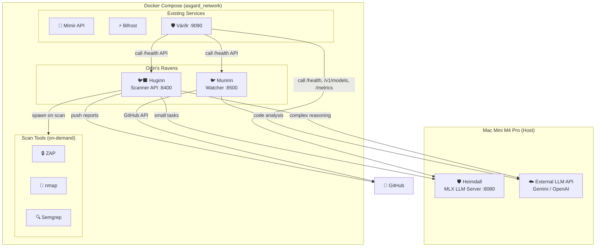

# 🐦‍⬛🐦 Odin's Ravens — Technical Requirements Document (TRD)

> Version 1.1 · March 2026 · Optimized for Mac Mini M4 Pro 64GB · **Rust/Axum Stack**

---

## 1. Hardware & Environment Constraints

### 1.1 Target Machine

| Spec | Value |
|:--|:--|
| **Machine** | Mac Mini M4 Pro |
| **CPU** | 14-core (10P + 4E) |
| **RAM** | 64 GB Unified Memory |
| **GPU** | 20-core Apple GPU (shared memory) |
| **Storage** | 1TB SSD (NVMe) |
| **OS** | macOS 15+ (Sequoia) |

### 1.2 Current Resource Usage (Live)

```
13 Docker containers — ~1,197 MB / 7,737 MB Docker allocation

SERVICE                  MEM       %
asgard_neo4j             483 MB    6.10%  ← heaviest
asgard_mariadb           126 MB    1.58%
asgard_mimir_dashboard   101 MB    1.28%
asgard_yggdrasil          96 MB    1.21%
asgard_bifrost            68 MB    0.86%
asgard_qdrant             61 MB    0.77%
asgard_fenrir             56 MB    0.70%
asgard_postgres           56 MB    0.70%
asgard_eir                53 MB    0.66%
asgard_vardr              36 MB    0.46%
asgard_mimir_api          28 MB    0.36%
asgard_eir_gateway        20 MB    0.25%
asgard_redis              14 MB    0.17%
──────────────────────────────────────
TOTAL                  ~1,197 MB
```

### 1.3 Memory Budget สำหรับ Huginn + Muninn

| Component | Budget | Justification |
|:--|:--|:--|
| **Existing Asgard** | ~1.5 GB | 13 containers + headroom |
| **Heimdall (MLX, Host)** | ~8-16 GB | Qwen3.5-9B quantized on Apple GPU |
| **macOS + System** | ~4 GB | OS, Finder, background |
| **Docker Engine overhead** | ~1 GB | Docker Desktop for Mac |
| **🐦‍⬛ Huginn** | **≤ 50 MB** | Rust/Axum — เทียบเท่า Eir Gateway (20MB), Várðr (36MB) |
| **🐦 Muninn** | **≤ 30 MB** | Rust/Axum — lightweight watcher |
| **Scan Tools (ZAP, nmap)** | **≤ 2 GB peak** | Spawned on-demand, killed after scan |
| **Python LLM Probes** | **≤ 200 MB peak** | Garak/PyRIT — on-demand เหมือน scan tools |
| **Free Reserve** | ~32-38 GB | สำหรับ dev tools, browser, IDE |

> [!IMPORTANT]
> **Total footprint Huginn + Muninn ≤ 80 MB idle, ≤ 2.3 GB peak (during scan)** — ลดจาก Python version 688 MB 🔥

---

## 2. Architecture Overview



### 2.1 Service Definitions

| Service | Container Name | Port | Tech Stack | Memory |
|:--|:--|:--|:--|:--|
| **Huginn API** | `asgard_huginn` | `:8400` | 🦀 Rust (Axum 0.8) | ~50 MB |
| **Muninn Worker** | `asgard_muninn` | `:8500` | 🦀 Rust (Axum 0.8) | ~30 MB |
| **ZAP** | (on-demand) | `:8090` (API) | Java | 1.5 GB peak |
| **LLM Probes** | (on-demand) | — | 🐍 Python (Garak/PyRIT) | 200 MB peak |

### 2.2 Tech Stack Rationale

| Choice | Why |
|:--|:--|
| **Rust (Axum)** | Consistent กับ Mimir, Eir, Várðr, Heimdall — team มี expertise แล้ว |
| **Python sidecar** | Garak + PyRIT เป็น Python lib — run as subprocess, ไม่ embed |
| **SQLite (rusqlite)** | ไม่ต้อง database server — ลด memory + complexity |

### 2.3 Design Principles

| Principle | How |
|:--|:--|
| **Minimal Memory** | Rust zero-cost abstractions, Tokio async runtime, no GC overhead |
| **No Embedded LLM** | ใช้ Heimdall (local) สำหรับ small tasks, External API สำหรับ complex reasoning |
| **Stateless Scans** | Scan results → file/SQLite, ไม่ hold in memory |
| **Stream Processing** | `tokio::io::BufReader` + async streams สำหรับ scan output |
| **On-demand Tools** | Docker containers สำหรับ heavy tools, `tokio::process::Command` สำหรับ CLI |

### 2.4 Finding Severity Mapping

> Normalize ค่า severity จากแต่ละ tool ให้เป็น Huginn severity เดียวกัน

| Tool Output | Huginn Severity | CVSS Range |
|:--|:--|:--|
| ZAP High / Semgrep ERROR / Trivy CRITICAL | 🔴 **Critical** | 9.0-10.0 |
| ZAP Medium / Semgrep WARNING / Trivy HIGH | 🟠 **High** | 7.0-8.9 |
| ZAP Low / Trivy MEDIUM | 🟡 **Medium** | 4.0-6.9 |
| ZAP Informational / Trivy LOW | 🟢 **Low** | 0.1-3.9 |
| Informational only | ⚪ **Info** | 0.0 |

### 2.5 Data Model

```rust
/// Core finding struct — ใช้ร่วมกันทุก scan type
#[derive(Debug, Serialize, Deserialize)]
pub struct Finding {
    pub id: String,              // UUID v4
    pub severity: Severity,
    pub title: String,
    pub description: String,
    pub location: String,        // URL or file:line
    pub tool: String,            // "zap", "semgrep", "trivy", "garak"
    pub cwe: Option<String>,     // e.g., "CWE-89"
    pub owasp: Option<String>,   // e.g., "A03:2021"
    pub remediation: Option<String>,
    pub confidence: Confidence,
    pub evidence: Option<String>,
}

#[derive(Debug, Serialize, Deserialize)]
pub enum Severity { Critical, High, Medium, Low, Info }

#[derive(Debug, Serialize, Deserialize)]
pub enum Confidence { High, Medium, Low }

#[derive(Debug, Serialize, Deserialize)]
pub struct ScanResult {
    pub scan_id: String,
    pub target: String,
    pub scan_type: String,       // "blackbox", "whitebox", "api", "llm"
    pub started_at: DateTime<Utc>,
    pub finished_at: DateTime<Utc>,
    pub findings: Vec<Finding>,
    pub report_hash: String,     // SHA-256 for integrity
}
```

### 2.6 Rust Crate Dependencies

```toml
# Huginn Cargo.toml — key dependencies
[dependencies]
axum = "0.8"
tokio = { version = "1", features = ["full"] }
serde = { version = "1", features = ["derive"] }
serde_json = "1"
reqwest = { version = "0.12", features = ["json", "stream"] }
rusqlite = { version = "0.32", features = ["bundled"] }
octocrab = "0.41"          # GitHub API
tera = "1"                  # Template engine for reports
tower-http = { version = "0.6", features = ["cors", "trace"] }
tracing = "0.1"
tracing-subscriber = { version = "0.3", features = ["env-filter"] }
chrono = { version = "0.4", features = ["serde"] }
uuid = { version = "1", features = ["v4"] }
sha2 = "0.10"                # Report integrity (SHA-256 hash)
```

### 2.5 Project Structure

```
Huginn/
├── Cargo.toml
├── Dockerfile
├── src/
│   ├── main.rs              # Axum server + routes
│   ├── config.rs            # Environment config
│   ├── health.rs            # GET /health endpoint
│   ├── db.rs                # SQLite (rusqlite)
│   ├── models.rs            # Finding, Severity, ScanResult structs
│   ├── scanner/
│   │   ├── mod.rs
│   │   ├── blackbox.rs      # ZAP, nmap, sslyze orchestration
│   │   ├── whitebox.rs      # Semgrep, TruffleHog, Trivy
│   │   ├── api.rs           # OWASP API Top 10
│   │   ├── llm.rs           # LLM security (calls Python probes)
│   │   └── performance.rs   # k6, Lighthouse
│   ├── pentest/
│   │   ├── mod.rs
│   │   └── agent.rs         # AI Pentest Agent (ReAct loop)
│   ├── report/
│   │   ├── mod.rs
│   │   ├── markdown.rs      # Markdown report generator
│   │   ├── json.rs          # JSON report
│   │   └── github.rs        # Push to GitHub (octocrab)
│   ├── chat.rs              # Security chatbot
│   └── llm.rs               # LLM client (Heimdall + Gemini router)
├── probes/                  # Python LLM security probes
│   ├── requirements.txt     # garak, pyrit
│   ├── run_garak.py
│   └── run_pyrit.py
└── templates/               # Tera report templates
    ├── owasp_web.md
    ├── owasp_api.md
    ├── owasp_llm.md         # OWASP LLM Top 10 2025
    └── pentest_summary.md

Muninn/
├── Cargo.toml
├── Dockerfile
└── src/
    ├── main.rs              # Axum server
    ├── config.rs
    ├── health.rs            # GET /health endpoint
    ├── db.rs                # SQLite
    ├── watcher.rs           # GitHub issue poller
    ├── analyzer.rs          # LLM root cause analysis
    ├── fixer.rs             # Code gen + PR creation
    └── github.rs            # octocrab wrapper
```

---

## 3. LLM Strategy

### 3.1 Multi-Model Architecture

> Heimdall รองรับหลาย model พร้อมกัน — เลือก model ตาม task type

| Model | Size | Memory | Role |
|:--|:--|:--|:--|
| **Qwen3.5-9B** (Heimdall default) | 9B Q4 | ~8 GB | Code analysis, summarize, chatbot, reports |
| **WhiteRabbitNeo 13B** | 13B Q4 | ~8 GB | 🔴 Pentest planning, exploit PoC, vuln classification |
| **Gemini API** (external) | Cloud | 0 | Complex reasoning, multi-file analysis, long context |
| **OpenAI API** (fallback) | Cloud | 0 | Backup for Gemini |

**Memory Budget (local models):**
```
Qwen3.5-9B:         ~8 GB
WhiteRabbitNeo 13B:  ~8 GB
Total local LLM:    ~16 GB → เหลือ 48 GB free ✅
```

#### 3.1.1 WhiteRabbitNeo — Security-Specific LLM

| Aspect | Detail |
|:--|:--|
| **Model** | [WhiteRabbitNeo 13B](https://huggingface.co/WhiteRabbitNeo) |
| **Base** | Qwen (Alibaba) — fine-tuned สำหรับ offensive + defensive security |
| **Sponsor** | Kindo |
| **License** | DeepSeek Coder + WRN Extended — **fine-tune ได้** ✅ |
| **ข้อจำกัด** | ห้ามใช้: military, false content, discrimination |
| **Capabilities** | Exploit generation, vuln analysis, pentest strategy, defense recommendations |
| **Format** | GGUF (Q4_K_M) → deploy ผ่าน Heimdall (MLX) |

> [!WARNING]
> WhiteRabbitNeo มี offensive content — ต้อง enforce RoE (BRD Section 3) + gate access ผ่าน RBAC

### 3.2 Routing Policy

| Task | Model | Reason |
|:--|:--|:--|
| Scan result summarize | Qwen3.5 | General summarization, fast |
| Fix recommendation | Qwen3.5 | Code-focused, good at patching |
| OWASP report generation | Qwen3.5 | Template-based, structured output |
| Chatbot Q&A | Qwen3.5 | Interactive, low latency |
| **Pentest strategy planning** | **WhiteRabbitNeo** | Trained for offensive security |
| **Exploit PoC generation** | **WhiteRabbitNeo** | Can generate attack scripts |
| **Vulnerability classification** | **WhiteRabbitNeo** | Security taxonomy trained |
| Complex multi-file analysis | **Gemini API** | 1M token context window |
| Root cause analysis (Muninn) | **Gemini API** | Complex reasoning needed |
| Multi-file code fix | **Gemini API** | Need 100K+ token window |

### 3.3 External API Config

```yaml
# Huginn .env
LLM_PROVIDER: "auto"          # auto | local | local-security | gemini | openai
LOCAL_LLM_URL: "http://host.docker.internal:8080/v1"
LOCAL_LLM_MODEL: "qwen3.5"
SECURITY_LLM_MODEL: "whiterabbitneo-13b"
GEMINI_API_KEY: "${GEMINI_API_KEY}"
GEMINI_MODEL: "gemini-2.5-flash"

# Routing thresholds
LOCAL_MAX_TOKENS: 4096         # ถ้า > 4K tokens → use external
COMPLEX_TASK_THRESHOLD: 0.7    # confidence < 0.7 → escalate to external
```

### 3.4 Fallback Chain

```
Security tasks:  WhiteRabbitNeo → Gemini API → OpenAI API → template
General tasks:   Qwen3.5 → Gemini API → OpenAI API → template
```

### 3.5 Fine-Tune Roadmap (WhiteRabbitNeo)

| Phase | Action | Data | ผลที่ได้ |
|:--|:--|:--|:--|
| **MVP** | ใช้ stock model ตรงๆ | — | Pentest + vuln analysis พร้อมใช้ |
| **Phase 2** | LoRA fine-tune | Asgard scan results + Thai reports | รู้จัก codebase, ตอบภาษาไทย |
| **Phase 3** | Full fine-tune → "HuginnLM" | PDPA/CSA + medical security + custom reports | Custom security model ของเรา |

**Fine-tune Pipeline (M4 Pro):**
```
1. Data prep     → JSONL (instruction, input, output)
2. QLoRA train   → MLX-LM / Unsloth (~16 GB RAM, 2-6 hrs)
3. Merge         → LoRA adapter + base weights
4. Quantize      → GGUF Q4_K_M
5. Deploy        → Heimdall (MLX server)
```

---

### 3.6 Multi-Agent Architecture ⚡ NEW

> Huginn + Muninn ใช้ multi-agent pattern — agents สื่อสารผ่าน in-process channels (tokio mpsc)
> Phase 2+ จะใช้ Bifrost A2A protocol สำหรับ cross-service agents

#### 3.6.1 Agent Communication

```rust
/// Agent message format — ใช้สื่อสารระหว่าง agents ผ่าน tokio::mpsc
#[derive(Debug, Serialize, Deserialize)]
pub struct AgentMessage {
    pub from: AgentId,
    pub to: AgentId,
    pub msg_type: MessageType,
    pub payload: serde_json::Value,
    pub timestamp: DateTime<Utc>,
}

#[derive(Debug, Serialize, Deserialize)]
pub enum MessageType {
    TaskAssign,     // Orchestrator → Sub-agent
    FindingReport,  // Sub-agent → Orchestrator
    CodeFix,        // Coder → Reviewer
    ReviewResult,   // Reviewer → Coder (accept/reject)
    TestResult,     // Tester → Pipeline
    RoundScore,     // Judge → Red/Blue
}

pub type AgentId = String; // e.g., "recon-agent", "web-attack-agent"
```

#### 3.6.2 Huginn Agent Registry

```rust
pub struct AgentRegistry {
    agents: HashMap<AgentId, AgentConfig>,
}

pub struct AgentConfig {
    pub id: AgentId,
    pub role: AgentRole,
    pub llm_model: String,       // "qwen3.5" | "whiterabbitneo" | "gemini"
    pub tools: Vec<String>,       // ["nmap", "zap", "semgrep"]
    pub max_iterations: u32,      // Safety limit per agent
    pub memory_budget_mb: u32,    // Memory cap
}

pub enum AgentRole {
    // Pentest Swarm (FR-H10)
    Orchestrator, ReconAgent, WebAttackAgent, APIAttackAgent, ReportAgent,
    // Purple Team (FR-H11)
    RedAgent, BlueAgent, JudgeAgent,
    // Cross-Service (FR-H12)
    ServiceScanner, CoordinatorAgent,
}
```

#### 3.6.3 Orchestration Patterns

**Pattern 1: Parallel Swarm (Pentest)**
```
Orchestrator spawns N agents → tokio::join!() → collect findings → Report Agent
```

**Pattern 2: Adversarial Loop (Purple Team)**
```
loop {
    Red attacks → Blue detects → Judge scores → next round
    if rounds >= max_rounds || Red exhausted → break
}
```

**Pattern 3: Sequential Pipeline (Muninn Fix)**
```
Analyzer → Coder → Reviewer → (reject? → Coder) → Tester → PR
max_review_cycles: 3
```

#### 3.6.4 Memory & Concurrency Constraints

| Agent Group | Max Concurrent | Total Memory | LLM Calls |
|:--|:--|:--|:--|
| Pentest Swarm | 4 agents | ≤ 200 MB (50 MB each) | 1 LLM call at a time |
| Purple Team | 3 agents | ≤ 150 MB | Red → Blue → Judge (sequential) |
| Fix Pipeline | 4 agents | ≤ 100 MB | Sequential (1 active) |
| Cross-Service | 5 agents | ≤ 250 MB | 2 parallel scans max |

> [!NOTE]
> LLM calls ต้องเป็น sequential (Heimdall serves 1 request at a time)
> Agent orchestration ทำ parallel ได้ แต่ LLM inference ต้อง queue

#### 3.6.5 Project Structure Update

```
Huginn/src/
├── agents/
│   ├── mod.rs              # AgentRegistry, AgentMessage
│   ├── orchestrator.rs     # Pentest swarm orchestrator
│   ├── recon.rs            # Recon agent (nmap, subfinder)
│   ├── web_attack.rs       # Web attack agent (ZAP, SQLi)
│   ├── api_attack.rs       # API attack agent (BOLA, IDOR)
│   ├── red_team.rs         # Red agent (WhiteRabbitNeo)
│   ├── blue_team.rs        # Blue agent (detection)
│   ├── judge.rs            # Judge agent (scoring)
│   └── cross_service.rs    # Cross-service coordinator

Muninn/src/
├── agents/
│   ├── mod.rs
│   ├── analyzer.rs         # Root cause analysis agent
│   ├── coder.rs            # Code fix generation agent
│   ├── reviewer.rs         # Code review agent
│   ├── tester.rs           # Test generation + execution agent
│   └── learner.rs          # Continuous learning agent
```

#### 3.6.6 Phased Rollout

| Phase | Feature | Agents |
|:--|:--|:--|
| **MVP** | Single ReAct pentest + single-LLM fix | 1 agent each |
| **v1.1** | Pentest Swarm + Multi-Agent Fix Pipeline | 4+4 agents |
| **Phase 2** | Purple Team + Cross-Service Graph | +5 agents |
| **Phase 3** | Continuous Learning + Bifrost A2A integration | +1 agent |

---

## 4. Docker Compose Integration

```yaml
# ─── 🐦‍⬛ HUGINN — Security Scanner ───
huginn:
  build:
    context: ../Huginn
    dockerfile: Dockerfile
  container_name: asgard_huginn
  restart: unless-stopped
  ports:
    - "${HUGINN_PORT:-8400}:8400"
  environment:
    HUGINN_HOST: 0.0.0.0
    HUGINN_PORT: 8400
    HEIMDALL_URL: http://host.docker.internal:${HEIMDALL_PORT:-8080}
    HEIMDALL_API_KEY: ${HEIMDALL_API_KEY:-}
    GEMINI_API_KEY: ${GEMINI_API_KEY:-}
    GEMINI_MODEL: ${GEMINI_MODEL:-gemini-2.5-flash}
    GITHUB_TOKEN: ${GITHUB_TOKEN:-}
    VARDR_URL: http://vardr:9090
    LOG_LEVEL: ${LOG_LEVEL:-info}
  deploy:
    resources:
      limits:
        memory: 128M
      reservations:
        memory: 32M
  healthcheck:
    test: ["CMD", "curl", "-f", "http://localhost:8400/health"]
    interval: 30s
    timeout: 3s
    retries: 3
  networks:
    - asgard

# ─── 🐦 MUNINN — Issue Watcher ───
muninn:
  build:
    context: ../Muninn
    dockerfile: Dockerfile
  container_name: asgard_muninn
  restart: unless-stopped
  ports:
    - "${MUNINN_PORT:-8500}:8500"
  environment:
    MUNINN_HOST: 0.0.0.0
    MUNINN_PORT: 8500
    HUGINN_URL: http://huginn:8400
    HEIMDALL_URL: http://host.docker.internal:${HEIMDALL_PORT:-8080}
    HEIMDALL_API_KEY: ${HEIMDALL_API_KEY:-}
    GEMINI_API_KEY: ${GEMINI_API_KEY:-}
    GITHUB_TOKEN: ${GITHUB_TOKEN:-}
    SECURITY_LLM_MODEL: ${SECURITY_LLM_MODEL:-whiterabbitneo-13b}
    LOG_LEVEL: ${LOG_LEVEL:-info}
  deploy:
    resources:
      limits:
        memory: 64M
      reservations:
        memory: 16M
  healthcheck:
    test: ["CMD", "curl", "-f", "http://localhost:8500/health"]
    interval: 30s
    timeout: 3s
    retries: 3
  depends_on:
    - huginn
  networks:
    - asgard
```

### 4.1 Scan Tool Containers (on-demand)

> ไม่อยู่ใน docker-compose — Huginn จะ `docker run` เฉพาะตอนต้อง scan แล้ว `docker rm` หลังเสร็จ

| Tool | Image | Memory | Lifecycle |
|:--|:--|:--|:--|
| ZAP | `ghcr.io/zaproxy/zaproxy:stable` | 1.5 GB | Start → scan → stop → remove |
| Semgrep | `returntocorp/semgrep` | 512 MB | Start → scan → stop → remove |
| Trivy | `aquasec/trivy` | 256 MB | Start → scan → stop → remove |
| nmap | `instrumentisto/nmap` | 64 MB | Start → scan → stop → remove |
| k6 | `grafana/k6` | 128 MB | Start → load test → stop → remove |

**Memory Management:** ไม่ run tool 2 ตัวพร้อมกัน (sequential) ยกเว้น lightweight tools (nmap + sslyze)

> [!NOTE]
> ทุก scan container ต้อง pass `--memory` flag: เช่น `docker run --rm --memory=1.5g`
> เพื่อป้องกัน OOM — Huginn orchestrator จะกำหนด memory cap ตาม table ด้านบน

---

## 5. Várðr Integration

> [!IMPORTANT]
> Várðr ใช้ pattern **เรียก API ตรง** (Docker CLI + HTTP) — ไม่ได้ใช้ Prometheus scraper ภายนอก
> ดังนั้นทุก integration ต้องเป็น direct API calls

### 5.1 Changes Required in Várðr

#### 5.1.1 ServiceMeta — เพิ่ม Huginn + Muninn + Heimdall (Host)

```rust
// Várðr: src/models.rs — ServiceMeta::for_container()
n if n.contains("huginn") => Self {
    display_name: "Huginn",
    emoji: "🐦‍⬛",
    health_endpoint: Some("/health"),
    health_port: Some(8400),
},
n if n.contains("muninn") => Self {
    display_name: "Muninn",
    emoji: "🐦",
    health_endpoint: Some("/health"),
    health_port: Some(8500),
},
```

#### 5.1.2 Heimdall LLM Performance Monitoring (via API)

Várðr จะ poll Heimdall API ตรงๆ (Heimdall runs on host, ไม่ใช่ Docker container):

```rust
// Várðr: src/heimdall.rs (NEW module)
struct HeimdallClient {
    base_url: String,  // http://host.docker.internal:8080 (or localhost:8080)
}

impl HeimdallClient {
    // GET /health → backend status, loaded models
    async fn health(&self) -> HeimdallHealth;

    // GET /v1/models → list of loaded models
    async fn models(&self) -> Vec<ModelInfo>;

    // GET /metrics → parse Prometheus text format → struct
    async fn metrics(&self) -> HeimdallMetrics;

    // GET /reports/*.json → benchmark history (local file read)
    async fn benchmark_reports(&self) -> Vec<BenchmarkReport>;
}
```

**API ที่ Várðr call:**

| Heimdall API | Purpose | Poll Interval |
|:--|:--|:--|
| `GET /health` | Gateway + backend status, loaded models | 15s |
| `GET /v1/models` | Current model list | 60s |
| `GET /metrics` | `proxy_requests_total`, `proxy_request_duration_seconds`, `proxy_errors_total` | 15s |

**Benchmark History** (อ่านจาก file system):

| Source | Data |
|:--|:--|
| `Heimdall/reports/*.json` | TTFT, TPS (short/medium/long), memory, model comparison |
| Parsed by Várðr | แสดงเป็น chart + table ใน LLM Performance tab |

#### 5.1.3 Huginn/Muninn Monitoring (via API)

Várðr จะ call Huginn/Muninn API ตรงๆ (เหมือน pattern ที่ใช้กับ Docker containers):

| API | Response |
|:--|:--|
| `GET huginn:8400/health` | `{status, scans_active, scans_total, findings: {critical, high, medium, low}}` |
| `GET huginn:8400/api/scans` | Recent scan list with status |
| `GET muninn:8500/health` | `{status, repos_watched, issues_analyzed, fixes_proposed}` |
| `GET muninn:8500/api/fixes` | Recent fix proposals + PR status |

#### 5.1.4 Alert Rules — เพิ่ม security + LLM alerts

| Alert | Condition | Severity |
|:--|:--|:--|
| `huginn_critical_finding` | findings.critical > 0 | 🔴 Critical |
| `huginn_scan_failed` | scan error rate > 50% | 🟡 Warning |
| `huginn_container_down` | container not running | 🔴 Critical |
| `muninn_fix_failed` | PR creation failed | 🟡 Warning |
| `heimdall_backend_down` | /health returns unhealthy | 🔴 Critical |
| `heimdall_high_latency` | proxy_request_duration_seconds p95 > 10s | 🟡 Warning |
| `heimdall_error_spike` | proxy_errors_total spike > 10/min | 🟡 Warning |

#### 5.1.5 Dashboard UI — เพิ่ม 2 tabs ใหม่

| Tab | Content |
|:--|:--|
| **🐦‍⬛ Security** | Active scans, recent results, findings chart (critical/high/med/low), trend comparison |
| **🛡️ LLM Performance** | Heimdall health, loaded models, TPS/TTFT gauges, benchmark history chart, model comparison table |

### 5.2 Huginn Health Endpoint

```json
GET /health
{
  "status": "ok",
  "service": "huginn",
  "version": "0.1.0",
  "scans_active": 0,
  "scans_total": 12,
  "findings": { "critical": 0, "high": 3, "medium": 8, "low": 15 },
  "uptime_seconds": 86400
}
```

### 5.3 Muninn Health Endpoint

```json
GET /health
{
  "status": "ok",
  "service": "muninn",
  "version": "0.1.0",
  "repos_watched": 10,
  "issues_analyzed": 45,
  "fixes_proposed": 8,
  "fixes_merged": 3
}
```

---

## 6. Várðr Sprint Planning (Changes Needed)

> [!NOTE]
> ด้านล่างคือ tasks ที่ต้องเพิ่มใน Várðr Sprint ถัดไป

### Sprint A: Odin's Ravens Integration

| # | Task | Effort | Files |
|:--|:--|:--|:--|
| 1 | เพิ่ม Huginn + Muninn ใน `ServiceMeta` | S | `src/models.rs` |
| 2 | เพิ่ม Security tab ใน dashboard (active scans, findings chart) | M | `static/index.html`, `static/app.js` |
| 3 | Call Huginn/Muninn `/health` API → แสดง status | S | `src/docker.rs` (add non-Docker health polling) |
| 4 | เพิ่ม alert rules สำหรับ critical findings | S | `src/alerts.rs` |
| 5 | Watchdog: auto-restart Huginn/Muninn | S | `src/auto_restart.rs` |

### Sprint B: Heimdall LLM Performance

| # | Task | Effort | Files |
|:--|:--|:--|:--|
| 6 | สร้าง `src/heimdall.rs` — call Heimdall API (/health, /v1/models, /metrics) | M | `src/heimdall.rs` (NEW) |
| 7 | Parse Prometheus text format → HeimdallMetrics struct | S | `src/heimdall.rs` |
| 8 | เพิ่ม LLM Performance tab ใน dashboard (TPS gauge, TTFT, model list) | M | `static/index.html`, `static/app.js` |
| 9 | อ่าน `Heimdall/reports/*.json` แสดง benchmark history chart | M | `src/heimdall.rs`, `static/app.js` |
| 10 | Alert rules สำหรับ Heimdall (backend down, high latency, error spike) | S | `src/alerts.rs` |

**Estimated Total: 2 Sprints (2-3 weeks)**

---

## 7. API Design

### 7.1 Huginn API

| Method | Path | Description |
|:--|:--|:--|
| `GET` | `/health` | Health check + metrics summary |
| `GET` | `/metrics` | Prometheus metrics |
| `POST` | `/api/scan` | Start a new scan |
| `GET` | `/api/scan/{id}` | Get scan status/results |
| `GET` | `/api/scans` | List all scans |
| `POST` | `/api/scan/{id}/stop` | Stop a running scan |
| `GET` | `/api/reports` | List generated reports |
| `GET` | `/api/reports/{id}` | Get specific report |
| `POST` | `/api/pentest` | Start AI pentest agent |
| `POST` | `/api/chat` | Security chatbot |

### 7.2 Muninn API

| Method | Path | Description |
|:--|:--|:--|
| `GET` | `/health` | Health check |
| `GET` | `/metrics` | Prometheus metrics |
| `POST` | `/api/repos` | Add repo to watch list |
| `GET` | `/api/repos` | List watched repos |
| `DELETE` | `/api/repos/{id}` | Remove repo |
| `GET` | `/api/issues` | List analyzed issues |
| `GET` | `/api/fixes` | List proposed fixes |
| `POST` | `/api/issues/{id}/fix` | Trigger auto-fix |

---

## 8. Scan Target Configuration: Asgard + MyHero

### 8.1 Asgard Internal Targets

```yaml
targets:
  - name: mimir-api
    url: http://asgard_mimir_api:8080
    modes: [blackbox, api]
    auth:
      type: bearer
      token_env: MIMIR_API_TOKEN
    schedule: "0 2 * * 0"  # Weekly Sunday 2AM

  - name: bifrost
    url: http://asgard_bifrost:8100
    modes: [blackbox, api, agent-safety]
    schedule: "0 2 * * 0"

  - name: eir-gateway
    url: http://asgard_eir_gateway:8300
    modes: [blackbox, api]
    schedule: "0 2 * * 0"

  - name: heimdall
    url: http://host.docker.internal:8080
    modes: [llm-security]
    schedule: "0 3 * * 0"

  - name: asgard-repos
    repos:
      - MegaWiz-Dev-Team/Mimir
      - MegaWiz-Dev-Team/Bifrost
      - MegaWiz-Dev-Team/Fenrir
      - MegaWiz-Dev-Team/Eir
      - MegaWiz-Dev-Team/Yggdrasil
      - MegaWiz-Dev-Team/Vardr
    modes: [whitebox]
    schedule: "0 1 * * *"  # Daily 1AM
```

### 8.2 MyHero Target

```yaml
  - name: myhero
    url: https://cloud-super-hero.web.app  # or Cloud Run URL
    repo: MegaWiz-Dev-Team/cloud-super-hero
    modes: [blackbox, whitebox, api, performance]
    auth:
      type: session
      login_flow:
        url: /api/auth/login
        method: POST
        body: { email: "${MYHERO_TEST_EMAIL}", otp: "${MYHERO_TEST_OTP}" }
    schedule: "0 2 * * 1,4"  # Mon + Thu 2AM
```

---

## 9. Data Storage (Minimal)

| Data | Storage | Size Estimate |
|:--|:--|:--|
| Scan results | JSON files in `./data/scans/` | ~1 MB per scan |
| Reports | Markdown in `./data/reports/` | ~100 KB per report |
| Suppressions | SQLite `./data/huginn.db` | < 10 MB |
| Muninn state | SQLite `./data/muninn.db` | < 10 MB |
| Scan history | SQLite (same DB) | < 50 MB |

> ใช้ **SQLite** แทน database server → ลด memory + complexity ได้เยอะ เพราะ Huginn/Muninn ไม่ต้อง concurrent writes สูง

---

## 10. Dockerfiles (Multi-stage Rust Build)

### 10.1 Huginn Dockerfile

```dockerfile
# Huginn — Multi-stage Rust build (ARM64 optimized)
FROM rust:1.85-slim AS builder
WORKDIR /build

# Cache dependencies
COPY Cargo.toml Cargo.lock ./
RUN mkdir src && echo 'fn main() {}' > src/main.rs && \
    cargo build --release && rm -rf src

# Build app
COPY src/ src/
COPY templates/ templates/
RUN touch src/main.rs && cargo build --release

# Runtime
FROM debian:bookworm-slim
RUN apt-get update && apt-get install -y --no-install-recommends \
    ca-certificates curl nmap python3 python3-pip && \
    rm -rf /var/lib/apt/lists/*

# Python probes (LLM security testing)
COPY probes/ /app/probes/
RUN pip3 install --no-cache-dir --break-system-packages -r /app/probes/requirements.txt 2>/dev/null || true

COPY --from=builder /build/target/release/huginn /usr/local/bin/huginn
COPY templates/ /app/templates/

WORKDIR /app
EXPOSE 8400
CMD ["huginn"]
```

### 10.2 Muninn Dockerfile

```dockerfile
# Muninn — Multi-stage Rust build
FROM rust:1.85-slim AS builder
WORKDIR /build
COPY Cargo.toml Cargo.lock ./
RUN mkdir src && echo 'fn main() {}' > src/main.rs && \
    cargo build --release && rm -rf src
COPY src/ src/
RUN touch src/main.rs && cargo build --release

FROM debian:bookworm-slim
RUN apt-get update && apt-get install -y --no-install-recommends \
    ca-certificates curl && rm -rf /var/lib/apt/lists/*

COPY --from=builder /build/target/release/muninn /usr/local/bin/muninn

WORKDIR /app
EXPOSE 8500
CMD ["muninn"]
```

### 10.3 Image Size Comparison

| Image | Python (before) | Rust (after) | Savings |
|:--|:--|:--|:--|
| Huginn | ~450 MB | ~80 MB (+probes) | **82%** |
| Muninn | ~350 MB | ~25 MB | **93%** |

---

*📅 Created: March 2026 · v1.1 · Rust/Axum Stack · Optimized for Mac Mini M4 Pro 64GB*
*🏰 Part of Asgard AI Platform · Brand: Odin's Ravens*
