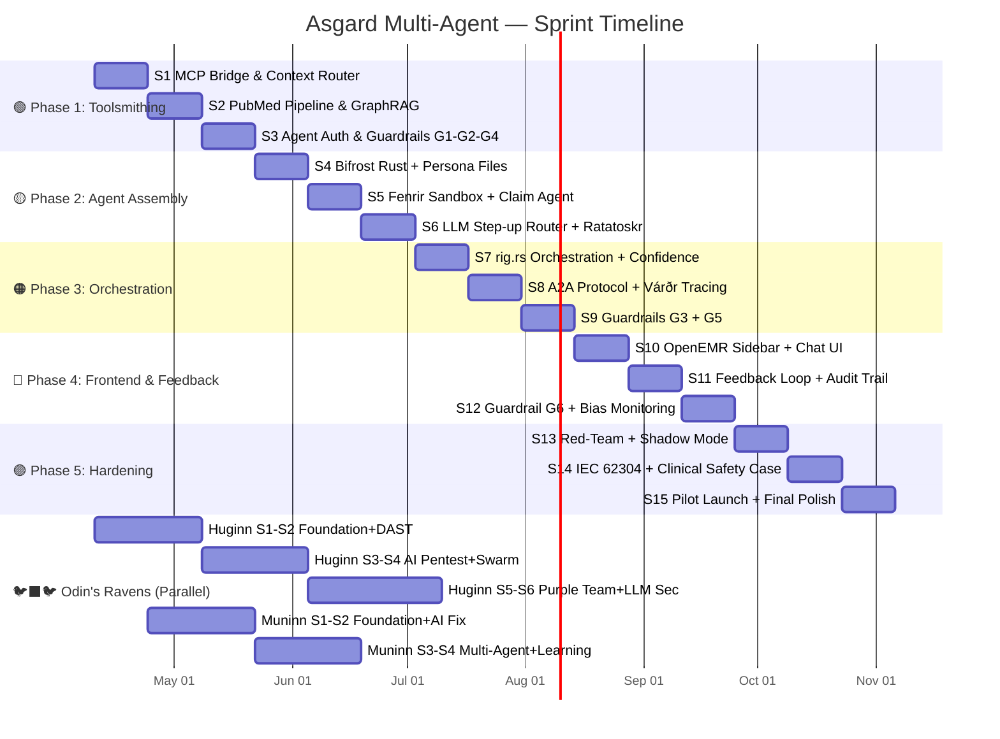

# 🗓️ Asgard Multi-Agent Ecosystem — Master Sprint Plan

> **Start Date:** 2026-04-10 (วันนี้)
> **Cadence:** 2-week sprints
> **Total:** 5 Phases × 3 Sprints = 15 Sprints (~30 สัปดาห์)
> **Architecture Reference:** [MultiAgent_Architecture_Plan.md](./MultiAgent_Architecture_Plan.md)

---

## 📊 Gantt Overview

---

## 🟢 Phase 1: Toolsmithing — สร้างเครื่องมือให้ AI (Week 1–6)

> **เป้าหมาย:** เตรียม Infrastructure ทุกตัวให้พร้อมคุยผ่าน MCP Protocol + เตรียมข้อมูลทางการแพทย์

### Sprint 1 (Apr 10 – Apr 24): MCP Bridge & Context Router
| Task | Service | Arch Ref | Done Criteria |
|------|---------|----------|---------------|
| Hermóðr ครอบ Eir Gateway ให้คุย MCP ได้ | 📨 Hermóðr + 🏥 Eir | §3, §4 | `tools/list` คืน Eir tools ผ่าน JSON-RPC |
| Context Router รับ Webhook จาก OpenEMR | 🏥 Eir | §4 | Event เปิดแฟ้ม/สั่งยา trigger Agent |
| Hermóðr ครอบ Heimdall | 📨 Hermóðr + 🛡️ Heimdall | §3 | `switch_model` ผ่าน MCP ได้ |
| Hermóðr ครอบ Yggdrasil | 📨 Hermóðr + 🌳 Yggdrasil | §3 | `validate_token` ผ่าน MCP ได้ |
| **Guardrail G1:** Prompt Injection Detection | 🏥 Eir / 📨 Hermóðr | §15 | Regex + Classifier ดักจับ Injection |

### Sprint 2 (Apr 24 – May 8): PubMed Pipeline & GraphRAG
| Task | Service | Arch Ref | Done Criteria |
|------|---------|----------|---------------|
| PubMed Ingestion Pipeline (E-utilities → Mimir) | 🧠 Mimir (Curator) | §2B, §5 | ดึง PMID, กรอง, Chunk, Embed ผ่าน Pipeline |
| 3-Tier Article Curation (Guidelines/Evidence/Context) | 🧠 Mimir (Curator) | §2B | Metadata tag tier ถูกต้องในทุก chunk |
| GraphRAG เชื่อมต่อ PrimeKG (Cypher queries) | 🧠 Mimir (Researcher) | §2C | `search_primekg` คืน Drug-Disease links |
| `search_medical_literature` tool (Vector DB → BigQuery) | 🧠 Mimir (Researcher) | §2B | Hybrid search ทำงาน < 5s |

### Sprint 3 (May 8 – May 22): Agent Auth & Early Guardrails
| Task | Service | Arch Ref | Done Criteria |
|------|---------|----------|---------------|
| Machine-User Tokens สำหรับทุก Agent | 🌳 Yggdrasil | §5, §10 | ทุก Agent มี JWT token เป็นของตัวเอง |
| **Guardrail G2:** PII/PHI Scrubbing pipeline | 🌳 Yggdrasil | §15 | ชื่อ→[PATIENT], HN→[ID] ก่อนส่ง LLM |
| **Guardrail G4:** Temperature Clamp + Token Budget | 🛡️ Heimdall | §15 | temp ≤ 0.3 บังคับ, Token budget enforced |
| ICD-10 Multi-Locale Namespace (cm/tm/jp) | 🧠 Mimir | §2E | Query `icd10:tm` คืนรหัสโรคภาษาไทย |

---

## 🟡 Phase 2: Agent Assembly — สร้างทีม AI (Week 7–12)

> **เป้าหมาย:** สร้าง Agent ทุกตัวพร้อม Persona Files + LLM Step-up Routing

### Sprint 4 (May 22 – Jun 5): Bifrost Rust + Persona Files
| Task | Service | Arch Ref | Done Criteria |
|------|---------|----------|---------------|
| Bifrost Orchestrator ใน Rust (Axum + rig.rs) | ⚡ Bifrost | §3, §5 | รับ Chat → มอบหมาย Agent → คืนคำตอบ |
| Agent Persona Files (IDENTITY/TONE/CONTEXT) ทุก Agent | ⚡ All | §9 | `asgard/personas/{name}/` มีครบ 3 ไฟล์ |
| GitOps Persona Synchronization | 🧠 Mimir | §9 | Save Personas ลง .md ใน Git เพื่อทำ Audit |
| MCP Client ใน Bifrost เชื่อมต่อ Hermóðr | ⚡ Bifrost | §11 | Bifrost เรียก Eir tools ผ่าน MCP ได้ |
| Odin Job Scheduler MVP + Cron Job Agents | 🔱 Odin | §4 | ตั้งเวลาปลุก Agent ทำงานกะดึก (เช่น สรุปประวัติพรุ่งนี้) |

### Sprint 5 (Jun 5 – Jun 19): Fenrir Sandbox + Claim Agent
| Task | Service | Arch Ref | Done Criteria |
|------|---------|----------|---------------|
| Fenrir Rust shell + Python sidecar (browser-use) | 🐺 Fenrir | §3, §5 | Fenrir รัน browser task ผ่าน Ratatoskr |
| Docker Sandbox per-task | 🐺 Fenrir | §10 | แต่ละ task รันใน Container แยก ไม่มี DB access |
| Claim Pre-Check + Auto-Submit Use Case #6 | 🐺 Fenrir + ⚡ Bifrost | §2F | ตรวจ Claim → กรอก e-Claim อัตโนมัติ |
| Ratatoskr ↔ Fenrir integration test | 🐿️ Ratatoskr + 🐺 Fenrir | §3 | Fenrir ใช้ `/api/v1/scrape` ของ Ratatoskr |

### Sprint 6 (Jun 19 – Jul 3): LLM Step-up + Billing Masters
| Task | Service | Arch Ref | Done Criteria |
|------|---------|----------|---------------|
| LLM Step-up Router (Local → Cloud เมื่อเคสอันตราย) | 🛡️ Heimdall + ⚡ Bifrost | §5 | Dangerousness score > threshold → Gemini |
| Billing Master Data Ingestion (TMT, TMLT, Rezept) | 🧠 Mimir | §2F | Query TMT/Rezept คืน Drug codes |
| Per-Tenant Persona Override (CONTEXT.md) | ⚡ Bifrost | §9 | คลินิกต่างกันเห็น AI คุยต่างกัน |
| Odin Health Monitor + Ping | 🔱 Odin | §4 | ทุก 5 นาที ping ทุก Agent, แจ้งเตือนถ้าล่ม |

---

## 🟠 Phase 3: Orchestration — ระบบตรรกะ (Week 13–18)

> **เป้าหมาย:** Bifrost คิดเป็น สั่งงานได้ + Trace ทุก Step + A2A Protocol

### Sprint 7 (Jul 3 – Jul 17): Orchestration + Studio Foundation
| Task | Service | Arch Ref | Done Criteria |
|------|---------|----------|---------------|
| rig.rs Multi-Agent Orchestration graph | ⚡ Bifrost | §5 | Bifrost แตก task → Eir + Mimir → รวมคำตอบ |
| Confidence Scoring system | ⚡ Bifrost | §6 | ทุก Response มี score + source badges |
| Source Hierarchy enforcement (🟢🔵🟡🔴) | ⚡ Bifrost | §6 | Badge สีถูกต้องตาม Source Level |
| **Guardrail G3:** Scope Guard + Tool Allowlist | ⚡ Bifrost | §15 | ถามนอกเรื่อง → ปฏิเสธ, เรียก Tool นอกรายการ → REJECT |
| Trajectory Context Compressor | ⚡ Bifrost | §5 | บีบอัด Context ถ้ายาวเกินไป (ป้องกัน Hallucination) |
| Studio: DB Migrations, Team CRUD, Auto-save API | 🧠 Mimir | Studio | 3 tables + Canvas save/load ทำงานได้ |
| Studio: Team List, ReactFlow Canvas, Node Types | 🧠 Mimir | Studio | Canvas UI สำหรับสร้าง Team |

### Sprint 8 (Jul 17 – Jul 31): A2A Protocol + Studio Execution
| Task | Service | Arch Ref | Done Criteria |
|------|---------|----------|---------------|
| A2A Server — Agent Card registry ใน Mimir | 🧠 Mimir | §11 | `/.well-known/agent.json` serve ได้ |
| A2A Client — Bifrost ค้นพบ Agent ภายนอก | ⚡ Bifrost | §11 | Bifrost list external agents ได้ |
| Várðr OpenTelemetry integration | 🛡️ Várðr | §12 | Trace ID ตาม Agent chain ครบ |
| Clinical Trace JSON format | 🛡️ Várðr | §12 | JSON trace มี agent/tool/latency/status |
| Studio: Persona CRUD + Inspector Forms Detais | 🧠 Mimir | Studio | ตั้งค่า Guardrails/Delegation บน Node ได้ |
| Studio: Test Sandbox + BifrostTeamSpec Compiler | 🧠 Mimir | Studio | Chat test + Deploy API คุยกับ Bifrost ได้ |

### Sprint 9 (Jul 31 – Aug 14): Output Guardrails + Studio Polish
| Task | Service | Arch Ref | Done Criteria |
|------|---------|----------|---------------|
| **Guardrail G5:** Citation Enforcement | ⚡ Bifrost | §15 | ไม่มี source → Badge แดง |
| **Guardrail G5:** Confidence Gate (< 60% → ปฏิเสธ) | ⚡ Bifrost | §15 | Low-confidence → แสดงปฏิเสธสุภาพ |
| **Guardrail G5:** Contraindication Double-Check | ⚡ Bifrost + 🧠 Mimir | §15 | คำตอบมียา → auto cross-check PrimeKG |
| Disclaimer Injection ทุกคำตอบ | ⚡ Bifrost | §14, §15 | ทุก Response มี disclaimer |
| Progressive Loading UI | ⚡ Bifrost | §7 | แสดงสถานะ "กำลังดึงข้อมูล..." |
| Studio: Auto-layout, AI Team Generator, 5 Presets | 🧠 Mimir | Studio | UI พร้อมใช้งาน 100% |

---

## 🔴 Phase 4: Frontend & Feedback (Week 19–24)

> **เป้าหมาย:** แพทย์ใช้งานจริง + ระบบ Feedback 3 ระดับ + Audit Trail

### Sprint 10 (Aug 14 – Aug 28): OpenEMR Integration
| Task | Service | Arch Ref | Done Criteria |
|------|---------|----------|---------------|
| Chat Sidebar ใน OpenEMR | 🏥 Eir + ⚡ Bifrost | §5 | หมอถาม AI ใน Sidebar ได้ |
| Secure Messaging Webhooks (LINE/Teams) | 🏥 Eir + 🌳 Yggdrasil | §3 | แพทย์สั่ง Agent จากมือถือผ่าน Chat App ภายนอก |
| Pre-Visit Summary auto-popup | 🏥 Eir + ⚡ Bifrost | §1 UC1 | เปิดแฟ้ม → Summary โผล่ < 500ms |
| Drug Interaction Alert real-time | ⚡ Bifrost + 🧠 Mimir | §1 UC2 | สั่งยา → Alert ทันที < 2s |
| Clinical Note auto-draft | 🏥 Eir + ⚡ Bifrost | §1 UC5 | ปิด Encounter → Clinical Note draft |

### Sprint 11 (Aug 28 – Sep 11): Feedback + Audit Trail
| Task | Service | Arch Ref | Done Criteria |
|------|---------|----------|---------------|
| Feedback 3 ระดับ (✅ ✏️ ⚠️) | ⚡ Bifrost + Frontend | §8 | 3 ปุ่ม ทำงานครบ บันทึกลง DB |
| Structured Audit Trail schema | ⚡ Bifrost + DB | §13 | 14 fields + Content Hash ลง MariaDB |
| Audit ↔ Trace ↔ Encounter linking | 🛡️ Várðr | §12, §13 | trace_id → encounter_id cross-ref ได้ |
| Correction Pair collection | ⚡ Bifrost | §8 | หมอกด ✏️ → เก็บ correction text |

### Sprint 12 (Sep 11 – Sep 25): Feedback Guardrail
| Task | Service | Arch Ref | Done Criteria |
|------|---------|----------|---------------|
| **Guardrail G6:** Circuit Breaker | 🔱 Odin | §15 | ⚠️ > 3/week → Pattern หยุดทันที |
| **Guardrail G6:** Drift Detection | 🔱 Odin | §15 | Confidence เฉลี่ยลดลง → Alert |
| **Guardrail G6:** Bias Monitoring | 🔱 Odin | §15 | ยาบางยี่ห้อถูกแนะนำมากผิดปกติ → Flag |
| Preference Memory (Human-in-the-loop) | 🧠 Mimir + ⚡ Bifrost | §8 | เรียนรู้การแก้ Feedback ✏️ แล้วเสนออัปเดต Identity |
| Odin QA Dashboard | 🔱 Odin + Frontend | §4 | Admin เห็น feedback stats |

---

## 🟣 Phase 5: Hardening & Compliance (Week 25–30)

> **เป้าหมาย:** ระบบปลอดภัยพร้อมให้คลินิกนำร่องใช้งาน

### Sprint 13 (Sep 25 – Oct 9): Red-Team + Shadow Mode
| Task | Service | Arch Ref | Done Criteria |
|------|---------|----------|---------------|
| Red-Team Testing (Prompt Injection สารพัดท่า) | All | §14 | ทดสอบ 50+ attack vectors, pass ≥ 95% |
| Shadow Mode deployment | ⚡ Bifrost | §14 | AI แนะนำแต่ไม่ Execute |
| Shadow Mode statistics dashboard | Frontend | §14 | เปรียบเทียบ AI vs หมอ accuracy |
| Consent Verification flow | 🌳 Yggdrasil | §15 G2 | คนไข้ต้อง consent ก่อน AI ดูข้อมูล |

### Sprint 14 (Oct 9 – Oct 23): Compliance Documentation
| Task | Service | Arch Ref | Done Criteria |
|------|---------|----------|---------------|
| IEC 62304 Clinical Safety Case document | Docs | §14 | เอกสาร Safety Case ฉบับสมบูรณ์ |
| ISO 29110 alignment verification | Docs | §14 | Review PM/SI docs ทั้ง ecosystem |
| PDPA/HIPAA data flow audit | All | §14, §15 | Flow diagram + PII touchpoints mapped |
| Model versioning & rollback procedure | 🛡️ Heimdall | §13 | Rollback model ได้ภายใน 5 นาที |

### Sprint 15 (Oct 23 – Nov 6): Pilot Launch 🚀
| Task | Service | Arch Ref | Done Criteria |
|------|---------|----------|---------------|
| Mega Care Clinic pilot deployment | All | §1 | คลินิก 1 แห่ง ใช้งานจริง 2 สัปดาห์ |
| Pilot feedback collection & analysis | 🔱 Odin | §8 | รวบรวม feedback ≥ 100 interactions |
| Performance tuning (Latency SLA) | All | §7 | ทุก Use Case ผ่าน Latency Budget |
| v1.0 Release preparation | 🏰 Asgard | — | CHANGELOG, version bump, Docker images |

---

## 🐦‍⬛🐦 Odin's Ravens — Parallel Track

> รัน **ขนานกับ Main Track** — ไม่มี dependency

### 🐦‍⬛ Huginn (Security Scanner)
| Sprint | Duration | Key Deliverables |
|--------|----------|------------------|
| H-S1 Foundation | Apr 10 – Apr 24 | Cargo scaffold, `/api/scan`, SQLite, nmap |
| H-S2 DAST+SAST | Apr 24 – May 8 | OWASP ZAP, Semgrep integration |
| H-S3 AI Pentest | May 8 – May 22 | LLM-driven exploit generation |
| H-S4 Multi-Agent Swarm | May 22 – Jun 5 | 4 specialized scanner agents |
| H-S5 Purple Team | Jun 5 – Jun 26 | Attack + Defend loop |
| H-S6 LLM Security | Jun 26 – Jul 10 | Prompt injection scanner for Asgard |

### 🐦 Muninn (Auto-Fixer)
| Sprint | Duration | Key Deliverables |
|--------|----------|------------------|
| M-S1 Foundation | Apr 24 – May 8 | GitHub poller, issue watcher |
| M-S2 AI Analyzer+Fix | May 8 – May 22 | LLM code analysis, PR generation |
| M-S3 Multi-Agent Pipeline | May 22 – Jun 5 | Scanner → Analyzer → Fixer chain |
| M-S4 Continuous Learning | Jun 5 – Jun 19 | Feedback loop, fix quality tracking |

---

## 📅 Sprint Calendar Summary

| Sprint | Dates | Phase | Key Theme |
|--------|-------|-------|-----------|
| **S1** | Apr 10 – Apr 24 | 🟢 1 | MCP Bridge + Context Router |
| **S2** | Apr 24 – May 8 | 🟢 1 | PubMed + GraphRAG |
| **S3** | May 8 – May 22 | 🟢 1 | Agent Auth + Guardrails |
| **S4** | May 22 – Jun 5 | 🟡 2 | Bifrost Rust + Personas |
| **S5** | Jun 5 – Jun 19 | 🟡 2 | Fenrir Sandbox + Claims |
| **S6** | Jun 19 – Jul 3 | 🟡 2 | LLM Step-up + Billing |
| **S7** | Jul 3 – Jul 17 | 🟠 3 | Orchestration + Confidence |
| **S8** | Jul 17 – Jul 31 | 🟠 3 | A2A + Observability |
| **S9** | Jul 31 – Aug 14 | 🟠 3 | Output Guardrails |
| **S10** | Aug 14 – Aug 28 | 🔴 4 | OpenEMR Integration |
| **S11** | Aug 28 – Sep 11 | 🔴 4 | Feedback + Audit Trail |
| **S12** | Sep 11 – Sep 25 | 🔴 4 | Bias Monitoring |
| **S13** | Sep 25 – Oct 9 | 🟣 5 | Red-Team + Shadow Mode |
| **S14** | Oct 9 – Oct 23 | 🟣 5 | IEC 62304 Compliance |
| **S15** | Oct 23 – Nov 6 | 🟣 5 | 🚀 Pilot Launch |

---

*📅 Created: April 10, 2026 — Sprint Start: Today*
