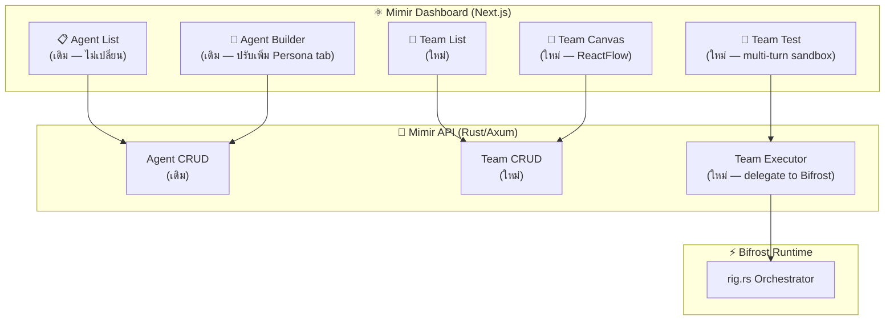
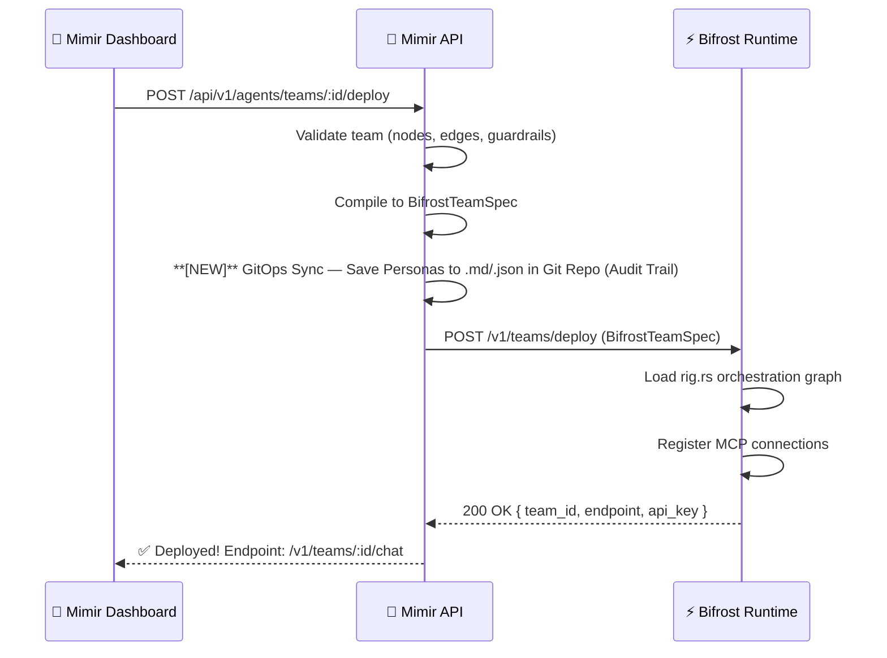

# 🏥 Multi-Agent Studio — Design Document

> ออกแบบใหม่ Agent Studio ใน Mimir Dashboard ให้รองรับ Multi-Agent Orchestration
> **ปัจจุบัน:** Single Agent Builder (CRUD + Chat + AI Generator)
> **เป้าหมาย:** Visual Multi-Agent Team Builder with Delegation, Guardrails, and Test Sandbox

---

## UI Mockup


---

## 📊 Current vs Proposed — เปรียบเทียบ

| Feature | ปัจจุบัน (Single Agent) | ใหม่ (Multi-Agent Studio) |
|---------|------------------------|--------------------------|
| สร้าง Agent | ✅ Form-based builder | ✅ เหมือนเดิม + Drag & Drop |
| Agent ทีม | ❌ ไม่มี | ✅ **Agent Team** — กลุ่ม Agent ที่ทำงานร่วมกัน |
| Visual Workflow | ❌ ไม่มี | ✅ **ReactFlow Canvas** — ลาก วาง เชื่อม |
| Delegation Rules | ❌ ไม่มี | ✅ **Routing Conditions** — กฎการมอบหมายงาน |
| Guardrails Config | ❌ ไม่มี | ✅ **G1-G6 Checkboxes** per-node |
| Confidence Gate | ❌ ไม่มี | ✅ **Threshold slider** per-team |
| Persona System | ❌ แค่ system prompt | ✅ **IDENTITY/TONE/CONTEXT** files |
| Test Mode | ❌ แค่ 1:1 chat | ✅ **Team Test** — ทดสอบทั้ง pipeline |
| Deploy | ✅ Publish + API Key | ✅ **Deploy Team** to Bifrost |

---

## 🏗️ Architecture — 4 Layers



---

## 📐 Data Model — 3 New Tables

### 1. `agent_teams` — ทีม Agent

```sql
CREATE TABLE agent_teams (
  id UUID PRIMARY KEY,
  tenant_id UUID NOT NULL,
  name VARCHAR(255) NOT NULL,
  description TEXT,
  persona_id VARCHAR(50), -- Reference to personas
  max_nodes INT DEFAULT 10,
  confidence_threshold FLOAT DEFAULT 0.6,
  status VARCHAR(20) DEFAULT 'draft',
  created_at TIMESTAMP,
  updated_at TIMESTAMP
);

CREATE TABLE personas (
  id VARCHAR(50) PRIMARY KEY,
  tenant_id UUID NOT NULL,
  name VARCHAR(255) NOT NULL,
  identity TEXT,
  tone TEXT,
  context TEXT,
  created_at TIMESTAMP,
  updated_at TIMESTAMP
);
```

### 2. `agent_team_nodes` — Node บน Canvas

```sql
CREATE TABLE agent_team_nodes (
    id              INT PRIMARY KEY AUTO_INCREMENT,
    team_id         INT NOT NULL,
    node_type       ENUM('input', 'agent', 'router', 'synthesizer', 'output', 'guardrail'),
    agent_id        INT NULL,                       -- FK → agents (null สำหรับ system nodes)
    external_agent  VARCHAR(50) NULL,               -- "eir", "fenrir", "mimir" (Asgard services)
    label           VARCHAR(200),
    config          JSON,                           -- Node-specific config
    position_x      FLOAT NOT NULL,
    position_y      FLOAT NOT NULL,
    
    FOREIGN KEY (team_id) REFERENCES agent_teams(id) ON DELETE CASCADE,
    FOREIGN KEY (agent_id) REFERENCES agents(id)
);
```

### 3. `agent_team_edges` — เส้นเชื่อม

```sql
CREATE TABLE agent_team_edges (
    id              INT PRIMARY KEY AUTO_INCREMENT,
    team_id         INT NOT NULL,
    source_node_id  INT NOT NULL,
    target_node_id  INT NOT NULL,
    condition       JSON NULL,                      -- {"type": "intent", "value": "medical_query"}
    priority        INT DEFAULT 0,
    
    FOREIGN KEY (team_id) REFERENCES agent_teams(id) ON DELETE CASCADE,
    FOREIGN KEY (source_node_id) REFERENCES agent_team_nodes(id),
    FOREIGN KEY (target_node_id) REFERENCES agent_team_nodes(id)
);
```

---

## 🖥️ Frontend Design — 5 Views

### View 1: Team List (หน้าแรก)

```
┌─────────────────────────────────────────────────┐
│  🏥 Multi-Agent Studio                          │
│                                                  │
│  ┌──────────┐  ┌──────────┐  ┌──────────┐      │
│  │ Sleep    │  │ Drug     │  │ Claim    │  [+]  │
│  │ Clinic   │  │ Check    │  │ Automator│       │
│  │ ──────── │  │ ──────── │  │ ──────── │       │
│  │ 4 agents │  │ 2 agents │  │ 3 agents │       │
│  │ ● Live   │  │ ○ Draft  │  │ ○ Draft  │       │
│  └──────────┘  └──────────┘  └──────────┘       │
│                                                  │
│  ── Standalone Agents ──                        │
│  (Agent List เดิมอยู่ด้านล่าง, ไม่หาย)         │
└─────────────────────────────────────────────────┘
```

- **New URL:** `/agents` → แบ่ง 2 sections:
  - **Agent Teams** (ด้านบน) — Cards แสดงทีม
  - **Standalone Agents** (ด้านล่าง) — Agent เดี่ยวเหมือนเดิม

### View 2: Team Canvas (ReactFlow)

> ❗ ใช้ `@xyflow/react` (ReactFlow v12) — เป็นมาตรฐาน visual workflow builder

```
┌─ Agent Palette ─┬─── Canvas ─────────────────┬── Inspector ──┐
│ 🔍 Search       │                             │ ⚡ Bifrost    │
│                  │    [User Input]             │               │
│ ── Asgard ──    │         │                   │ Delegation:   │
│ ⚡ Bifrost       │    [Bifrost Router]──┐     │ ☑ medical →   │
│ 🧠 Mimir        │    │    │     │       │     │   Mimir       │
│ 🏥 Eir          │ [Mimir][Eir][Fenrir]  │     │ ☑ browser →   │
│ 🐺 Fenrir       │    │    │     │       │     │   Fenrir      │
│ 🛡️ Heimdall     │    └────┴─────┘       │     │               │
│                  │    [Synthesizer]       │     │ Guardrails:   │
│ ── Custom ──    │         │              │     │ ☑ G3 Scope    │
│ 🤖 My Agent 1   │    [Response]          │     │ ☑ G5 Citation │
│ 🤖 My Agent 2   │                       │     │               │
│                  │                       │     │ Confidence:   │
│ ── System ──    │                       │     │ ──●── 60%     │
│ 📩 Input        │                       │     │               │
│ 📤 Output       │                       │     │ Persona:      │
│ 🔄 Router       │                       │     │ [Medical TH ▼]│
│ 🛡️ Guardrail    │                       │     │               │
│ 🎯 Synthesizer  │                       │     │ [Delete Node] │
└──────────────────┴───────────────────────┴────────────────────┘
```

**Node Types:**

| Type | Icon | Agent | Role | Studio Palette |
|-------|------|----------------|
| 🧠 **Mimir** | Knowledge Engine (RAG/Medical) | ✅ |
| 🏥 **Eir** | OpenEMR / FHIR Bridge | ✅ |
| 🐺 **Fenrir** | Computer Use / Web Forms | ✅ |
| 🐦 **Muninn** | Code/Issue Fixer | ✅ |
| 🐦‍⬛ **Huginn** | Security Pentester | ✅ |

> [!NOTE]
> **Hidden Agents:** 📨 Hermóðr, 🐿️ Ratatoskr, 🛡️ Heimdall, 🌳 Yggdrasil, 🛡️ Várðr, และ 🔱 Odin จะไม่แสดงใน Agent Palette เนื่องจากเป็น Infrastructure/Platform Services ที่ถูกเรียกใช้โดยอัตโนมัติเบื้องหลัง ไม่ใช่ Agent ระดับ application ที่ผู้ใช้ (แพทย์/แอดมินสร้างทีม) จะนำมาต่อ flow ได้เอง

**Edge Conditions:**

```typescript
interface EdgeCondition {
  type: "always" | "intent" | "confidence" | "keyword" | "custom";
  value?: string;        // intent class or keyword
  threshold?: number;    // confidence threshold
  expression?: string;   // custom Rust expression
}
```

### View 3: Team Inspector (Right Panel)

แต่ละ Node type มี Inspector form ต่างกัน:

**Router Node Inspector:**
```
┌─ ⚡ Bifrost Router ──────────────┐
│                                   │
│ Delegation Rules:                 │
│ ┌─────────────────────────────┐  │
│ │ IF intent = "medical_query" │  │
│ │ THEN → Mimir (search_kb)   │  │
│ │ ────────────────────────── │  │
│ │ IF intent = "patient_data"  │  │
│ │ THEN → Eir (read_fhir)     │  │
│ │ ────────────────────────── │  │
│ │ IF intent = "browser_task"  │  │
│ │ THEN → Fenrir (navigate)   │  │
│ │ ────────────────────────── │  │
│ │ ELSE → Mimir (fallback)    │  │
│ └─────────────────────────────┘  │
│ [+ Add Rule]                     │
│                                   │
│ Parallel Execution: ☑            │
│ Max Concurrent Agents: [3]       │
│ Timeout (seconds): [30]          │
└───────────────────────────────────┘
```

**Agent Node Inspector:**
```
┌─ 🧠 Mimir: Search Knowledge ────┐
│                                   │
│ Agent: [Mimir Researcher    ▼]   │
│                                   │
│ Override System Prompt: ☐        │
│ Override Temperature: ☐          │
│                                   │
│ MCP Tools (Allowlist):           │
│ ☑ search_knowledge               │
│ ☑ search_primekg                 │
│ ☐ ingest_pubmed                  │
│                                   │
│ Input Mapping:                    │
│ user_query    → query            │
│ patient_id    → context.pid      │
│                                   │
│ Output: "knowledge_results"      │
└───────────────────────────────────┘
```

### View 4: Team Test Sandbox

```
┌─────────────────────────────────────────────────┐
│  🧪 Test Team: Sleep Clinic Assistant           │
│                                                  │
│  ┌─ Chat ──────────┐  ┌─ Agent Trace ────────┐ │
│  │ 👤 คนไข้ HN123  │  │ Step 1: Bifrost      │ │
│  │    มีปัญหานอน   │  │   Intent: medical    │ │
│  │    ไม่หลับ      │  │   → Delegate: Mimir  │ │
│  │                  │  │   → Delegate: Eir    │ │
│  │ 🤖 ระบบพบว่า... │  │                      │ │
│  │   📊 7 sources  │  │ Step 2: Mimir        │ │
│  │   🏥 HN: 12345  │  │   Tool: search_kb    │ │
│  │   💊 ยา: ...    │  │   Results: 7 chunks  │ │
│  │                  │  │   Confidence: 0.82   │ │
│  │                  │  │                      │ │
│  │ ────────────── │  │ Step 3: Eir          │ │
│  │ [Type message]  │  │   Tool: read_fhir    │ │
│  │                  │  │   Patient: loaded    │ │
│  └──────────────────┘  │                      │ │
│                         │ Step 4: Synthesize   │ │
│  ┌─ Metrics ─────────┐ │   Confidence: 0.78  │ │
│  │ Latency: 2.3s     │ │   Sources: 7        │ │
│  │ Agents: 3/3 ✅    │ │   Guardrails: PASS  │ │
│  │ Guardrails: PASS  │ └──────────────────────┘ │
│  │ Confidence: 78%   │                          │
│  └───────────────────┘                          │
└─────────────────────────────────────────────────┘
```

### View 5: Persona Manager (New Tab in Agent Builder)

```
┌─ Agent Builder ─────────────────────────────────┐
│  [Basic] [Model] [Behavior] [RAG] [Tools]       │
│                    └── ✨ NEW: [Persona] tab     │
│                                                  │
│  ┌─ IDENTITY.md ──────────────────────────────┐ │
│  │ ชื่อ: หมอมิเมียร์                          │ │
│  │ บทบาท: ผู้ช่วยแพทย์ด้านเวชศาสตร์การนอนหลับ │ │
│  │ ภาษา: ไทย, อังกฤษ (Medical)               │ │
│  └────────────────────────────────────────────┘ │
│                                                  │
│  ┌─ TONE.md ──────────────────────────────────┐ │
│  │ สุภาพ, ระมัดระวัง, ไม่วินิจฉัยโดยตรง      │ │
│  │ ใช้ "ข้อมูลแนะนำ" แทน "แพทย์บอกว่า"       │ │
│  └────────────────────────────────────────────┘ │
│                                                  │
│  ┌─ CONTEXT.md ───────────────────────────────┐ │
│  │ คลินิก: MegaCare Sleep Center              │ │
│  │ เปิด: จ-ศ 8:00-17:00                      │ │
│  │ แพทย์: นพ.สมชาย (Pulmonologist)            │ │
│  └────────────────────────────────────────────┘ │
└─────────────────────────────────────────────────┘
```

---

## 🔌 Backend API — New Endpoints

### Team CRUD

```
GET    /api/v1/agents/teams              → list teams
POST   /api/v1/agents/teams              → create team
GET    /api/v1/agents/teams/:id          → get team (with nodes & edges)
PUT    /api/v1/agents/teams/:id          → update team
DELETE /api/v1/agents/teams/:id          → delete team
POST   /api/v1/agents/teams/:id/publish  → publish team → Bifrost
```

### Team Canvas (Nodes & Edges)

```
PUT    /api/v1/agents/teams/:id/canvas   → save entire canvas (nodes + edges)
GET    /api/v1/agents/teams/:id/canvas   → load canvas
```

### Team Execution

```
POST   /api/v1/agents/teams/:id/test     → test team (proxy to Bifrost)
GET    /api/v1/agents/teams/:id/trace    → get last execution trace
POST   /api/v1/agents/teams/:id/deploy   → deploy to Bifrost runtime
```

### Persona Management

```
GET    /api/v1/personas                   → list persona templates
POST   /api/v1/personas                   → create persona
GET    /api/v1/personas/:id               → get persona (IDENTITY/TONE/CONTEXT)
PUT    /api/v1/personas/:id               → update persona
```

---

## 📦 Dependencies (Frontend)

```json
{
  "@xyflow/react": "^12.0.0",       // ReactFlow v12 — visual canvas
  "elkjs": "^0.9.0",                // Auto-layout algorithm
  "@dnd-kit/core": "^6.0.0"         // Drag & Drop from palette to canvas
}
```

---

## 🗓️ Implementation Phases

### Phase A (Sprint S7): Foundation
| Task | Component | Effort |
|------|-----------|--------|
| DB Migration: 3 new tables + `personas` | Mimir Backend | 1 day |
| Team CRUD + Canvas save/load API | Mimir Backend | 2 days |
| Auto-save (debounced PUT) | Mimir Backend | 0.5 day |
| Team List view (View 1) | Mimir Frontend | 1 day |
| ReactFlow Canvas + Node types (View 2) | Mimir Frontend | 3 days |
| Inspector forms (View 3) | Mimir Frontend | 2 days |
| **Constraint: max 10 nodes per team** | Both | built-in |

### Phase B (Sprint S8): Execution
| Task | Component | Effort |
|------|-----------|--------|
| Persona CRUD API + tab (View 5) | Both | 2 days |
| BifrostTeamSpec compiler | Mimir Backend | 2 days |
| Team deploy API → Bifrost | Mimir Backend | 1 day |
| Team Test sandbox + trace (View 4) | Mimir Frontend | 3 days |
| Delegation rules UI | Mimir Frontend | 2 days |
| Guardrails checkbox per-node | Mimir Frontend | 1 day |

### Phase C (Sprint S9/S10): Polish & Deploy
| Task | Component | Effort |
|------|-----------|--------|
| Bifrost: `/v1/teams/deploy` + runtime | Bifrost Backend | 3 days |
| Bifrost: Team orchestration (rig.rs graph) | Bifrost Backend | 3 days |
| Auto-layout (ELK) | Mimir Frontend | 1 day |
| AI Team Generator | Both | 3 days |
| Template teams (5 presets) | Mimir Backend | 1 day |

---

## 🎯 Migration Strategy — ไม่ทำลายของเดิม

> [!IMPORTANT]
> **Agent เดี่ยวยังใช้ได้เหมือนเดิม** — Multi-Agent Studio เป็นฟีเจอร์เพิ่ม ไม่ใช่แทนที่

1. **Standalone agents** ยังทำงานเหมือนเดิม — chat, publish, API key
2. **Team** คือ layer ใหม่ที่ **reference** ไปยัง standalone agents
3. Agent เดียวกันสามารถอยู่ในหลาย Team ได้
4. URL: `/agents` → ส่วนบนเป็น Teams, ส่วนล่างเป็น Standalone
5. **Deploy** ส่ง `BifrostTeamSpec` ไปยัง Bifrost Runtime — ได้ endpoint `/v1/teams/:id/chat`

---

## ✅ Decisions (Resolved)

| Question | Decision |
|----------|----------|
| Team size limit | **Max 10 nodes** per team |
| Real-time collaboration | **No** — ใช้ Auto-save แทน (เรียบง่ายกว่า) |
| Deploy target | **Bifrost Runtime** — ผ่าน deploy API |
| ReactFlow License | MIT ✅ — attribute ใน README |

---

## 💾 Auto-Save — Debounced Canvas Persistence

> ทุกการเปลี่ยนแปลงบน Canvas จะถูกบันทึกอัตโนมัติ — ไม่ต้องกด Save

### วิธีทำงาน

```typescript
// useAutoSave hook — debounce 2 วินาที
const saveTimer = useRef<NodeJS.Timeout>();

const onNodesChange = (changes) => {
  applyNodeChanges(changes); // update ReactFlow state
  
  // Debounced auto-save
  clearTimeout(saveTimer.current);
  saveTimer.current = setTimeout(async () => {
    await saveCanvas(teamId, { nodes, edges });
    setLastSaved(new Date());
  }, 2000);
};
```

### Backend Endpoint

```
PUT /api/v1/agents/teams/:id/canvas
    Body: { nodes: [...], edges: [...] }
    Response: { saved_at: "2026-04-10T17:00:00Z" }
```

### Canvas Top Bar

```
┌─ Canvas Top Bar ──────────────────────────────────┐
│ 🎨 Sleep Clinic Assistant                          │
│                                                     │
│ 💾 Last saved: 3s ago  ·  [Test Team] [Deploy]     │
└─────────────────────────────────────────────────────┘
```

---

## 🚀 Bifrost Deploy Protocol — Team → Runtime

> เมื่อกด **Deploy** ใน Multi-Agent Studio จะส่ง Team config ไปยัง Bifrost

### Deploy Flow



### BifrostTeamSpec (ส่งจาก Mimir → Bifrost)

```json
{
  "team_id": "sleep-clinic-001",
  "tenant_id": 1,
  "display_name": "Sleep Clinic Assistant",
  "max_nodes": 10,
  "confidence_threshold": 0.6,
  "persona": {
    "identity": "หมอมิเมียร์ — ผู้ช่วยแพทย์...",
    "tone": "สุภาพ, ระมัดระวัง...",
    "context": "MegaCare Sleep Center..."
  },
  "guardrails": {
    "g1_input_sanitize": true,
    "g3_scope_guard": true,
    "g5_citation_check": true,
    "g5_confidence_gate": true,
    "g5_disclaimer": true
    // หมายเหตุ: G2 (Privacy), G4 (LLM), G6 (Feedback) ไม่ได้อยู่ใน Team Spec 
    // เนื่องจากถูกบังคับใช้ที่ระดับ Service (Yggdrasil, Heimdall, Odin) โดยอัตโนมัติ
  },
  "graph": {
    "nodes": [
      { "id": "input-1", "type": "input" },
      { "id": "router-1", "type": "router", "config": {
        "rules": [
          { "intent": "medical_query", "target": "mimir-1" },
          { "intent": "patient_data", "target": "eir-1" },
          { "intent": "browser_task", "target": "fenrir-1" }
        ],
        "parallel": true,
        "timeout_seconds": 30
      }},
      { "id": "mimir-1", "type": "external", "service": "mimir", "tools": ["search_knowledge", "search_primekg"] },
      { "id": "eir-1", "type": "external", "service": "eir", "tools": ["read_fhir", "get_patient_summary"] },
      { "id": "fenrir-1", "type": "external", "service": "fenrir", "tools": ["navigate_browser", "fill_form"] },
      { "id": "synth-1", "type": "synthesizer", "config": { "strategy": "merge_with_citations" } },
      { "id": "output-1", "type": "output", "config": { "disclaimer": true } }
    ],
    "edges": [
      { "source": "input-1", "target": "router-1" },
      { "source": "router-1", "target": "mimir-1", "condition": { "type": "intent", "value": "medical_query" } },
      { "source": "router-1", "target": "eir-1", "condition": { "type": "intent", "value": "patient_data" } },
      { "source": "router-1", "target": "fenrir-1", "condition": { "type": "intent", "value": "browser_task" } },
      { "source": "mimir-1", "target": "synth-1" },
      { "source": "eir-1", "target": "synth-1" },
      { "source": "fenrir-1", "target": "synth-1" },
      { "source": "synth-1", "target": "output-1" }
    ]
  }
}
```

### Bifrost Runtime Endpoints (After Deploy)

```
POST /v1/teams/:team_id/chat     → Run team orchestration
POST /v1/teams/:team_id/stream   → SSE streaming orchestration
GET  /v1/teams/:team_id/health   → Team health status
GET  /v1/teams/:team_id/trace    → Last execution trace
DELETE /v1/teams/:team_id        → Undeploy team
```
