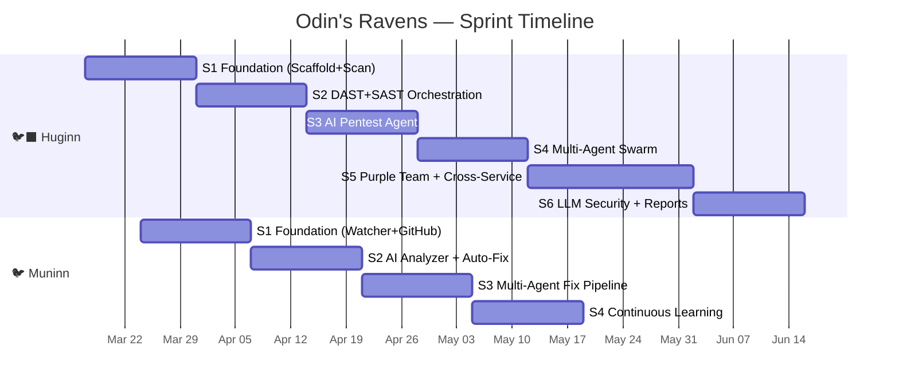

# 🐦‍⬛ Huginn & 🐦 Muninn — Implementation Plan & Sprint Planning

> Version 3.0 · March 2026 · Rust/Axum · Multi-Agent Architecture
>
> Asgard เป็นของทุกคนแล้ว — Asgard belongs to everyone.

---

## Overview

| Service | Role | Stack | Port | Memory |
|:--|:--|:--|:--|:--|
| 🐦‍⬛ **Huginn** | Security Scanner + Multi-Agent Pentest | 🦀 Rust/Axum | `:8400` | 50 MB idle, 2.3 GB scan |
| 🐦 **Muninn** | Issue Watcher + Multi-Agent Auto-Fixer | 🦀 Rust/Axum | `:8500` | 30 MB idle |

---

## 📅 Timeline

---

## 🐦‍⬛ Huginn — Sprint Breakdown

### Sprint 1: Foundation (Week 1-2)

> Scope: Scaffold Rust project, healthcheck, scan API, basic blackbox scan

| # | Task | Detail | Acceptance |
|:--|:--|:--|:--|
| H1.1 | Cargo project scaffold | `main.rs`, `config.rs`, `health.rs`, `db.rs`, `models.rs` | `cargo build` passes |
| H1.2 | Dockerfile + Docker Compose | Multi-stage build, add to Asgard compose | `docker compose up huginn` works |
| H1.3 | `GET /health` | Asgard health endpoint pattern | Várðr can scrape |
| H1.4 | `POST /api/scan` | Accept target URL + scan type | Returns scan_id |
| H1.5 | `GET /api/scans/{id}` | Return scan status + results | JSON response |
| H1.6 | SQLite schema | `scans`, `findings`, `suppressions` tables | `cargo test` passes |
| H1.7 | Basic nmap scan | `tokio::process::Command` → nmap → parse XML | Findings in DB |

**Deliverable:** Huginn boots, registers in Várðr, accepts scan requests

---

### Sprint 2: DAST + SAST Orchestration (Week 3-4)

> Scope: ZAP, Semgrep, Trivy orchestration; severity mapping; result normalization

| # | Task | Detail | Acceptance |
|:--|:--|:--|:--|
| H2.1 | ZAP baseline scan | `docker run --rm --memory=1.5g` ZAP → JSON → `Finding` | DAST findings |
| H2.2 | Semgrep SAST scan | Clone repo → Semgrep → parse JSON | SAST findings |
| H2.3 | Trivy container scan | Image name → Trivy → parse JSON | CVE findings |
| H2.4 | sslyze TLS scan | Target URL → sslyze → TLS grade | TLS findings |
| H2.5 | Severity mapping | ZAP/Semgrep/Trivy → unified `Severity` enum | All tools normalized |
| H2.6 | Scan orchestrator | Sequential tool execution + progress tracking | Scan complete flow |
| H2.7 | GitHub report push | octocrab → push markdown report to repo | Report in repo |
| H2.8 | GitHub issue creation | Critical/High findings → GitHub issues | Issues created |

**Deliverable:** Full blackbox + whitebox scan → report → issues

---

### Sprint 3: AI Pentest Agent (Week 5-6)

> Scope: Single ReAct pentest agent + LLM integration + chatbot

| # | Task | Detail | Acceptance |
|:--|:--|:--|:--|
| H3.1 | LLM client (Heimdall) | OpenAI-compatible API client in Rust | Chat completions work |
| H3.2 | LLM client (Gemini/OpenAI) | External API fallback | Fallback chain works |
| H3.3 | Model router | `select_model(task, tokens)` → route to correct LLM | Routing logic correct |
| H3.4 | ReAct loop | Observe→Think→Act→Observe cycle, max 20 iterations | Pentest completes |
| H3.5 | RoE enforcement | Scope lock, blast radius limit, kill switch | Safety verified |
| H3.6 | Security chatbot API | `POST /api/chat` — Q&A about scan results | Thai + English |
| H3.7 | Report templates (Tera) | `owasp_web.md`, `owasp_api.md`, `pentest_summary.md` | Reports generate |

**Deliverable:** AI pentest agent scans autonomously within RoE, chatbot works

---

### Sprint 4: Multi-Agent Swarm (Week 7-8)

> Scope: Pentest Agent Swarm (4+1 agents), A2A message protocol

| # | Task | Detail | Acceptance |
|:--|:--|:--|:--|
| H4.1 | `AgentMessage` + `AgentRegistry` | In-process agent communication via tokio mpsc | Message passing works |
| H4.2 | Orchestrator agent | Plan → assign tasks → collect findings | Orchestration flow |
| H4.3 | Recon agent | nmap + subdomain enum → findings | Attack surface discovered |
| H4.4 | Web Attack agent | ZAP + injection tests (WhiteRabbitNeo) | Web vulns found |
| H4.5 | API Attack agent | OWASP API Top 10 tests (WhiteRabbitNeo) | API vulns found |
| H4.6 | Report agent | Compile all agent findings → unified report | Combined report |
| H4.7 | LLM queue | Serialize LLM calls (Heimdall = 1 at a time) | No race conditions |

**Deliverable:** 4 agents scan in parallel, 3-4x faster than single agent

---

### Sprint 5: Purple Team + Cross-Service (Week 9-11)

> Scope: Red vs Blue simulation, Cross-Service vulnerability graph

| # | Task | Detail | Acceptance |
|:--|:--|:--|:--|
| H5.1 | Red agent | WhiteRabbitNeo plans + executes attacks | Attack scenarios work |
| H5.2 | Blue agent | Qwen3.5 detects + responds to attacks | Detection rate measured |
| H5.3 | Judge agent | Gemini scores each round | Purple Team report |
| H5.4 | Purple Team loop | Max 10 rounds → final assessment | Full simulation runs |
| H5.5 | Cross-service coordinator | 1 agent per Asgard service | Graph built |
| H5.6 | Attack chain detection | Analyze cross-service data flows → chains | Chain findings |

**Deliverable:** Automated purple team simulation, cross-service attack chains

---

### Sprint 6: LLM Security + Polish (Week 12-13)

> Scope: OWASP LLM Top 10, Garak/PyRIT integration, compliance reports

| # | Task | Detail | Acceptance |
|:--|:--|:--|:--|
| H6.1 | Garak probe runner | Python subprocess → parse results | LLM01-LLM10 tested |
| H6.2 | PyRIT integration | Red team toolkit for AI systems | Agent safety tested |
| H6.3 | `owasp_llm.md` template | OWASP LLM Top 10 report | Report generates |
| H6.4 | PDPA/CSA compliance report | Thai compliance mapping | Thai report |
| H6.5 | SHA-256 report integrity | `sha2` crate → hash each report | Hash verified |
| H6.6 | False positive management | Triage workflow + suppressions | Persisted in SQLite |
| H6.7 | E2E integration tests | Full scan flow → report → issues | All tests pass |

**Deliverable:** Complete security platform with compliance + LLM testing

---

## 🐦 Muninn — Sprint Breakdown

### Sprint 1: Foundation (Week 2-3)

> Scope: Scaffold, GitHub polling, issue watching

| # | Task | Detail | Acceptance |
|:--|:--|:--|:--|
| M1.1 | Cargo project scaffold | `main.rs`, `config.rs`, `health.rs`, `db.rs` | `cargo build` passes |
| M1.2 | Dockerfile + Docker Compose | Multi-stage, add to Asgard compose | Container runs |
| M1.3 | `GET /health` | Health endpoint with watch stats | Várðr scrapes |
| M1.4 | GitHub issue poller | octocrab → poll every 5 min → filter labels | Issues detected |
| M1.5 | SQLite schema | `watched_repos`, `analyzed_issues`, `fixes` | Schema works |
| M1.6 | Label filter | `huginn-finding`, `security`, `auto-fix`, `muninn-skip` | Filter correct |

**Deliverable:** Muninn watches repos, detects new security issues

---

### Sprint 2: AI Analyzer + Auto-Fix (Week 4-5)

> Scope: LLM analysis, code fix generation, PR creation

| # | Task | Detail | Acceptance |
|:--|:--|:--|:--|
| M2.1 | LLM client | Reuse Huginn LLM client pattern (reqwest) | Chat works |
| M2.2 | Root cause analyzer | Send issue + code context → LLM → analysis | Root cause identified |
| M2.3 | Code fix generator | LLM generates minimal fix | Code fix valid |
| M2.4 | Branch creator | `fix/muninn-{issue_id}` via octocrab | Branch created |
| M2.5 | PR creator | Draft PR with `[Muninn Auto-Fix]` prefix | PR created |
| M2.6 | Fix verification | `cargo check` / `npm test` before push | Verified |
| M2.7 | Max 3 files rule | If fix > 3 files → create issue instead | Safety enforced |

**Deliverable:** End-to-end: issue detected → analyzed → fix PR created

---

### Sprint 3: Multi-Agent Fix Pipeline (Week 6-7)

> Scope: 4-agent pipeline (Analyzer → Coder → Reviewer → Tester)

| # | Task | Detail | Acceptance |
|:--|:--|:--|:--|
| M3.1 | Agent framework | `AgentMessage`, pipeline orchestration | Pipeline runs |
| M3.2 | Analyzer agent | Root cause + CWE classification (Gemini) | Analysis report |
| M3.3 | Coder agent | Generate minimal fix (Qwen3.5) | Code generated |
| M3.4 | Reviewer agent | Review fix: security, correctness (Gemini) | Accept/reject |
| M3.5 | Reject → retry loop | Max 3 review cycles | Retry works |
| M3.6 | Tester agent | Generate unit test + run (Qwen3.5) | Test passes |
| M3.7 | Pipeline integration | Full flow → draft PR with test | E2E works |

**Deliverable:** AI agents review each other's work before PR

---

### Sprint 4: Continuous Learning (Week 8-9)

> Scope: Pattern detection, playbook generation, trend analysis

| # | Task | Detail | Acceptance |
|:--|:--|:--|:--|
| M4.1 | Historical analysis | Query SQLite for recurring patterns | Patterns found |
| M4.2 | Security playbook gen | LLM generates playbook from findings | Playbook created |
| M4.3 | Trend analysis API | `GET /api/trends` — improvement/regression | Trends displayed |
| M4.4 | Fine-tune data export | Export findings → JSONL for WhiteRabbitNeo | Export valid |
| M4.5 | Dashboard integration | Muninn stats in Várðr dashboard | Dashboard works |

**Deliverable:** Long-term learning + trend tracking

---

## 📊 Resource Estimates

| Sprint | Duration | Key Dependencies |
|:--|:--|:--|
| Huginn S1 | 2 weeks | Docker, Rust toolchain |
| Huginn S2 | 2 weeks | ZAP, Semgrep, Trivy images |
| Huginn S3 | 2 weeks | Heimdall running, WhiteRabbitNeo model |
| Huginn S4 | 2 weeks | S3 complete |
| Huginn S5 | 3 weeks | S4 complete, all Asgard services running |
| Huginn S6 | 2 weeks | Python (Garak/PyRIT) installed |
| Muninn S1 | 2 weeks | GitHub token configured |
| Muninn S2 | 2 weeks | Huginn S1+ (needs issues to fix) |
| Muninn S3 | 2 weeks | S2 complete |
| Muninn S4 | 2 weeks | S3 complete + historical data |

**Total:** ~13 weeks (Huginn) + ~8 weeks (Muninn, overlapping)
**Effective Timeline:** ~16 weeks with overlap → **Q2-Q3 2026**

---

*Asgard เป็นของทุกคนแล้ว — Asgard belongs to everyone.*
