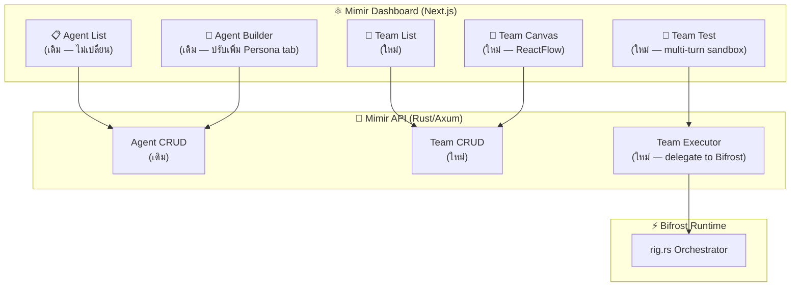

# 🏥 Multi-Agent Studio — Design Document

> ออกแบบใหม่ Agent Studio ใน Mimir Dashboard ให้รองรับ Multi-Agent Orchestration
> **ปัจจุบัน:** Single Agent Builder (CRUD + Chat + AI Generator)
> **เป้าหมาย:** Visual Multi-Agent Team Builder with Delegation, Guardrails, and Test Sandbox

---

## UI Mockup


---

## 📊 Current vs Proposed — เปรียบเทียบ

| Feature | ปัจจุบัน (Single Agent) | ใหม่ (Multi-Agent Studio) |
|---------|------------------------|--------------------------|
| สร้าง Agent | ✅ Form-based builder | ✅ เหมือนเดิม + Drag & Drop |
| Agent ทีม | ❌ ไม่มี | ✅ **Agent Team** — กลุ่ม Agent ที่ทำงานร่วมกัน |
| Visual Workflow | ❌ ไม่มี | ✅ **ReactFlow Canvas** — ลาก วาง เชื่อม |
| Delegation Rules | ❌ ไม่มี | ✅ **Routing Conditions** — กฎการมอบหมายงาน |
| Guardrails Config | ❌ ไม่มี | ✅ **G1-G6 Checkboxes** per-node |
| Confidence Gate | ❌ ไม่มี | ✅ **Threshold slider** per-team |
| Persona System | ❌ แค่ system prompt | ✅ **IDENTITY/TONE/CONTEXT** files |
| Test Mode | ❌ แค่ 1:1 chat | ✅ **Team Test** — ทดสอบทั้ง pipeline |
| Deploy | ✅ Publish + API Key | ✅ **Deploy Team** to Bifrost |

---

## 🏗️ Architecture — 4 Layers



---

## 📐 Data Model — 3 New Tables

### 1. `agent_teams` — ทีม Agent

```sql
CREATE TABLE agent_teams (
    id              INT PRIMARY KEY AUTO_INCREMENT,
    tenant_id       INT NOT NULL,
    name            VARCHAR(100) NOT NULL,         -- "sleep-clinic-assistant"
    display_name    VARCHAR(200),                   -- "Sleep Clinic Assistant"
    description     TEXT,
    persona_id      VARCHAR(50),                    -- → "medical-thai"
    confidence_threshold FLOAT DEFAULT 0.6,         -- ขั้นต่ำ Confidence Score
    guardrails      JSON,                           -- {"g1": true, "g3": true, ...}
    is_published    BOOLEAN DEFAULT FALSE,
    api_key         VARCHAR(100),
    created_at      DATETIME DEFAULT NOW(),
    updated_at      DATETIME DEFAULT NOW(),
    
    FOREIGN KEY (tenant_id) REFERENCES tenants(id)
);
```

### 2. `agent_team_nodes` — Node บน Canvas

```sql
CREATE TABLE agent_team_nodes (
    id              INT PRIMARY KEY AUTO_INCREMENT,
    team_id         INT NOT NULL,
    node_type       ENUM('input', 'agent', 'router', 'synthesizer', 'output', 'guardrail'),
    agent_id        INT NULL,                       -- FK → agents (null สำหรับ system nodes)
    external_agent  VARCHAR(50) NULL,               -- "eir", "fenrir", "mimir" (Asgard services)
    label           VARCHAR(200),
    config          JSON,                           -- Node-specific config
    position_x      FLOAT NOT NULL,
    position_y      FLOAT NOT NULL,
    
    FOREIGN KEY (team_id) REFERENCES agent_teams(id) ON DELETE CASCADE,
    FOREIGN KEY (agent_id) REFERENCES agents(id)
);
```

### 3. `agent_team_edges` — เส้นเชื่อม

```sql
CREATE TABLE agent_team_edges (
    id              INT PRIMARY KEY AUTO_INCREMENT,
    team_id         INT NOT NULL,
    source_node_id  INT NOT NULL,
    target_node_id  INT NOT NULL,
    condition       JSON NULL,                      -- {"type": "intent", "value": "medical_query"}
    priority        INT DEFAULT 0,
    
    FOREIGN KEY (team_id) REFERENCES agent_teams(id) ON DELETE CASCADE,
    FOREIGN KEY (source_node_id) REFERENCES agent_team_nodes(id),
    FOREIGN KEY (target_node_id) REFERENCES agent_team_nodes(id)
);
```

---

## 🖥️ Frontend Design — 5 Views

### View 1: Team List (หน้าแรก)

```
┌─────────────────────────────────────────────────┐
│  🏥 Multi-Agent Studio                          │
│                                                  │
│  ┌──────────┐  ┌──────────┐  ┌──────────┐      │
│  │ Sleep    │  │ Drug     │  │ Claim    │  [+]  │
│  │ Clinic   │  │ Check    │  │ Automator│       │
│  │ ──────── │  │ ──────── │  │ ──────── │       │
│  │ 4 agents │  │ 2 agents │  │ 3 agents │       │
│  │ ● Live   │  │ ○ Draft  │  │ ○ Draft  │       │
│  └──────────┘  └──────────┘  └──────────┘       │
│                                                  │
│  ── Standalone Agents ──                        │
│  (Agent List เดิมอยู่ด้านล่าง, ไม่หาย)         │
└─────────────────────────────────────────────────┘
```

- **New URL:** `/agents` → แบ่ง 2 sections:
  - **Agent Teams** (ด้านบน) — Cards แสดงทีม
  - **Standalone Agents** (ด้านล่าง) — Agent เดี่ยวเหมือนเดิม

### View 2: Team Canvas (ReactFlow)

> ❗ ใช้ `@xyflow/react` (ReactFlow v12) — เป็นมาตรฐาน visual workflow builder

```
┌─ Agent Palette ─┬─── Canvas ─────────────────┬── Inspector ──┐
│ 🔍 Search       │                             │ ⚡ Bifrost    │
│                  │    [User Input]             │               │
│ ── Asgard ──    │         │                   │ Delegation:   │
│ ⚡ Bifrost       │    [Bifrost Router]──┐     │ ☑ medical →   │
│ 🧠 Mimir        │    │    │     │       │     │   Mimir       │
│ 🏥 Eir          │ [Mimir][Eir][Fenrir]  │     │ ☑ browser →   │
│ 🐺 Fenrir       │    │    │     │       │     │   Fenrir      │
│ 🛡️ Heimdall     │    └────┴─────┘       │     │               │
│                  │    [Synthesizer]       │     │ Guardrails:   │
│ ── Custom ──    │         │              │     │ ☑ G3 Scope    │
│ 🤖 My Agent 1   │    [Response]          │     │ ☑ G5 Citation │
│ 🤖 My Agent 2   │                       │     │               │
│                  │                       │     │ Confidence:   │
│ ── System ──    │                       │     │ ──●── 60%     │
│ 📩 Input        │                       │     │               │
│ 📤 Output       │                       │     │ Persona:      │
│ 🔄 Router       │                       │     │ [Medical TH ▼]│
│ 🛡️ Guardrail    │                       │     │               │
│ 🎯 Synthesizer  │                       │     │ [Delete Node] │
└──────────────────┴───────────────────────┴────────────────────┘
```

**Node Types:**

| Type | Icon | สี | Drag Source | Config |
|------|------|-----|-------------|--------|
| `input` | 📩 | Purple | System palette | — |
| `output` | 📤 | Green | System palette | Disclaimer text |
| `router` | 🔄 | Amber | System palette | Delegation rules (JSON) |
| `agent` | 🤖 | Provider color | Agent palette | Agent ID, override params |
| `external` | ⚡🧠🏥🐺 | Service color | Asgard palette | Service name, MCP tools |
| `synthesizer` | 🎯 | Teal | System palette | Merge strategy |
| `guardrail` | 🛡️ | Red | System palette | G1-G6 toggles |

**Edge Conditions:**

```typescript
interface EdgeCondition {
  type: "always" | "intent" | "confidence" | "keyword" | "custom";
  value?: string;        // intent class or keyword
  threshold?: number;    // confidence threshold
  expression?: string;   // custom Rust expression
}
```

### View 3: Team Inspector (Right Panel)

แต่ละ Node type มี Inspector form ต่างกัน:

**Router Node Inspector:**
```
┌─ ⚡ Bifrost Router ──────────────┐
│                                   │
│ Delegation Rules:                 │
│ ┌─────────────────────────────┐  │
│ │ IF intent = "medical_query" │  │
│ │ THEN → Mimir (search_kb)   │  │
│ │ ────────────────────────── │  │
│ │ IF intent = "patient_data"  │  │
│ │ THEN → Eir (read_fhir)     │  │
│ │ ────────────────────────── │  │
│ │ IF intent = "browser_task"  │  │
│ │ THEN → Fenrir (navigate)   │  │
│ │ ────────────────────────── │  │
│ │ ELSE → Mimir (fallback)    │  │
│ └─────────────────────────────┘  │
│ [+ Add Rule]                     │
│                                   │
│ Parallel Execution: ☑            │
│ Max Concurrent Agents: [3]       │
│ Timeout (seconds): [30]          │
└───────────────────────────────────┘
```

**Agent Node Inspector:**
```
┌─ 🧠 Mimir: Search Knowledge ────┐
│                                   │
│ Agent: [Mimir Researcher    ▼]   │
│                                   │
│ Override System Prompt: ☐        │
│ Override Temperature: ☐          │
│                                   │
│ MCP Tools (Allowlist):           │
│ ☑ search_knowledge               │
│ ☑ search_primekg                 │
│ ☐ ingest_pubmed                  │
│                                   │
│ Input Mapping:                    │
│ user_query    → query            │
│ patient_id    → context.pid      │
│                                   │
│ Output: "knowledge_results"      │
└───────────────────────────────────┘
```

### View 4: Team Test Sandbox

```
┌─────────────────────────────────────────────────┐
│  🧪 Test Team: Sleep Clinic Assistant           │
│                                                  │
│  ┌─ Chat ──────────┐  ┌─ Agent Trace ────────┐ │
│  │ 👤 คนไข้ HN123  │  │ Step 1: Bifrost      │ │
│  │    มีปัญหานอน   │  │   Intent: medical    │ │
│  │    ไม่หลับ      │  │   → Delegate: Mimir  │ │
│  │                  │  │   → Delegate: Eir    │ │
│  │ 🤖 ระบบพบว่า... │  │                      │ │
│  │   📊 7 sources  │  │ Step 2: Mimir        │ │
│  │   🏥 HN: 12345  │  │   Tool: search_kb    │ │
│  │   💊 ยา: ...    │  │   Results: 7 chunks  │ │
│  │                  │  │   Confidence: 0.82   │ │
│  │                  │  │                      │ │
│  │ ────────────── │  │ Step 3: Eir          │ │
│  │ [Type message]  │  │   Tool: read_fhir    │ │
│  │                  │  │   Patient: loaded    │ │
│  └──────────────────┘  │                      │ │
│                         │ Step 4: Synthesize   │ │
│  ┌─ Metrics ─────────┐ │   Confidence: 0.78  │ │
│  │ Latency: 2.3s     │ │   Sources: 7        │ │
│  │ Agents: 3/3 ✅    │ │   Guardrails: PASS  │ │
│  │ Guardrails: PASS  │ └──────────────────────┘ │
│  │ Confidence: 78%   │                          │
│  └───────────────────┘                          │
└─────────────────────────────────────────────────┘
```

### View 5: Persona Manager (New Tab in Agent Builder)

```
┌─ Agent Builder ─────────────────────────────────┐
│  [Basic] [Model] [Behavior] [RAG] [Tools]       │
│                    └── ✨ NEW: [Persona] tab     │
│                                                  │
│  ┌─ IDENTITY.md ──────────────────────────────┐ │
│  │ ชื่อ: หมอมิเมียร์                          │ │
│  │ บทบาท: ผู้ช่วยแพทย์ด้านเวชศาสตร์การนอนหลับ │ │
│  │ ภาษา: ไทย, อังกฤษ (Medical)               │ │
│  └────────────────────────────────────────────┘ │
│                                                  │
│  ┌─ TONE.md ──────────────────────────────────┐ │
│  │ สุภาพ, ระมัดระวัง, ไม่วินิจฉัยโดยตรง      │ │
│  │ ใช้ "ข้อมูลแนะนำ" แทน "แพทย์บอกว่า"       │ │
│  └────────────────────────────────────────────┘ │
│                                                  │
│  ┌─ CONTEXT.md ───────────────────────────────┐ │
│  │ คลินิก: MegaCare Sleep Center              │ │
│  │ เปิด: จ-ศ 8:00-17:00                      │ │
│  │ แพทย์: นพ.สมชาย (Pulmonologist)            │ │
│  └────────────────────────────────────────────┘ │
└─────────────────────────────────────────────────┘
```

---

## 🔌 Backend API — New Endpoints

### Team CRUD

```
GET    /api/v1/agents/teams              → list teams
POST   /api/v1/agents/teams              → create team
GET    /api/v1/agents/teams/:id          → get team (with nodes & edges)
PUT    /api/v1/agents/teams/:id          → update team
DELETE /api/v1/agents/teams/:id          → delete team
POST   /api/v1/agents/teams/:id/publish  → publish team → Bifrost
```

### Team Canvas (Nodes & Edges)

```
PUT    /api/v1/agents/teams/:id/canvas   → save entire canvas (nodes + edges)
GET    /api/v1/agents/teams/:id/canvas   → load canvas
```

### Team Execution

```
POST   /api/v1/agents/teams/:id/test     → test team (proxy to Bifrost)
GET    /api/v1/agents/teams/:id/trace    → get last execution trace
POST   /api/v1/agents/teams/:id/deploy   → deploy to Bifrost runtime
```

### Persona Management

```
GET    /api/v1/personas                   → list persona templates
POST   /api/v1/personas                   → create persona
GET    /api/v1/personas/:id               → get persona (IDENTITY/TONE/CONTEXT)
PUT    /api/v1/personas/:id               → update persona
```

---

## 📦 Dependencies (Frontend)

```json
{
  "@xyflow/react": "^12.0.0",       // ReactFlow v12 — visual canvas
  "elkjs": "^0.9.0",                // Auto-layout algorithm
  "@dnd-kit/core": "^6.0.0"         // Drag & Drop from palette to canvas
}
```

---

## 🗓️ Implementation Phases

### Phase A (Sprint S7): Foundation — ต่อจาก Sprint Plan เดิม
| Task | Component | Effort |
|------|-----------|--------|
| DB Migration: `agent_teams`, `agent_team_nodes`, `agent_team_edges` | Mimir Backend | 1 day |
| Team CRUD API | Mimir Backend | 2 days |
| Canvas save/load API | Mimir Backend | 1 day |
| Team List view (View 1) | Mimir Frontend | 1 day |
| Agent Builder: add Persona tab (View 5) | Mimir Frontend | 1 day |
| ReactFlow Canvas scaffold (View 2) | Mimir Frontend | 3 days |
| Node types + Inspector forms (View 3) | Mimir Frontend | 2 days |

### Phase B (Sprint S8): Execution
| Task | Component | Effort |
|------|-----------|--------|
| Persona CRUD API | Mimir Backend | 1 day |
| Team → Bifrost deploy API | Mimir Backend | 2 days |
| Team Test sandbox + trace view (View 4) | Mimir Frontend | 3 days |
| Delegation rules UI | Mimir Frontend | 2 days |
| Guardrails checkbox per-node | Mimir Frontend | 1 day |

### Phase C (Sprint S10): Polish
| Task | Component | Effort |
|------|-----------|--------|
| Auto-layout (ELK) | Mimir Frontend | 1 day |
| AI Team Generator ("สร้างทีมสำหรับคลินิกเด็ก") | Mimir Backend + Frontend | 3 days |
| Template teams (5 presets) | Mimir Backend | 1 day |
| Keyboard shortcuts + minimap | Mimir Frontend | 1 day |

---

## 🎯 Migration Strategy — ไม่ทำลายของเดิม

> [!IMPORTANT]
> **Agent เดี่ยวยังใช้ได้เหมือนเดิม** — Multi-Agent Studio เป็นฟีเจอร์เพิ่ม ไม่ใช่แทนที่

1. **Standalone agents** ยังทำงานเหมือนเดิม — chat, publish, API key
2. **Team** คือ layer ใหม่ที่ **reference** ไปยัง standalone agents
3. Agent เดียวกันสามารถอยู่ในหลาย Team ได้
4. URL: `/agents` → ส่วนบนเป็น Teams, ส่วนล่างเป็น Standalone (ไม่ต้องเปลี่ยน URL)

---

## Open Questions

> [!IMPORTANT]
> 1. **ReactFlow License** — `@xyflow/react` ใช้ได้ฟรีตาม MIT สำหรับ open-source แต่ต้อง attribute
> 2. **Team size limit** — จำกัดกี่ Agent ต่อ Team? (เสนอ: max 10 nodes)
> 3. **Real-time collaboration** — ต้องการให้หลายคนแก้ Canvas พร้อมกันไหม? (เสนอ: ยังไม่ต้อง — เฟส 2)
