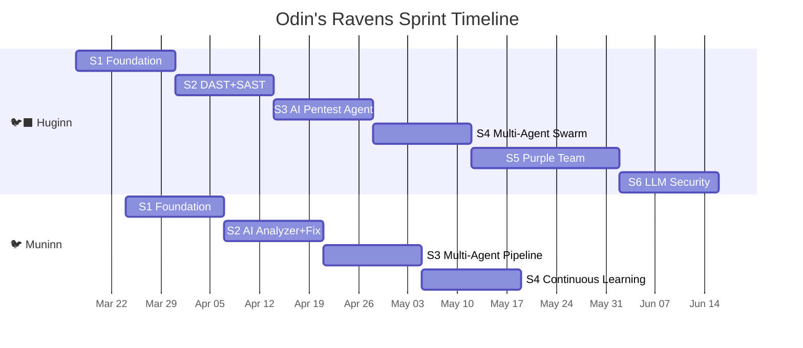

# 🏰 Asgard Sprint Planning — March 2026

> Asgard เป็นของทุกคนแล้ว — Asgard belongs to everyone.

---

## 📊 Current Status (as of 2026-03-15)

| Component | Version | Sprint | Tests | ISO Docs | Docker | Status |
|:--|:--|:--|:--|:--|:--|:--|
| 🛡️ Heimdall | v0.4.0 | — | Benchmarked | ✅ | ⚠️ Host only | ✅ Production |
| 🧠 Mimir | v0.29.0 | Sprint 29 | 255+ | ✅ | ✅ Infra compose | ✅ Active |
| ⚡ Bifrost | v0.7.0 | Sprint 7 | 133 | ✅ | ✅ Dockerfile | ✅ Mimir Sync |
| 🏥 Eir | v0.4.0 | Sprint 4 | 57 | ✅ | ⚠️ OpenEMR image | ✅ JWKS Auth |
| 🐺 Fenrir | v0.3.0 | Sprint 3 | 63 | ✅ | ✅ Dockerfile | ✅ JWT Auth |
| 🌳 Yggdrasil | v0.5.0 | Sprint 5 | 45 | ✅ | ✅ Compose | ✅ Yggdrasil Setup |
| 🛡️ Várðr | v0.1.0 | Sprint 1 | 5 | ✅ | ✅ Compose | ✅ Active |
| ⚖️ Týr | v4.9.0 | Active | — | ✅ | ✅ K3s | ✅ Active |
| ⚖️ Forseti | v1.0.0 | Sprint 6 | 147 | ✅ | ✅ Python | ✅ Active |
| 🔨 Mjölnir | v0.1.0 | Load | — | ✅ | ✅ Cargo | ✅ Active |
| 🐿️ Ratatoskr | v0.1.0 | Sprint 1 | — | ✅ | ✅ Dockerfile | ✅ Active |
| 📨 Hermóðr | v0.1.0 | Sprint 1 | — | ✅ | ✅ Dockerfile | ✅ Active |
| 🐦‍⬛ Huginn | v0.1.0 | Sprint 1 | — | 🚧 | 🚧 WIP | 🚧 In Progress |
| 🐦 Muninn | v0.1.0 | Sprint 1 | — | 🚧 | 🚧 WIP | 🚧 In Progress |
| 🏰 Asgard | v1.0-α | — | — | ✅ PM | ✅ Unified | ✅ Active |

> **537+ tests** across the entire platform

---

## 🎯 Next Sprint: Integration & Hardening

### Week 1 (P0 — Must Do) ✅ Completed 2026-03-14
| Task | Component | Description | Status |
|:--|:--|:--|:--|
| Mimir Dockerfiles | 🧠 Mimir | Multi-stage builds for API (Rust) + Dashboard (Next.js) | ✅ Done |
| Backup CLI | 🏰 Asgard | `scripts/backup.sh` backs up MariaDB + Qdrant | ✅ Done |

### Week 2 (P1 — Should Do)
| Task | Component | Description | Status |
|:--|:--|:--|:--|
| Yggdrasil FastAPI Depends | 🌳 Yggdrasil | `require_auth()` for Python services | ✅ Done |
| Bifrost JWT auth | ⚡ Bifrost | Yggdrasil JWT middleware | ✅ Done |
| Fenrir JWT auth | 🐺 Fenrir | Yggdrasil JWT middleware | ✅ Done |
| Bifrost ↔ Eir E2E | ⚡↔🏥 | ReAct agent → patient query → response | ✅ Done |
| Service accounts | 🌳 Yggdrasil | Machine-to-machine tokens |
| Mimir OIDC login | 🧠🌳 | Dashboard → Yggdrasil SSO | ✅ Done |

### Week 3 (P2 — Nice to Have)
| Task | Component | Description | Status |
|:--|:--|:--|:--|
| Fenrir + Heimdall LLM | 🐺🛡️ | Browser Use + NL → actions |
| Eir FHIR extensions | 🏥 | Encounter create, Medication request |
| Cross-component JWT | All | All services validate Yggdrasil tokens | ✅ Done (Bifrost+Fenrir) |

---

## 🏢 Enterprise Partner Integration Gaps

> **Strategic gaps identified for Tier-1 Enterprise deployments and White-Label (OEM) partnerships. These tasks must be distributed across services to prepare for strict Data Sovereignty PoCs and SI co-implementations.**

### Phase 1: Infrastructure & Data Sovereignty
| Task | Component | Description | Priority |
|:--|:--|:--|:--|
| Air-gapped VPN | ⚡ Infra | Establish secure WireGuard tunnel for strict cross-border GPU infrastructure. | P0 🔴 |
| Multi-Lingual PII Scrubber | 🛡️ Heimdall | Ensure robust Thai/Japanese/English PII masking is operational before LLM proxying. | P0 🔴 |
| Mjolnir SLA Load Test | 🔨 Mjolnir | Integrate Mjolnir to stress-test Odin orchestration to prove Enterprise SLA. | P1 🟡 |

### Phase 2: Co-Branding & SI Enablement
| Task | Component | Description | Priority |
|:--|:--|:--|:--|
| OEM Theming Engine | 🧠 Mimir (UI) | Support dynamic logo/theme switching for White-Label client installations. | P1 🟡 |
| Black-box API Docs | 🏰 Asgard | Generate pristine OpenAPI/Swagger docs for SI Partners to consume securely. | P1 🟡 |
| CJK Localization | All Services | Ensure prompt pipelines, parsers, and UI support robust UTF-8 CJK encoding. | P2 🟢 |
| SI Billing Telemetry | 🌳 Yggdrasil | Add tenant-level API usage tracking for Volume-based SaaS revenue models. | P2 🟢 |

### Phase 3: Mimir RAG Engine Enhancements (Backlog)
| Task | Component | Description | Priority |
|:--|:--|:--|:--|
| Pre/Post Tool Hook System | 🧠 Mimir (`rag_engine`) | Implement `PreToolUse` and `PostToolUse` hook middleware inside the `DynamicContextPlugin` trait. Enables PII scrubbing and audit logging to fire **before** context is sent to the LLM — currently delegated to Heimdall but should be enforceable at the RAG layer too. | P1 🟡 |
| Agent Interrupt / Cancel | 🧠 Mimir (`rag_engine`) | Add graceful cancellation support for long-running `OracleRagAgent::chat()` calls via a `CancellationToken`. Critical for H100 inference workloads where Agent tasks may run 10-45s and users need to abort cleanly without corrupting session state. | P1 🟡 |

---

### 🐦‍⬛ Huginn — Sprint 1: Foundation
- [ ] Cargo scaffold (main.rs, config.rs, health.rs, db.rs, models.rs)
- [ ] Dockerfile + Docker Compose integration
- [ ] `GET /health` endpoint (Várðr compatible)
- [ ] `POST /api/scan` + `GET /api/scans/{id}`
- [ ] SQLite schema (scans, findings, suppressions)
- [ ] Basic nmap scan via `tokio::process::Command`

### 🐦 Muninn — Sprint 1: Foundation
- [ ] Cargo scaffold (main.rs, config.rs, health.rs, db.rs)
- [ ] Dockerfile + Docker Compose integration
- [ ] `GET /health` endpoint
- [ ] GitHub issue poller (octocrab, 5 min interval)
- [ ] SQLite schema (watched_repos, analyzed_issues, fixes)
- [ ] Label filter (huginn-finding, security, auto-fix, muninn-skip)

---

## 🐦‍⬛🐦 Odin's Ravens: Enterprise Security (Q2-Q3 2026)

> **[Full Implementation Plan →](roadmap/huginn-muninn.md)** | **[BRD](business/odins-ravens-brd.md)** | **[TRD](business/odins-ravens-trd.md)**

| Service | Stack | Total Sprints | Key Innovation |
|:--|:--|:--|:--|
| 🐦‍⬛ Huginn | 🦀 Rust/Axum | 6 sprints (13 weeks) | Multi-Agent Pentest Swarm + Purple Team |
| 🐦 Muninn | 🦀 Rust/Axum | 4 sprints (8 weeks) | Multi-Agent Fix Pipeline + Continuous Learning |

---

*Asgard เป็นของทุกคนแล้ว — Asgard belongs to everyone.*
