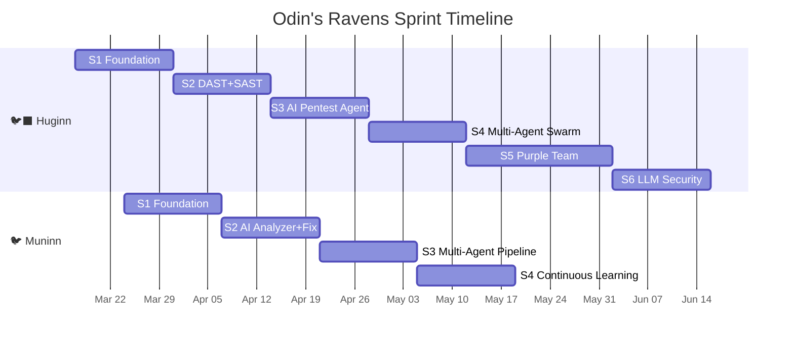

# 🏰 Asgard Sprint Planning — May 2026

> Asgard เป็นของทุกคนแล้ว — Asgard belongs to everyone.

---

## 📊 Current Status (as of 2026-05-12, Sprint 50 — v1.3.0 shipped)

Cluster is on v1.3.0 (Mimir + Bifrost + Syn rolled). Sprint 50 OCR + Sprint 50b text-PII guardrail (Tier 1) verified end-to-end against the live cluster.

| Component | Version | Last Sprint | Tests | ISO Docs | Docker/K8s | Status |
|:--|:--|:--|:--|:--|:--|:--|
| 🛡️ Heimdall gateway | v0.5.0 | 50b | 27+ Skuggi-core | ✅ | ⚠️ Host only (MLX) | ✅ Production |
| 🧠 Mimir (bridge) | **v1.3.0** | **50 / 50b** | 255+ + Skuggi corpus 30 | ✅ | ✅ K8s | ✅ Active |
| 🖥️ Mimir Dashboard | **v1.3.0** | **50 / 50b** | — | ✅ | ✅ K8s | ✅ Active |
| ⚡ Bifrost (Rust) | **v0.3.0** | **50** (B-50d OCR preproc) | cargo test ✓ | ✅ | ✅ K8s | ✅ Active |
| 👁️ Syn (OCR API) | **v0.2.0** | **50** (S1) | **13 unit + 8/8 e2e** | 📝 ADR-006 | ✅ K8s (NodePort 30002) | ✅ Active |
| 🌑 Skuggi-core | **v0.1.0** | **50b W1** | 27+ Tier 1 regex | 📝 ADR-007 | 🔗 in-process (Heimdall) | ✅ Text-PII shipped |
| 🏥 Eir | v0.5.0 | 38 + ocr_extract allowlist (50) | 57 | ✅ | ⚠️ OpenEMR image | ✅ JWKS Auth |
| 🐺 Fenrir | v0.2.0 | 3 | 63 | ✅ | ✅ K8s | ✅ JWT Auth |
| 🌳 Yggdrasil | v0.2.0 | 51e (OIDC rotation) | 45 | ✅ | ✅ K8s (Zitadel) | ✅ Active |
| 🛡️ Várðr | v0.5.0 | 1 | 5 | ✅ | ✅ K8s | ✅ Active |
| ⚖️ Týr | v4.9.0 | Active | — | ✅ | ✅ K3s (Wazuh) | ✅ Active |
| ⚖️ Forseti | v0.2.0 | 6 + syn-api scenario (50) | 147 + 8 syn e2e | ✅ | ✅ K8s | ✅ Active |
| 🔨 Mjölnir | v0.2.0 | Load | — | ✅ | ✅ K8s | ✅ Active |
| 🐿️ Ratatoskr | v0.2.0 | 1 | — | ✅ | ✅ K8s | ✅ Active |
| 📨 Hermóðr | v0.2.0 | 1 | — | ✅ | ✅ K8s | ✅ Active |
| 🐦‍⬛ Huginn | v0.3.0 | 1 | — | 🚧 | 🚧 Not deployed | 🚧 In Progress |
| 🐦 Muninn | v0.3.0 | 1 | — | 🚧 | 🚧 Not deployed | 🚧 In Progress |
| 🏰 Asgard (chart) | **v0.3.0** (appVersion 0.50.0) | 50 + 51e | — | ✅ PM | ✅ Umbrella Helm | ✅ Active |

> Sprint 50 introduced **Syn** (OCR/eKYC) and **Skuggi** (PII guardrail) as first-class platform services. ADR-006 + ADR-007 accepted.

---

## ✅ Sprint 50 — Complete (2026-05-12)

**Theme:** Vision pipeline + PII guardrail foundation.

| Lane | Deliverable | PR(s) | State |
|:--|:--|:--|:--|
| A — Mimir | OCR schema + smart router + audit + cost guard + curator review + tool allowlist + Skuggi text-PII pipeline + audit history | Mimir #264-#276 (13 PRs) | ✅ merged |
| B — Heimdall | Tier 1b anchored patterns + leak contract + skuggi-core path-dep refactor | Heimdall #6, #7 | ✅ merged |
| C — Bifrost (B-50d) | Transparent OCR preprocessing for image-bearing chat (Python → Rust rewrite) | Bifrost #13, #14 | ✅ merged |
| D — Syn (S1) | 3-tier OCR (PaddleOCR + Typhoon-OCR-local + Gemini Flash/Pro), smart router, audit, benchmarks | Syn #5, #6 | ✅ merged |
| E — Asgard | Umbrella v1.3-alpha release-prep + E2E runbook + integ-test cargo migration | Asgard #35, #36, #52 | ✅ merged |
| F — Test coverage | Syn unit tests (13) + Forseti syn_e2e.yaml (8 pass) + integ-test wiring | Syn #9, Forseti #6 #8, Asgard #55 | ✅ merged |
| G — Deploy fixes | imagePullPolicy=Always default (root cause of stale-:latest), syn-api MARIADB_URL secretKeyRef | Asgard #56, Syn #10 | ✅ merged |

**Live verification (2026-05-12):**
- ✅ `/api/v1/admin/skuggi/corpus` — 30 asgard_insurance rows seeded
- ✅ `/api/v1/admin/skuggi/redactions` — audit endpoint reachable
- ✅ `/api/v1/syn/ocr/extract-json` — HTTP 200, full audit row written (engine=paddleocr-local)
- ✅ Forseti syn-api scenarios — 8/8 pass

---

## ✅ Sprint 50b — Skuggi text-PII W1 (2026-05-09)

**Theme:** ADR-007 implementation — first PII guardrail tier.

| Stage | Deliverable | State |
|:--|:--|:--|
| W1 — Text Tier 1 + audit | `skuggi-core` crate, regex detector matrix (Thai ID, HN, license, phone, email + medical-cert patterns), `pii_redactions` table, Heimdall in-process middleware, /admin/skuggi/redactions audit history | ✅ Shipped 2026-05-09 |
| ADR-007 | Architecture decision record accepted | ✅ 2026-05-09 |

**Effect:** Text-payload cloud LLM calls now have a guardrail. Image and Tier 2 (NER) still gated to local-only.

---

## ✅ Sprint 51d — Open-core go-live (2026-05-10)

Asgard repo flipped private → public. Triggered pre-existing inline-secrets burn from
commit `73a004f`. Recovery via Sprint 51e. Incident bundle filed
2026-05-20 at [`docs/incidents/2026-05-10-open-core-go-live-burn/`](incidents/2026-05-10-open-core-go-live-burn/README.md)
(README + incident-report + postmortem + compliance-response). SEV-2,
no observed exploitation, no PHI breach. Compensating control: `.pre-commit-config.yaml`
gitleaks v8.21.2 (was in place pre-incident; prevents future regressions).

## ✅ Sprint 51e — Secret Rotation (7/8 done, closed 2026-05-19)

Hand-patched secret rotation across services post-51d burn. Doc-of-record:
[`docs/security/ROTATION-PLAN-2026-05-10.md`](security/ROTATION-PLAN-2026-05-10.md).

| Step | Component | State |
|:--|:--|:--|
| 1 | Heimdall (LLM Gateway) | ✅ Rotated 2026-05-11 (dual-key zero-downtime) |
| 2 | Neo4j | ✅ Rotated 2026-05-11 |
| 3 | Laminar → renamed `heimdall-trace` 2026-05-19 | ✅ Rotated 2026-05-11 PM (DB sha3-256 hash + ConfigMap + Secret + restart) |
| 4 | MariaDB | ✅ Rotated 2026-05-11 |
| 5 | Postgres | ✅ Rotated 2026-05-11 |
| 6 | Mimir-OIDC | ✅ Rotated 2026-05-11 |
| 7a | Bifrost DB (inline → Secret) | ✅ Patched 2026-05-11 |
| 7b | Eir-Gateway OAuth2 (OpenEMR CryptoGen) | ✅ Rotated 2026-05-11 PM |
| 8 | Yggdrasil masterkey | ⏸ Deferred per Option 8A — encrypted-data audit shows low risk; revisit if external IDP creds or SMTP relays are added to Zitadel |

Verification pass 2026-05-19 confirmed all rotations stable. Separate finding
during verification: `laminar-app-server.SHARED_SECRET_TOKEN` is an
otel-collector-internal placeholder (NOT part of this incident scope) — tracked
separately at [`docs/security/laminar-shared-secret-token-cleanup-draft.md`](security/laminar-shared-secret-token-cleanup-draft.md).

**Bonus fixes (during rotation work):**
- `lan-bridge-http` cleanup
- Mimir↔Neo4j 401 unauthenticated path
- Bifrost DATABASE_URL chart wired to MIMIR_DATABASE_URL secretKeyRef
- syn-api MARIADB_URL → secretKeyRef (2026-05-12)

---

## 🆕 2026-05-19 — Architecture & Naming Decisions

> Locked design decisions from "Living Clinical Evidence" planning session. Affect Sprint 55+ deliverables; do NOT disturb Sprint 52-54 (Insurance Launch + Cloud Enablement) which remain locked.

### Component naming reassignments

| Before | After (2026-05-19) | Rationale |
|:--|:--|:--|
| Sága = Laminar (display name) | **Sága = STT** (pairs with Bragi=TTS) | Aligns with `strategy/roadmap.md` Sága S1 Whisper Foundation (Q3 2026); fits the storytelling/listening goddess myth |
| Laminar (no Asgard name) | **`heimdall-trace`** submodule | Heimdall = mythological all-watcher; already sees all LLM calls as gateway; per `feedback_no_new_norse_components` extends existing instead of new top-level |
| Bifrost (single runtime) | **`bifrost-agent` + `bifrost-jobs`** | Agent runs (tree-shape, live) vs cron jobs (linear, scheduled) need different debug surfaces; unified via `bifrost.runs` envelope |

### Planned submodules (Sprint 55+)
- **`mimir-curator`** — Label Studio wrap (port 8888), 2 projects: `ocr-region-gt` (existing aspiration) + `oracle-review` (new). Replaces v2.3.11 OCR annotation UI (retire/redirect)
- **`mimir-well`** — Memory artifact accumulation layer; Mímisbrunnr metaphor; Tulving 3-tier schema (episodic/semantic/procedural); PROV-AGENT provenance → Tyr audit stream
- **`mimir-guideline-lineage`** — Neo4j subgraph (separate from PrimeKG) with HL7 FHIR CPG-IG schema; tracks `REPLACES`/`DERIVED_FROM`/`CITES`/`CONTRADICTS` between Guideline/Recommendation/Evidence nodes
- **`heimdall-trace`** — Laminar self-hosted wrapper, OTel ingest, PG+ClickHouse backend, UI proxied via `/heimdall/trace/*` with Heimdall JWT
- **`bifrost-trace` middleware** — Emits OTel root span from Bifrost runtimes → heimdall-trace

### Locked policy decisions
- **Heimdall budget cap:** $100 USD/month/tenant for `oracle_ingest` (shared bucket incl. deep-research + LLM-as-judge eval); fallback to local LLM (gemma-4-26b) when exceeded; dashboard at `/heimdall/budget`
- **Eir agents:** Local LLM only remains hard rule (per `feedback_eir_agents_local_only`) — cloud LLM never permitted for clinical reasoning
- **Curator conflict resolution:** Recursive deep-research tiebreaker (PubMed + other societies + Epistemonikos L·OVE → Heimdall synthesize → new `research_brief` artifact); max 2 rounds before escalating to senior clinician
- **Eval architecture split:** Mimir Eval (cold/benchmark, dataset-driven, asgard_platform tenant) + heimdall-trace (warm/live, per-trace LLM-as-judge); unified scoreboard surface in Mimir UI; Sága→Mimir push via webhook
- **Prompt management:** `agent_configs` MariaDB stays source of truth; Laminar trace just tags `prompt_version=X` (NO Laminar prompt mgmt — avoid drift between 2 stores)
- **PII in traces:** Skuggi pre-emit redaction (W1 Text Tier 1 shipped 2026-05-09) — PHI never enters heimdall-trace storage
- **Retention (draft, compliance review post-S1):** Hot 30d (Laminar) / Warm 1y (Mimir summary) / Cold 6y (sampled + eval-failed, MinIO) — HIPAA min 6y for medical-decision records
- **Positioning:** "Your Hospital's Living Research System" or "Living Clinical Evidence, On Your Premises" — borrows Cochrane/Elliott 2014 academic credibility; commercial space empty (UpToDate/DynaMed/BMJ/OpenEvidence don't own "living")

### Memory references
- `asgard_laminar_saga` (Laminar=heimdall-trace, supersedes Sága=Laminar)
- `asgard_saga_stt` (Sága=STT reassignment)
- `bifrost_runtime_family` (agent+jobs split)
- `asgard_living_evidence_positioning`, `mimir_guideline_lineage_plan`, `mimir_well_memory_artifacts`
- `mimir_curator_label_studio`, `mimir_curator_conflict_resolution`, `heimdall_oracle_budget_cap`
- `bifrost_cron_monitor` (extended by `bifrost_runtime_family`)

---

## 🎯 Next Sprint: Sprint 51 — Hardening + Skuggi W2 Foundation

**Window:** 2026-05-13 → 2026-05-26 (2 weeks)
**Theme:** Tighten Sprint 50 deliverables + start image-PII redaction prep.

### Week 1 (P0)
| Task | Component | Description | Status |
|:--|:--|:--|:--|
| Flip Syn integ-test from advisory → gating | 🏰 Asgard CI | After 2 weeks of stable green, drop `continue-on-error` on syn cargo test + syn-api Forseti scenarios | 📝 Planned |
| Skuggi W2 image redaction design | 🌑 Skuggi | ADR follow-up: OCR bbox-based PII blur before cloud Tier 2/3 image submission | 📝 Planned |
| Curator review queue UI | 🧠 Mimir Dashboard | Wire `/api/v1/syn/ocr/review-queue` + `/documents/{id}/review` to a Curator-only admin page (B-50f follow-up) | 📝 Planned |
| ~~Eir ocr_extract end-to-end smoke~~ | 🏥↔📨↔👁️ | Trigger an Eir agent OCR call → Hermodr `ocr_extract` tool → syn-api `/extract` → assert audit row | ✅ **Done 2026-05-12** — JSON-RPC path verified via new `hermodr-syn` sidecar (Syn PR #11). Audit row id=`687f51b4` in `ocr_documents`. |
| Bifrost overseer per-agent tool wire-up | ⚡ Bifrost | `swarm_engine/overseer.rs:151` stubs `_agent_tools` — agents can't explicitly call ocr_extract yet (transparent OCR via B-50d is the only active path). Wire the `agent_configs.tools` JSON to Bifrost's Rig tool registry. | 🆕 Discovered 2026-05-12 during P0 smoke — promoted to P0 since the allowlist migration is otherwise inert |

### Week 2 (P1)
| Task | Component | Description | Status |
|:--|:--|:--|:--|
| Sprint 51e leftovers | 🔐 Infra | Finish Step 3 (Laminar) + 7b (Eir) + 8 (Masterkey) rotations | 📝 Planned |
| Python sidecar pytest | 👁️ Syn | Smoke tests for paddleocr-sidecar + pythainlp-sidecar (`/healthz`, `/extract` fake-image path) | 📝 Planned |
| OCR cost guard hard-stop | 🧠 Mimir (B-50m) | Verify the per-tenant monthly budget enforcement actually 429s at the boundary (right now only logs) | 📝 Planned |
| sprint-planning.md auto-refresh | 🏰 Asgard | Generate this doc from PR labels + git tags so it stops going stale | 📝 Planned |

### Stretch (P2)
| Task | Component | Description |
|:--|:--|:--|
| ICD-10-TM Hermodr tool | 📨 Hermóðr | Thai-localized ICD-10 lookup — Mimir already has `icd10_lookup.py` reference data, just need MCP wrapper |
| Skuggi W3 NER scaffold | 🌑 Skuggi | PyThaiNLP wrapper (Tier 2) — gated on observed recall ≥ 98%; if not, jump straight to Sprint 55-57 ONNX plan |
| Sprint 52 INS-01 prep | 🏥 Insurance | Draft `sprint52_insurance_agents.sql` migration + Hermodr tool stubs (no production wire-up yet) |

---

## 📅 Upcoming Sprints (preview)

### Sprint 52-53 (2026-05-27 → 2026-06-23) — asgard_insurance Launch
- INS-01: Seed `asgard_insurance` tenant_configs + 5 insurance agents (insurance-router/generic/medical-review/pre-auth/claims)
- INS-02: Hermodr tools — `policy_coverage_lookup`, `claim_history_search`
- INS-04/05: Tool wiring + Forseti e2e scenario
- **Gating:** gemma-local only by default. Cloud LLM blocked until Sprint 54.

### Sprint 54 — Insurance Cloud Enablement
- Blocked on: Skuggi W2 image redaction + W3 NER (or Sprint 55-57 ONNX if PyThaiNLP fails recall gate)
- Flips `ocr_cloud_flash_enabled` per insurance sub-tenant once Skuggi covers both text and image surfaces

### Sprint 55-57 (gated) — Thai Medical NER Fine-tune
- Replace PyThaiNLP Tier 2 with in-process ONNX
- Only execute if PyThaiNLP recall drops below 98% on production data
- 03_17 execution plan + 03_18 MLOps infra docs (already drafted)

### Sprint 55-58 — "Living Clinical Evidence" System (NEW 2026-05-19)

> Theme: **"Your Hospital's Living Research System"** — guideline lineage tracking + memory artifact accumulation + live observability. Public-facing positioning that differentiates Asgard from medical AI chatbots.
>
> **Sequencing rule:** Starts only after S1 Insurance Go/No-Go decision (2026-06-12) and Sprint 52-54 (Insurance Launch + Cloud Enablement) are stable. If PyThaiNLP recall < 98%, the gated Thai NER work shares Sprint 55-57 bandwidth — Living Evidence shifts to S56-S59. If recall ≥ 98%, Living Evidence runs full Sprint 55-58.

| Sprint | Focus | Deliverables |
|:--|:--|:--|
| **55** | Lineage MVP + observability foundation | `mimir-guideline-lineage` Neo4j subgraph (HL7 FHIR CPG-IG schema); `mimir-guideline-ingest` Rust pipeline (**MAGICapp JSON only, 1 society × 1 topic — ESC HTN**); `heimdall-trace` integration wire-up (OTel ingest + Heimdall JWT proxy + spans from Bifrost/Heimdall/Hermodr/Mimir/Skuggi — rotation itself closed 2026-05-11 in 51e); `bifrost-agent` + `bifrost-jobs` runtime split + unified `bifrost.runs` schema; Heimdall $100/mo budget middleware basic |
| **56** | Curator + Memory Well | `mimir-curator` (Label Studio wrap, 2 projects: ocr-region-gt + oracle-review); PDF ingest pipeline (Syn OCR → Heimdall extract → curator review queue); `mimir-well` schema (Tulving 3-tier artifacts + PROV-O emit → Tyr audit); retire v2.3.11 OCR annotation UI (redirect → mimir-curator) |
| **57** | UI + new eval types + scale | `/mimir/well` timeline UI + node inspector; 4 new eval types via `eval-tab-registry.tsx` (`agent_trace_quality`, `citation_faithfulness`, `tool_call_correctness`, `session_safety`); `/bifrost/runs` unified monitor UI (agent trace tree view + job linear log view); replay sandbox (`dry_run=true` in Hermodr context); scale to 4 societies × 4 topics |
| **58** | Deep research + feedback loop | Recursive research tiebreaker pipeline (curator disagreement → Heimdall synthesize new evidence brief → re-queue, max 2 rounds); Sága→Mimir score push webhook; Sága labeling queue → Mimir dataset promotion (closed feedback loop); HealthBench-Pro port to Sága offline eval; comparison view in Mimir scoreboard (benchmark vs live) |

**Demo gate (end of Sprint 55):** Eir-cardio answers "current BP target for diabetic adult" with currency signaling — *"Per ESC 2025 [updated from ESC 2024], target <130/80, driven by SPRINT-DM trial (NEJM 2024). Evidence as of YYYY-MM-DD."* + lineage timeline in UI. **This unlocks public "Living Clinical Evidence" positioning + blog/landing-page copy.**

**Explicit non-goals (Sprint 55 MVP):**
- ❌ Multi-PDF ingest (MAGICapp JSON only)
- ❌ 2 societies × 2 topics (1×1 enough for demo)
- ❌ Curator workflow (no PDF extract = no review queue needed yet — moved to S56)
- ❌ Mimir Well UI (schema only S55, UI in S57)
- ❌ Deep research tiebreaker (S58; requires 2 curators in conflict)
- ❌ Separate eval budget bucket (shared $100/mo with line items)
- ❌ Laminar prompt management (keep `agent_configs` source of truth)

**Cost ceiling:** Heimdall cloud LLM for guideline extract ≈ $0.011 per 100-page guideline (Gemini Flash Lite). At $100/mo budget → 6,700-25,000 extracts headroom. Deep research brief ≈ $0.15. Realistic mo volume ≪ cap.

---

## 🏢 Enterprise Partner Integration Gaps

> Strategic gaps for Tier-1 Enterprise + White-Label (OEM) deployments. Distributed across services; tracked here for visibility.

### Phase 1: Infrastructure & Data Sovereignty
| Task | Component | Description | Priority |
|:--|:--|:--|:--|
| Air-gapped VPN | ⚡ Infra | Secure WireGuard tunnel for strict cross-border GPU infra | P0 🔴 |
| Multi-Lingual PII Scrubber | 🛡️ Heimdall / 🌑 Skuggi | Thai/Japanese/English PII masking before LLM proxy — **Text Tier 1 DONE 2026-05-09**, image + NER pending | 🟡 in-flight |
| Mjolnir SLA Load Test | 🔨 Mjolnir | Stress-test Odin orchestration to prove Enterprise SLA | P1 🟡 |

### Phase 2: Co-Branding & SI Enablement
| Task | Component | Description | Priority |
|:--|:--|:--|:--|
| OEM Theming Engine | 🧠 Mimir (UI) | Dynamic logo/theme for White-Label installs | P1 🟡 |
| Black-box API Docs | 🏰 Asgard | OpenAPI/Swagger for SI partners | P1 🟡 |
| CJK Localization | All | UTF-8 CJK across prompt pipelines, parsers, UI | P2 🟢 |
| SI Billing Telemetry | 🌳 Yggdrasil | Tenant-level API usage for volume-based SaaS | P2 🟢 |

### Phase 3: Mimir RAG Engine Enhancements (Backlog)
| Task | Component | Description | Priority |
|:--|:--|:--|:--|
| Pre/Post Tool Hook System | 🧠 Mimir (`rag_engine`) | `PreToolUse` + `PostToolUse` hook middleware in `DynamicContextPlugin` — enables PII scrubbing + audit at the RAG layer too | P1 🟡 |
| Agent Interrupt / Cancel | 🧠 Mimir (`rag_engine`) | Graceful cancellation for long `OracleRagAgent::chat()` via `CancellationToken` — needed for 10-45s H100 calls | P1 🟡 |

---

## 🐦‍⬛🐦 Odin's Ravens: Enterprise Security (Q2-Q3 2026)

> **[Full Implementation Plan →](roadmap/huginn-muninn.md)** | **[BRD](business/odins-ravens-brd.md)** | **[TRD](business/odins-ravens-trd.md)**

```mermaid
gantt
    title Odin's Ravens Sprint Timeline
    dateFormat YYYY-MM-DD
    axisFormat %b %d

    section 🐦‍⬛ Huginn
    S1 Foundation           :h1, 2026-03-17, 14d
    S2 DAST+SAST            :h2, after h1, 14d
    S3 AI Pentest Agent     :h3, after h2, 14d
    S4 Multi-Agent Swarm    :h4, after h3, 14d
    S5 Purple Team          :h5, after h4, 21d
    S6 LLM Security         :h6, after h5, 14d

    section 🐦 Muninn
    S1 Foundation           :m1, 2026-03-24, 14d
    S2 AI Analyzer+Fix      :m2, after m1, 14d
    S3 Multi-Agent Pipeline :m3, after m2, 14d
    S4 Continuous Learning  :m4, after m3, 14d
```

| Service | Stack | Total Sprints | Key Innovation |
|:--|:--|:--|:--|
| 🐦‍⬛ Huginn | 🦀 Rust/Axum | 6 sprints (13 weeks) | Multi-Agent Pentest Swarm + Purple Team |
| 🐦 Muninn | 🦀 Rust/Axum | 4 sprints (8 weeks) | Multi-Agent Fix Pipeline + Continuous Learning |

### 🐦‍⬛ Huginn — Sprint 1: Foundation
- [ ] Cargo scaffold (main.rs, config.rs, health.rs, db.rs, models.rs)
- [ ] Dockerfile + Docker Compose integration
- [ ] `GET /health` endpoint (Várðr compatible)
- [ ] `POST /api/scan` + `GET /api/scans/{id}`
- [ ] SQLite schema (scans, findings, suppressions)
- [ ] Basic nmap scan via `tokio::process::Command`

### 🐦 Muninn — Sprint 1: Foundation
- [ ] Cargo scaffold (main.rs, config.rs, health.rs, db.rs)
- [ ] Dockerfile + Docker Compose integration
- [ ] `GET /health` endpoint
- [ ] GitHub issue poller (octocrab, 5 min interval)
- [ ] SQLite schema (watched_repos, analyzed_issues, fixes)
- [ ] Label filter (huginn-finding, security, auto-fix, muninn-skip)

---

*Asgard เป็นของทุกคนแล้ว — Asgard belongs to everyone.*
