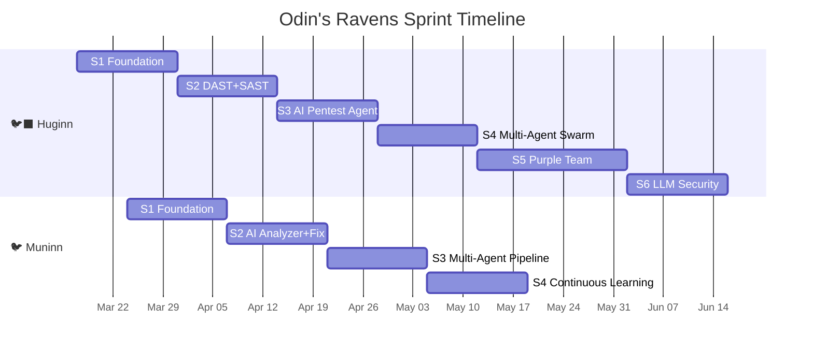

# 🏰 Asgard Sprint Planning — May 2026

> Asgard เป็นของทุกคนแล้ว — Asgard belongs to everyone.

---

## 📊 Current Status (as of 2026-05-12, Sprint 50 — v1.3.0 shipped)

Cluster is on v1.3.0 (Mimir + Bifrost + Syn rolled). Sprint 50 OCR + Sprint 50b text-PII guardrail (Tier 1) verified end-to-end against the live cluster.

| Component | Version | Last Sprint | Tests | ISO Docs | Docker/K8s | Status |
|:--|:--|:--|:--|:--|:--|:--|
| 🛡️ Heimdall gateway | v0.5.0 | 50b | 27+ Skuggi-core | ✅ | ⚠️ Host only (MLX) | ✅ Production |
| 🧠 Mimir (bridge) | **v1.3.0** | **50 / 50b** | 255+ + Skuggi corpus 30 | ✅ | ✅ K8s | ✅ Active |
| 🖥️ Mimir Dashboard | **v1.3.0** | **50 / 50b** | — | ✅ | ✅ K8s | ✅ Active |
| ⚡ Bifrost (Rust) | **v0.3.0** | **50** (B-50d OCR preproc) | cargo test ✓ | ✅ | ✅ K8s | ✅ Active |
| 👁️ Syn (OCR API) | **v0.2.0** | **50** (S1) | **13 unit + 8/8 e2e** | 📝 ADR-006 | ✅ K8s (NodePort 30002) | ✅ Active |
| 🌑 Skuggi-core | **v0.1.0** | **50b W1** | 27+ Tier 1 regex | 📝 ADR-007 | 🔗 in-process (Heimdall) | ✅ Text-PII shipped |
| 🏥 Eir | v0.5.0 | 38 + ocr_extract allowlist (50) | 57 | ✅ | ⚠️ OpenEMR image | ✅ JWKS Auth |
| 🐺 Fenrir | v0.2.0 | 3 | 63 | ✅ | ✅ K8s | ✅ JWT Auth |
| 🌳 Yggdrasil | v0.2.0 | 51e (OIDC rotation) | 45 | ✅ | ✅ K8s (Zitadel) | ✅ Active |
| 🛡️ Várðr | v0.5.0 | 1 | 5 | ✅ | ✅ K8s | ✅ Active |
| ⚖️ Týr | v4.9.0 | Active | — | ✅ | ✅ K3s (Wazuh) | ✅ Active |
| ⚖️ Forseti | v0.2.0 | 6 + syn-api scenario (50) | 147 + 8 syn e2e | ✅ | ✅ K8s | ✅ Active |
| 🔨 Mjölnir | v0.2.0 | Load | — | ✅ | ✅ K8s | ✅ Active |
| 🐿️ Ratatoskr | v0.2.0 | 1 | — | ✅ | ✅ K8s | ✅ Active |
| 📨 Hermóðr | v0.2.0 | 1 | — | ✅ | ✅ K8s | ✅ Active |
| 🐦‍⬛ Huginn | v0.3.0 | 1 | — | 🚧 | 🚧 Not deployed | 🚧 In Progress |
| 🐦 Muninn | v0.3.0 | 1 | — | 🚧 | 🚧 Not deployed | 🚧 In Progress |
| 🏰 Asgard (chart) | **v0.3.0** (appVersion 0.50.0) | 50 + 51e | — | ✅ PM | ✅ Umbrella Helm | ✅ Active |

> Sprint 50 introduced **Syn** (OCR/eKYC) and **Skuggi** (PII guardrail) as first-class platform services. ADR-006 + ADR-007 accepted.

---

## ✅ Sprint 50 — Complete (2026-05-12)

**Theme:** Vision pipeline + PII guardrail foundation.

| Lane | Deliverable | PR(s) | State |
|:--|:--|:--|:--|
| A — Mimir | OCR schema + smart router + audit + cost guard + curator review + tool allowlist + Skuggi text-PII pipeline + audit history | Mimir #264-#276 (13 PRs) | ✅ merged |
| B — Heimdall | Tier 1b anchored patterns + leak contract + skuggi-core path-dep refactor | Heimdall #6, #7 | ✅ merged |
| C — Bifrost (B-50d) | Transparent OCR preprocessing for image-bearing chat (Python → Rust rewrite) | Bifrost #13, #14 | ✅ merged |
| D — Syn (S1) | 3-tier OCR (PaddleOCR + Typhoon-OCR-local + Gemini Flash/Pro), smart router, audit, benchmarks | Syn #5, #6 | ✅ merged |
| E — Asgard | Umbrella v1.3-alpha release-prep + E2E runbook + integ-test cargo migration | Asgard #35, #36, #52 | ✅ merged |
| F — Test coverage | Syn unit tests (13) + Forseti syn_e2e.yaml (8 pass) + integ-test wiring | Syn #9, Forseti #6 #8, Asgard #55 | ✅ merged |
| G — Deploy fixes | imagePullPolicy=Always default (root cause of stale-:latest), syn-api MARIADB_URL secretKeyRef | Asgard #56, Syn #10 | ✅ merged |

**Live verification (2026-05-12):**
- ✅ `/api/v1/admin/skuggi/corpus` — 30 asgard_insurance rows seeded
- ✅ `/api/v1/admin/skuggi/redactions` — audit endpoint reachable
- ✅ `/api/v1/syn/ocr/extract-json` — HTTP 200, full audit row written (engine=paddleocr-local)
- ✅ Forseti syn-api scenarios — 8/8 pass

---

## ✅ Sprint 50b — Skuggi text-PII W1 (2026-05-09)

**Theme:** ADR-007 implementation — first PII guardrail tier.

| Stage | Deliverable | State |
|:--|:--|:--|
| W1 — Text Tier 1 + audit | `skuggi-core` crate, regex detector matrix (Thai ID, HN, license, phone, email + medical-cert patterns), `pii_redactions` table, Heimdall in-process middleware, /admin/skuggi/redactions audit history | ✅ Shipped 2026-05-09 |
| ADR-007 | Architecture decision record accepted | ✅ 2026-05-09 |

**Effect:** Text-payload cloud LLM calls now have a guardrail. Image and Tier 2 (NER) still gated to local-only.

---

## 🔄 Sprint 51e — Secret Rotation (in flight, 5/7 done as of 2026-05-11)

Hand-patched secret rotation across services to break out of pre-rotation defaults.

| Step | Component | State |
|:--|:--|:--|
| 1 | Heimdall (LLM Gateway) | ✅ Rotated |
| 2 | Neo4j | ✅ Rotated |
| 3 | Laminar | ⏭️ Deferred (third-party complexity) |
| 4 | MariaDB | ✅ Rotated |
| 5 | Postgres | ✅ Rotated |
| 6 | Mimir-OIDC | ✅ Rotated |
| 7a | Bifrost DB (inline → Secret) | ✅ Patched |
| 7b | Eir | ⏭️ Deferred |
| 8 | Masterkey | ⏭️ Deferred |

**Bonus fixes (during rotation work):**
- `lan-bridge-http` cleanup
- Mimir↔Neo4j 401 unauthenticated path
- Bifrost DATABASE_URL chart wired to MIMIR_DATABASE_URL secretKeyRef
- syn-api MARIADB_URL → secretKeyRef (2026-05-12)

---

## 🎯 Next Sprint: Sprint 51 — Hardening + Skuggi W2 Foundation

**Window:** 2026-05-13 → 2026-05-26 (2 weeks)
**Theme:** Tighten Sprint 50 deliverables + start image-PII redaction prep.

### Week 1 (P0)
| Task | Component | Description | Status |
|:--|:--|:--|:--|
| Flip Syn integ-test from advisory → gating | 🏰 Asgard CI | After 2 weeks of stable green, drop `continue-on-error` on syn cargo test + syn-api Forseti scenarios | 📝 Planned |
| Skuggi W2 image redaction design | 🌑 Skuggi | ADR follow-up: OCR bbox-based PII blur before cloud Tier 2/3 image submission | 📝 Planned |
| Curator review queue UI | 🧠 Mimir Dashboard | Wire `/api/v1/syn/ocr/review-queue` + `/documents/{id}/review` to a Curator-only admin page (B-50f follow-up) | 📝 Planned |
| Eir ocr_extract end-to-end smoke | 🏥↔📨↔👁️ | Trigger an Eir agent OCR call → Hermodr `ocr_extract` tool → syn-api `/extract` → assert audit row | 📝 Planned |

### Week 2 (P1)
| Task | Component | Description | Status |
|:--|:--|:--|:--|
| Sprint 51e leftovers | 🔐 Infra | Finish Step 3 (Laminar) + 7b (Eir) + 8 (Masterkey) rotations | 📝 Planned |
| Python sidecar pytest | 👁️ Syn | Smoke tests for paddleocr-sidecar + pythainlp-sidecar (`/healthz`, `/extract` fake-image path) | 📝 Planned |
| OCR cost guard hard-stop | 🧠 Mimir (B-50m) | Verify the per-tenant monthly budget enforcement actually 429s at the boundary (right now only logs) | 📝 Planned |
| sprint-planning.md auto-refresh | 🏰 Asgard | Generate this doc from PR labels + git tags so it stops going stale | 📝 Planned |

### Stretch (P2)
| Task | Component | Description |
|:--|:--|:--|
| ICD-10-TM Hermodr tool | 📨 Hermóðr | Thai-localized ICD-10 lookup — Mimir already has `icd10_lookup.py` reference data, just need MCP wrapper |
| Skuggi W3 NER scaffold | 🌑 Skuggi | PyThaiNLP wrapper (Tier 2) — gated on observed recall ≥ 98%; if not, jump straight to Sprint 55-57 ONNX plan |
| Sprint 52 INS-01 prep | 🏥 Insurance | Draft `sprint52_insurance_agents.sql` migration + Hermodr tool stubs (no production wire-up yet) |

---

## 📅 Upcoming Sprints (preview)

### Sprint 52-53 (2026-05-27 → 2026-06-23) — asgard_insurance Launch
- INS-01: Seed `asgard_insurance` tenant_configs + 5 insurance agents (insurance-router/generic/medical-review/pre-auth/claims)
- INS-02: Hermodr tools — `policy_coverage_lookup`, `claim_history_search`
- INS-04/05: Tool wiring + Forseti e2e scenario
- **Gating:** gemma-local only by default. Cloud LLM blocked until Sprint 54.

### Sprint 54 — Insurance Cloud Enablement
- Blocked on: Skuggi W2 image redaction + W3 NER (or Sprint 55-57 ONNX if PyThaiNLP fails recall gate)
- Flips `ocr_cloud_flash_enabled` per insurance sub-tenant once Skuggi covers both text and image surfaces

### Sprint 55-57 (gated) — Thai Medical NER Fine-tune
- Replace PyThaiNLP Tier 2 with in-process ONNX
- Only execute if PyThaiNLP recall drops below 98% on production data
- 03_17 execution plan + 03_18 MLOps infra docs (already drafted)

---

## 🏢 Enterprise Partner Integration Gaps

> Strategic gaps for Tier-1 Enterprise + White-Label (OEM) deployments. Distributed across services; tracked here for visibility.

### Phase 1: Infrastructure & Data Sovereignty
| Task | Component | Description | Priority |
|:--|:--|:--|:--|
| Air-gapped VPN | ⚡ Infra | Secure WireGuard tunnel for strict cross-border GPU infra | P0 🔴 |
| Multi-Lingual PII Scrubber | 🛡️ Heimdall / 🌑 Skuggi | Thai/Japanese/English PII masking before LLM proxy — **Text Tier 1 DONE 2026-05-09**, image + NER pending | 🟡 in-flight |
| Mjolnir SLA Load Test | 🔨 Mjolnir | Stress-test Odin orchestration to prove Enterprise SLA | P1 🟡 |

### Phase 2: Co-Branding & SI Enablement
| Task | Component | Description | Priority |
|:--|:--|:--|:--|
| OEM Theming Engine | 🧠 Mimir (UI) | Dynamic logo/theme for White-Label installs | P1 🟡 |
| Black-box API Docs | 🏰 Asgard | OpenAPI/Swagger for SI partners | P1 🟡 |
| CJK Localization | All | UTF-8 CJK across prompt pipelines, parsers, UI | P2 🟢 |
| SI Billing Telemetry | 🌳 Yggdrasil | Tenant-level API usage for volume-based SaaS | P2 🟢 |

### Phase 3: Mimir RAG Engine Enhancements (Backlog)
| Task | Component | Description | Priority |
|:--|:--|:--|:--|
| Pre/Post Tool Hook System | 🧠 Mimir (`rag_engine`) | `PreToolUse` + `PostToolUse` hook middleware in `DynamicContextPlugin` — enables PII scrubbing + audit at the RAG layer too | P1 🟡 |
| Agent Interrupt / Cancel | 🧠 Mimir (`rag_engine`) | Graceful cancellation for long `OracleRagAgent::chat()` via `CancellationToken` — needed for 10-45s H100 calls | P1 🟡 |

---

## 🐦‍⬛🐦 Odin's Ravens: Enterprise Security (Q2-Q3 2026)

> **[Full Implementation Plan →](roadmap/huginn-muninn.md)** | **[BRD](business/odins-ravens-brd.md)** | **[TRD](business/odins-ravens-trd.md)**

```mermaid
gantt
    title Odin's Ravens Sprint Timeline
    dateFormat YYYY-MM-DD
    axisFormat %b %d

    section 🐦‍⬛ Huginn
    S1 Foundation           :h1, 2026-03-17, 14d
    S2 DAST+SAST            :h2, after h1, 14d
    S3 AI Pentest Agent     :h3, after h2, 14d
    S4 Multi-Agent Swarm    :h4, after h3, 14d
    S5 Purple Team          :h5, after h4, 21d
    S6 LLM Security         :h6, after h5, 14d

    section 🐦 Muninn
    S1 Foundation           :m1, 2026-03-24, 14d
    S2 AI Analyzer+Fix      :m2, after m1, 14d
    S3 Multi-Agent Pipeline :m3, after m2, 14d
    S4 Continuous Learning  :m4, after m3, 14d
```

| Service | Stack | Total Sprints | Key Innovation |
|:--|:--|:--|:--|
| 🐦‍⬛ Huginn | 🦀 Rust/Axum | 6 sprints (13 weeks) | Multi-Agent Pentest Swarm + Purple Team |
| 🐦 Muninn | 🦀 Rust/Axum | 4 sprints (8 weeks) | Multi-Agent Fix Pipeline + Continuous Learning |

### 🐦‍⬛ Huginn — Sprint 1: Foundation
- [ ] Cargo scaffold (main.rs, config.rs, health.rs, db.rs, models.rs)
- [ ] Dockerfile + Docker Compose integration
- [ ] `GET /health` endpoint (Várðr compatible)
- [ ] `POST /api/scan` + `GET /api/scans/{id}`
- [ ] SQLite schema (scans, findings, suppressions)
- [ ] Basic nmap scan via `tokio::process::Command`

### 🐦 Muninn — Sprint 1: Foundation
- [ ] Cargo scaffold (main.rs, config.rs, health.rs, db.rs)
- [ ] Dockerfile + Docker Compose integration
- [ ] `GET /health` endpoint
- [ ] GitHub issue poller (octocrab, 5 min interval)
- [ ] SQLite schema (watched_repos, analyzed_issues, fixes)
- [ ] Label filter (huginn-finding, security, auto-fix, muninn-skip)

---

*Asgard เป็นของทุกคนแล้ว — Asgard belongs to everyone.*
