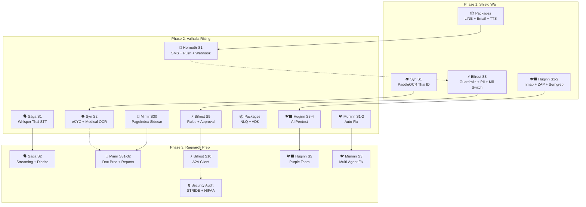

# 🏰 Asgard — Comprehensive Sprint Plan v2.0 (Skill-Informed)

> **Inputs**: TOR Gap Analysis, PageIndex Evaluation, MegaCare×Eir Compatibility, Shared Services Plan, **40 Agent Skills**
> **Date**: March 2026 | **Horizon**: Q2–Q4 2026
> **Goal**: Close TOR gaps from **46% → 85%+** coverage
> **Review**: Cross-referenced with all platform skills for technical accuracy

---

## 📊 Current Product Status (Mar 2026)

| # | Product | Ver | Sprint | Tests | Stack | Port | Status |
|:--|:--|:--|:--|:--|:--|:--|:--|
| 1 | 🛡️ Heimdall | v0.4 | — | Bench | Python MLX | `:8080` | ✅ Production |
| 2 | 🧠 Mimir | v0.29 | S29 | 255+ | Rust Axum | `:3000` | ✅ Active |
| 3 | ⚡ Bifrost | v0.7 | S7 | 133 | Python FastAPI | `:8100` | ✅ Active |
| 4 | 🏥 Eir | v0.4 | S4 | 57 | Rust Axum + OpenEMR | `:8300` | ✅ Active |
| 5 | 🐺 Fenrir | v0.3 | S3 | 63 | Rust Axum | `:8200` | ✅ Active |
| 6 | 🌳 Yggdrasil | v0.5 | S5 | 45 | Docker (Zitadel) | `:8085` | ✅ Active |
| 7 | 🛡️ Várðr | v0.1 | S1 | 5 | Rust Axum | `:9090` | ✅ Active |
| 8 | 🐦‍⬛ Huginn | v0.1 | S1 | — | Rust Axum | `:8400` | 🚧 Starting |
| 9 | 🐦 Muninn | v0.1 | S1 | — | Rust Axum | `:8500` | 📋 Planned |
| 10 | 👁️ **Syn** | — | — | — | Python FastAPI | `:8600` | 🆕 New |
| 11 | 🗣️ **Sága** | — | — | — | Python FastAPI | `:8700` | 🆕 New |
| 12 | 📨 **Hermóðr** | — | — | — | Python FastAPI | `:8800` | 🆕 New |
| 13 | 🏰 Asgard | v1α | — | — | Docker Compose | — | ✅ Active |

> **Total existing**: 537+ tests • 9 active products • 13 containers

---

## 🗺️ Gap → Sprint Mapping (Skill-Informed)

| TOR Gap | Target | Sprint | Skill Reference | Priority |
|:--|:--|:--|:--|:--|
| AI Guardrails | ⚡ Bifrost S8 | PII filter (Thai regex 13-digit, phone 0[689]x), kill switch, hallucination check | `ai-guardrails` | 🔴 P0 |
| Handover to Human | ⚡ Bifrost S8 | Context builder + queue + notify via Hermóðr | `ai-guardrails` | 🔴 P0 |
| OCR / eKYC | 👁️ Syn S1-S2 | PaddleOCR (lang='th'), ThaiIDResult schema, iApp face match | `ocr-document-processing` | 🔴 P0 |
| MegaCare Packages | 📦 packages/ | LINE webhook, Gmail API, Google TTS, BigQuery NLQ, ADK base | `fastapi-service-pattern` | 🔴 P0 |
| Approval Workflow | ⚡ Bifrost S9 | Approval queue, timeout escalation, JSON rule evaluator | `ai-guardrails` | 🟡 P1 |
| Rule Engine | ⚡ Bifrost S9 | JSON rule eval + insurance policy scoring | `ai-guardrails` | 🟡 P1 |
| Speech-to-Text | 🗣️ Sága S1-S2 | Whisper large-v3 (Thai ≥85%), WebSocket streaming, diarization | `speech-processing` | 🟡 P1 |
| Notification | 📨 Hermóðr S1 | ThaiBulkSMS, FCM push, webhook dispatch + retry queue + dedup | `notification-patterns` | 🟡 P1 |
| PageIndex | 🧠 Mimir S30 | Python sidecar (:8650), tree→enriched chunks, Heimdall LLM routing | `pageindex-integration` | 🟡 P1 |
| Document Processing | 🧠 Mimir S30-31 | XLSX parser, table_extractor, ocr_bridge → Syn | `ocr-document-processing` | 🟡 P1 |
| A2A Protocol | ⚡ Bifrost S10 | `/.well-known/agent.json`, task lifecycle, multi-skill routing | `a2a-protocol` | 🟡 P1 |
| FHIR Extensions | 🏥 Eir S5 | Encounter create, MedicationRequest, `$docref` DocumentReference | `fhir-healthcare-integration` | 🟡 P1 |
| Report Generation | 🧠 Mimir S32 | PDF/Excel export (Tera template → PDF) | — | 🟠 P2 |
| eBao Connector | ⚡ Bifrost tool | Insurance core API connector stub | — | 🟠 P2 |

---

## 📅 Phase 1: Foundation (Apr 2026) — "Shield Wall"

> **Goal**: Close P0 gaps — 46% → 55%

### ⚡ Bifrost S8 — AI Governance (W1-2)

> Skill: `ai-guardrails`

| Module | Files | Key Implementation |
|:--|:--|:--|
| `guardrails/pii_filter.py` | PII detection | Thai ID (`\d{1}-\d{4}-\d{5}-\d{2}-\d{1}`), phone (`0[689]\d-?\d{3}-?\d{4}`), email, credit card, bank account — regex-based with NER fallback |
| `guardrails/hallucination.py` | Grounding check | Compare response vs source texts via Heimdall LLM call → `{grounded: bool, confidence: 0-1}` |
| `guardrails/content_filter.py` | Category filter | Block `medical_advice_without_disclaimer`, `financial_guarantee`, `personal_data_request` |
| `guardrails/kill_switch.py` | Emergency stop | `POST /guardrails/kill` → global flag → 503 on all agent calls |
| `handover/context_builder.py` | Handover | Summarize chat → handover package, route to human queue |
| `handover/queue.py` | Human queue | In-memory queue with priority, trigger notify via Hermóðr |

**Tests**: +15 (pytest-asyncio) — `test_pii_masks_thai_id`, `test_kill_switch_blocks_agent`, `test_hallucination_flags_ungrounded`

---

### 📦 Package Extract (W1-2)

> Skill: `fastapi-service-pattern`

| Package | Source | Key Exports |
|:--|:--|:--|
| `@asgard/line-connector` | `customer-service/app/api/line.py` | `LineWebhookHandler`, `FlexMessageBuilder`, `LIFFAuth` |
| `@asgard/email-service` | `customer-service/app/services/email_service.py` | `GmailClient.send()`, HTML templates |
| `@asgard/tts-service` | `customer-service/app/api/tts.py` | `GoogleTTS.synthesize(text, lang="th-TH")` → MP3 bytes |

**Tests**: +10 (pytest) — unit tests for each package

---

### 👁️ Syn S1 — OCR Foundation (W3-4)

> Skill: `ocr-document-processing` + `fastapi-service-pattern`

| Component | Implementation |
|:--|:--|
| **Scaffold** | FastAPI + Pydantic Settings (`SYN_PORT=8600`), `/health`, `/readyz` |
| **Thai ID OCR** | `PaddleOCR(lang='th', use_gpu=False)` → `ThaiIDResult` (13 fields: id_number, prefix, first_name, …) |
| **General OCR** | `POST /v1/ocr/general` → raw text + confidence |
| **Docker** | `python:3.12-slim`, pre-download Thai model (~300MB), expose `:8600` |
| **Compose** | Add `asgard_syn` container, healthcheck `curl /health`, `networks: [asgard]` |

```python
# Output Schema (from ocr-document-processing skill)
class ThaiIDResult(BaseModel):
    id_number: str          # 13 digits
    prefix: str             # นาย/นาง/นางสาว
    first_name: str
    last_name: str
    date_of_birth: str      # YYYY-MM-DD
    address: str
    confidence: float       # ≥0.7 accept, <0.5 reject
```

**Tests**: +20 (pytest-asyncio + httpx) — Thai ID parsing, confidence thresholds, health endpoints
**Acceptance**: Confidence ≥0.7 on 80%+ of sample Thai ID images

---

### 🐦‍⬛ Huginn S1-S2 (W3-4)

> Skill: `rust-axum-service` + `security-scanning`

- Cargo scaffold, SQLite schema, nmap scan
- S2: ZAP (DAST) + Semgrep (SAST) + Trivy (container) integration
- OWASP-aligned severity mapping (from `owasp-reporting` skill)

**Tests**: +30 — Rust `#[cfg(test)]` + `#[tokio::test]`

---

### Phase 1 Summary

| Metric | Count |
|:--|:--|
| New tests | +75 |
| Total tests (platform) | **612+** |
| New containers | +1 (Syn) |
| Compose services | **14** |
| TOR coverage | **55%** |

---

## 📅 Phase 2: Expansion (May-Jun 2026) — "Valhalla Rising"

> **Goal**: Complete OCR/eKYC, STT, Notifications — 55% → 65-75%

### ⚡ Bifrost S9 — Intelligence (W1-2)

| Module | Implementation |
|:--|:--|
| `approval/workflow.py` | Approval flow definition (YAML config), pending queue, timeout → auto-escalate |
| `tools/rule_engine/evaluator.py` | JSON rule evaluation — condition/action chains |
| `tools/rule_engine/scoring.py` | Risk/priority scoring for insurance underwriting |

**Tests**: +20 — `test_rule_engine_evaluates_policy`, `test_approval_timeout_escalates`

---

### 👁️ Syn S2 — Full OCR + eKYC (W1-2)

> Skill: `ocr-document-processing`

| Endpoint | Input | Output |
|:--|:--|:--|
| `POST /v1/ocr/medical-doc` | Medical certificate image | ICD-10 codes (`[A-Z]\d{2}(?:\.\d{1,4})?`), document type |
| `POST /v1/ocr/bank-book` | Bank book image | Account number, bank name |
| `POST /v1/classify/document` | Any document image | Type: `medical_certificate`, `claim_form`, `lab_result`, `prescription` |
| `POST /v1/ekyc/face-match` | Photo + ID card | Match score via iApp/NDID API |

**Tests**: +25 — ICD-10 extraction, document classification, eKYC mock
**Acceptance**: eKYC end-to-end: photo → verified identity with ≥95% match

---

### 🗣️ Sága S1 — STT Foundation (W3-4)

> Skill: `speech-processing` + `fastapi-service-pattern`

| Component | Implementation |
|:--|:--|
| **Scaffold** | FastAPI + WebSocket (`SAGA_PORT=8700`), health, readyz |
| **Whisper STT** | `whisper.load_model("large-v3")`, `language="th"`, CPU mode |
| **Audio prep** | ffmpeg → 16kHz mono WAV, sox noise reduction |
| **API** | `POST /v1/stt/transcribe` (file upload), `GET /v1/models` |
| **Docker** | `python:3.12-slim`, `apt install ffmpeg sox`, pre-download Whisper (~3GB) |

```python
# Key config from speech-processing skill
ocr = whisper.load_model("large-v3")  # or "medium" for faster inference
result = model.transcribe(audio_path, language="th", fp16=False)
# Returns: {text, language, segments: [{start, end, text, confidence}]}
```

**Tests**: +15 — `test_transcribe_thai_audio`, `test_health_endpoint`, mock audio fixtures
**Acceptance**: Thai STT accuracy ≥85% on 10 test audio clips

---

### 📨 Hermóðr S1 — Notification Gateway (W3-4)

> Skill: `notification-patterns` + `fastapi-service-pattern`

| Channel | Provider | Implementation |
|:--|:--|:--|
| SMS | ThaiBulkSMS API | `POST /v1/notify/sms` → `{recipient, template_id, variables}` |
| Push | FCM (firebase-admin) | `POST /v1/notify/push` → token-based push |
| Webhook | Generic HTTP | `POST /v1/notify/webhook` → POST to URL with retry |
| Batch | All channels | `POST /v1/notify/batch` → multi-channel dispatch |

**Infrastructure from skill:**
- `RetryQueue` with exponential backoff (base=2.0, max_retries=3)
- `DeduplicationStore` with TTL (1 hour) for idempotency keys
- Template management: `templates/insurance/` + `templates/healthcare/`
- Port `:8800`, container `asgard_hermodr`

**Tests**: +15 — `test_sms_send_mock`, `test_retry_on_failure`, `test_dedup_blocks_duplicate`

---

### 🧠 Mimir S30 — PageIndex Integration (W1-4)

> Skill: `pageindex-integration` + `rust-backend-patterns`

| Component | Implementation |
|:--|:--|
| **Python sidecar** | FastAPI `:8650`, `POST /v1/index` → upload PDF → tree JSON |
| **LLM routing** | `api_base="http://heimdall:8080/v1"`, model `qwen3.5-9b` (cost=$0 local) |
| **Tree→Chunks bridge** | `tree_to_enriched_chunks()` → `{content, metadata: {section_path, page_start, hierarchy_level}}` |
| **Rust caller** | `reqwest::multipart::Form` → POST to sidecar → parse `PageIndexTree` |
| **Config** | `PAGEINDEX_ENABLED=false` (opt-in), `PAGEINDEX_URL`, `PAGEINDEX_MODEL` |

**Best for**: Insurance กรมธรรม์, TOR docs, Medical guidelines (hierarchical)
**Tests**: +10 — tree construction, chunk enrichment metadata, sidecar health
**Acceptance**: PDF → PageIndex tree → enriched chunks pipeline runs end-to-end

---

### 📦 Package Extract 2 + 🐦‍⬛ Huginn S3-4 + 🐦 Muninn S1-2

| Product | Deliverables | Tests |
|:--|:--|:--|
| Packages | `nlq-engine` (BigQuery NLQ), `adk-base` (ADK Orchestrator) | +5 |
| Huginn S3-4 | AI Pentest Agent (ReAct), Multi-Agent Swarm | +25 |
| Muninn S1-2 | GitHub poller, AI Analyzer + Auto-Fix + PR | +25 |

---

### Phase 2 Summary

| Metric | Count |
|:--|:--|
| New tests | +140 |
| Total tests (platform) | **752+** |
| New containers | +3 (Sága, Hermóðr, PageIndex sidecar) |
| Compose services | **17** |
| TOR coverage | **65-75%** |

---

## 📅 Phase 3: Integration (Jul-Aug 2026) — "Ragnarök Prep"

> **Goal**: Cross-product integration — 75% → 85%+

### 🗣️ Sága S2 — Streaming (W1-4)

> Skill: `speech-processing`

- **WebSocket STT**: `WS /v1/stt/stream` — buffer 3s audio (288KB @48kHz) → partial results
- **Speaker diarization**: pyannote.audio or Whisper's word timestamps
- **TTS integration**: Bridge to `@asgard/tts-service` (Google Cloud TTS, 5 languages)

---

### ⚡ Bifrost S10 — A2A Client (W1-4)

> Skill: `a2a-protocol` + `fhir-healthcare-integration`

- **Agent Card**: Expose `/.well-known/agent.json` with skills registry
- **Task lifecycle**: `submitted → working → completed/failed/input-required`
- **Multi-service routing**: Bifrost → Eir (FHIR), Bifrost → Syn (OCR), Bifrost → Sága (STT)
- **FHIR Integration**: Patient search, Clinical summary, DocumentReference via Eir `:8300`

---

### 🧠 Mimir S31-S32 — Doc+Reports (W1-4)

- S31: XLSX parser (calamine crate), `table_extractor.rs`, `ocr_bridge.rs` → Syn `:8600`
- S32: PDF generator (Tera templates → printpdf), Excel export (rust_xlsxwriter)

---

### Security Review (All Services)

> Skill: `security-audit`

- **STRIDE** threat model for each new service (Syn, Sága, Hermóðr)
- **HIPAA/PDPA** checklist for Syn (eKYC handles personal data) and Sága (voice recordings)
- **OWASP API Top 10** review for all new REST endpoints
- **Docker hardening**: non-root user, read-only FS, resource limits for all 17 containers
- **Dependency audit**: `pip-audit` (Python), `cargo audit` (Rust)

---

### 🏰 Unified Docker Compose (All 17 services)

> Skill: `docker-deployment`

```yaml
# New services added to docker-compose.yml
syn:
  build: ../Syn
  container_name: asgard_syn
  ports: ["8600:8600"]
  healthcheck:
    test: ["CMD", "curl", "-f", "http://localhost:8600/health"]
  networks: [asgard]

saga:
  build: ../Saga
  container_name: asgard_saga
  ports: ["8700:8700"]
  deploy:
    resources:
      limits: { memory: 4G }  # Whisper model needs RAM
  networks: [asgard]

hermodr:
  build: ../Hermodr
  container_name: asgard_hermodr
  ports: ["8800:8800"]
  networks: [asgard]

pageindex:
  build: ../Mimir/sidecar/pageindex
  container_name: asgard_pageindex
  ports: ["8650:8650"]
  depends_on: [heimdall]
  networks: [asgard]
```

---

### Phase 3 Summary

| Metric | Count |
|:--|:--|
| New tests | +60 |
| Total tests (platform) | **812+** |
| Compose services | **17** (finalized) |
| TOR coverage | **85%+** |

---

## 📅 Phase 4: TOR Demo (Sep-Oct 2026) — "Götterdämmerung"

> **Goal**: Integration testing, TOR demo readiness

### End-to-End Flows

```
1. LINE Message → @asgard/line-connector → Bifrost Agent 
   → Eir(FHIR Patient Search) → Mimir(RAG) → Response → LINE Reply

2. Voice Call → Sága(STT) → Bifrost Agent → Syn(OCR claim doc)
   → Rule Engine(evaluate) → Approval Queue → Hermóðr(SMS notify)

3. Document Upload → Syn(classify) → Mimir(PageIndex → RAG)
   → Bifrost(summarize) → Hermóðr(email report)
```

### Security Hardening

> Skill: `security-audit` + `ai-guardrails`

- Huginn S6: LLM Security — prompt injection defense
- Full STRIDE review across all 13 services
- Penetration test report (Huginn self-scan)

---

## 📈 Coverage Trajectory (Updated)

```
Timeline:    Mar 2026    Apr(P1)   May-Jun(P2)  Jul-Aug(P3)  Sep-Oct(P4)
             ─────────────────────────────────────────────────────────────
TOR Cover:   ██░░░░░░░░  ███░░░░░  ██████░░░░   ████████░░   █████████░
             46%         55%       65-75%        85%+         85%+ + demo

Tests:       537+        612+      752+          812+         852+
Services:    13          14        17            17           17 (stable)
Skills:      32          40        40            40+          40+
```

---

## 🏗️ Dependency Graph (Enhanced)



---

## 📊 Effort Summary (Skill-Informed)

| Product | Sprints | Duration | Tests | Key APIs | Skill(s) Used |
|:--|:--|:--|:--|:--|:--|
| ⚡ Bifrost | S8-S10 | 3 mo | +55 | `/guardrails/*`, `/approval/*`, `/.well-known/agent.json` | `ai-guardrails`, `a2a-protocol` |
| 🧠 Mimir | S30-S32 | 3 mo | +30 | PageIndex sidecar, XLSX/PDF export | `pageindex-integration`, `rust-backend-patterns` |
| 👁️ Syn | S1-S2 | 2 mo | +45 | `/v1/ocr/thai-id`, `/v1/ekyc/face-match` | `ocr-document-processing`, `fastapi-service-pattern` |
| 🗣️ Sága | S1-S2 | 2 mo | +30 | `/v1/stt/transcribe`, `WS /v1/stt/stream` | `speech-processing`, `fastapi-service-pattern` |
| 📨 Hermóðr | S1 | 1 mo | +15 | `/v1/notify/sms`, `/v1/notify/push` | `notification-patterns`, `fastapi-service-pattern` |
| 🐦‍⬛ Huginn | S1-S6 | 3 mo | +80 | Scan API, pentest agents | `rust-axum-service`, `security-scanning`, `owasp-reporting` |
| 🐦 Muninn | S1-S4 | 2 mo | +50 | GitHub poller, fix PR API | `rust-axum-service`, `code-analysis-fixing` |
| 📦 Packages | — | 2 wk | +10 | 5 shared pip packages | `fastapi-service-pattern` |
| **TOTAL** | — | **6 mo** | **+315** | | **40 skills** |

---

## ✅ TOR Gap Closure Forecast

| Gap Category | Current | P1 (Apr) | P2 (May-Jun) | P3 (Jul-Aug) | P4 (Sep-Oct) |
|:--|:--|:--|:--|:--|:--|
| Core AI Platform | 96% | 96% | 96% | 96% | 96% |
| AI Governance | 50% | **83%** | 83% | 90% | 90% |
| Service/POS Agent | 43% | 43% | **71%** | 85% | 85% |
| Claims Agent | 8% | 8% | 25% | **50%** | **60%** |
| Underwriting Agent | 0% | **10%** 🆕 | **15%** | **30%** | **40%** | 🆕 Visual BMI PoC in P1 |
| Data Analysis | 50% | 50% | **67%** | 83% | 83% |
| Channel Integration | 56% | **75%** | 75% | **88%** | **94%** |
| OCR/Document | 0% | **40%** | **80%** | 80% | 80% |
| Voice/Speech | 33% | 33% | **67%** | **100%** | 100% |
| Infrastructure | 50% | 50% | 75% | **100%** | 100% |
| **TOTAL** | **46%** | **55%** | **65%** | **85%+** | **~87%** |

> [!IMPORTANT]
> Claims (60%) + Underwriting (40%) ยังต่ำ เพราะต้องการ **Insurance domain logic** จาก Dhipaya Life domain expert — ไม่ใช่ pure platform work
> 
> 🆕 **Visual BMI (FR-UW-BMI-01)** เริ่ม PoC ใน P1 ด้วย Gemini 2.5 Flash (1-2 วัน) + Digital Scale CNN (open-source, MAPE 7.9%) → dual-use กับ MegaCare STOP-BANG (auto-fill B+N) — [ดูรายละเอียด](file:///Users/mimir/Developer/TOR/FR-UW-BMI-01_Visual_BMI_Analysis.md)

---

## 🧪 Test Strategy per Phase

> Skill: `test-strategy`

| Phase | Unit (70%) | Integration (20%) | E2E (10%) |
|:--|:--|:--|:--|
| P1 (+75) | 52 tests | 15 tests | 8 tests |
| P2 (+140) | 98 tests | 28 tests | 14 tests |
| P3 (+60) | 42 tests | 12 tests | 6 tests |
| P4 (+40) | 28 tests | 8 tests | 4 tests |

**Test frameworks:**
- Rust services: `#[cfg(test)]` + `#[tokio::test]` + `cargo test`
- Python services: `pytest` + `pytest-asyncio` + `httpx.AsyncClient` + `pytest --cov`
- E2E: Playwright (browser flows), curl scripts (API chains)

---

## ⚠️ Risks & Dependencies (Skill-Informed Mitigations)

| Risk | Impact | Mitigation | Skill |
|:--|:--|:--|:--|
| PaddleOCR Thai accuracy <70% | Syn quality | Test early with real Thai IDs; iApp Vision API fallback; confidence threshold (≥0.7) | `ocr-document-processing` |
| Whisper Thai accuracy <85% | Sága quality | Benchmark Whisper vs Google STT; hybrid mode (local + cloud fallback) | `speech-processing` |
| PageIndex Thai ToC detection | Mimir tree quality | Test with Thai PDFs; tune prompts via Heimdall; fall back to page-level chunking | `pageindex-integration` |
| Whisper model 3GB RAM | Sága deployment | Docker `deploy.resources.limits.memory: 4G`; consider `medium` model (1.5GB) | `docker-deployment` |
| PaddleOCR model 300MB | Syn Docker size | Multi-stage build; pre-download in Docker layer | `docker-deployment` |
| eBao API access | Insurance domain | Need partner coordination with Dhipaya Life **early in Phase 2** | — |
| Team capacity (17 containers!) | Delivery pace | P0 only in Phase 1; defer P2 items; use skill templates for faster scaffolding | `roadmap-planning` |
| AGPL contamination (Eir/OpenEMR) | License | Keep Eir isolated; no code merge into proprietary — use A2A protocol for integration | `a2a-protocol` |
| PII leakage in agent responses | PDPA/HIPAA | PII filter on both input AND output; Thai ID regex + bank account patterns | `ai-guardrails` + `security-audit` |
| Notification spam | UX damage | Deduplication store (TTL 1hr); rate limiting per recipient | `notification-patterns` |
| PHI in voice recordings (Sága) | HIPAA compliance | Encrypt audio at rest; auto-delete after transcription; audit log all access | `security-audit` |
| 🆕 Visual BMI accuracy cross-population | UW false-flag rate | Gemini PoC first (1-2 d); Digital Scale fine-tune with Thai dataset; use as flag only (Human-in-the-loop) | `ai-guardrails` |
| 🆕 Visual BMI PDPA compliance | Biometric data concern | PoC: anonymized images on Cloud; Production: Gemma 3 on-prem via Heimdall; delete images after scoring | `security-audit` |
