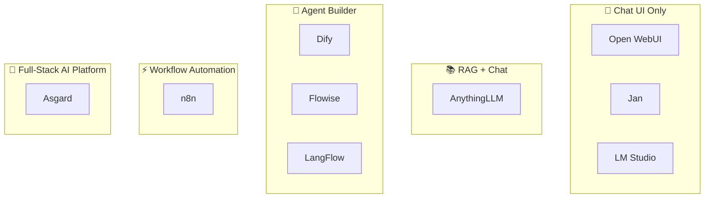
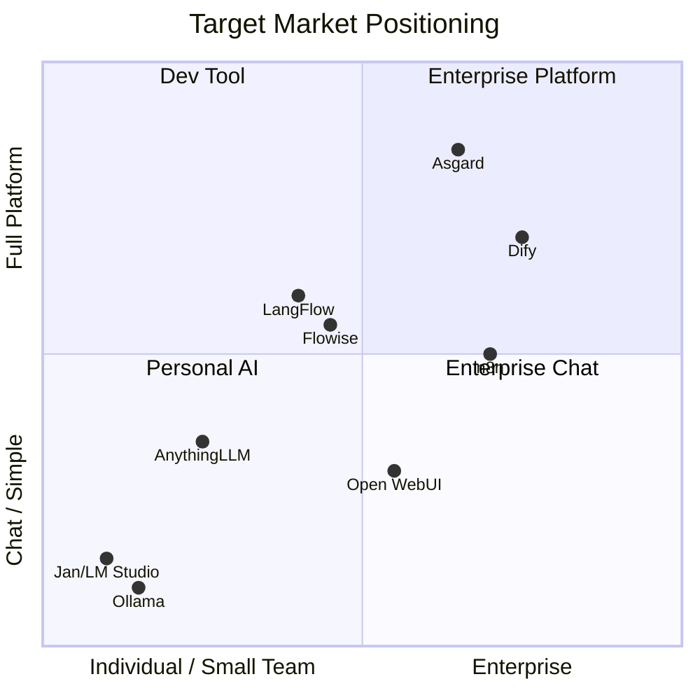

# 🏰 Asgard — Competitor & Target Market Analysis

> Competitor analysis, target market mapping, and market gaps where Asgard can differentiate.

---

## 1. Competitor Landscape



---

## 2. Competitor Breakdown

### 💬 Open WebUI

| | |
|:--|:--|
| **Type** | Chat UI for Ollama / OpenAI-compatible backends |
| **Target** | 🧑‍💻 Developers, Homelab, Universities, Enterprise |
| **Customers** | Samsung Semiconductor, Johannes Gutenberg University (30K+) |
| **Pricing** | Free (MIT License) |
| **Strengths** | ⭐ 80K+ GitHub stars, beautiful UI, RBAC, SCIM 2.0 |
| **Weaknesses** | No RAG pipeline, no Agent runtime, no Gateway |
| **Where Asgard wins** | Full-stack (Gateway + RAG + Agent + Computer Use) |

---

### 📚 AnythingLLM

| | |
|:--|:--|
| **Type** | RAG + Chat (All-in-one local AI) |
| **Target** | 🧑‍💻 Individuals, Small teams, Privacy-conscious users |
| **Pricing** | Desktop free (MIT), Cloud ~$50/month |
| **Strengths** | Very easy to use, supports many document formats |
| **Weaknesses** | No multi-tenancy, no Agent runtime, no Gateway |
| **Where Asgard wins** | Multi-tenant, Enterprise features, Gateway |

---

### 🤖 Dify — **Primary Competitor**

| | |
|:--|:--|
| **Type** | LLM App Builder (Low-code) |
| **Target** | 🏢 Mid-market B2B, Enterprise |
| **Pricing** | Free self-host, Cloud $59-159/month, Enterprise ¥500K/year |
| **GitHub** | ⭐ 60K+ stars |
| **Strengths** | Visual workflow, Plugin marketplace, Full Enterprise features |
| **Weaknesses** | ❌ No LLM Gateway, ❌ No Computer Use, ❌ Requires cloud APIs |
| **Where Asgard wins** | **Native local inference** (MLX/vLLM), Gateway, Computer Use |

---

### ⚡ Flowise

| | |
|:--|:--|
| **Type** | LLM Workflow Builder (Low-code) |
| **Target** | 🧑‍💻 Developers, Small teams |
| **Pricing** | Free (Apache 2.0), Cloud $35-65/month |
| **Strengths** | Drag-and-drop UI, Human-in-the-Loop |
| **Weaknesses** | ❌ No Gateway, ❌ No Computer Use |

---

### 🔀 LangFlow

| | |
|:--|:--|
| **Type** | Visual AI Workflow Builder (Developer-focused) |
| **Target** | 🧑‍💻 Developers, AI researchers |
| **Pricing** | Free (MIT), Enterprise $2K+/month |
| **Weaknesses** | Too technical, requires manual assembly |

---

### ⚙️ n8n

| | |
|:--|:--|
| **Type** | Workflow Automation + AI features |
| **Target** | 🏢 Business automation, IT ops |
| **Pricing** | Free self-host, Cloud €20-800/month |
| **Weaknesses** | AI is just an add-on feature, not core |

---

### 🐾 OpenClaw (formerly Clawdbot / Moltbot) — **Emerging Autonomous Agent**

| | |
|:--|:--|
| **Type** | Autonomous AI Agent — messaging-native, full system access |
| **Target** | 🧑‍💻 DevOps / Backend engineers, freelancers, power users |
| **GitHub** | ⭐ 347K+ stars (reportedly the most-starred repo in GitHub history, Apr 2026) |
| **Pricing** | Free (MIT License) — pay only for LLM API usage |
| **Origin** | Austrian developer Peter Steinberger (PSPDFKit); now under community foundation after founder joined OpenAI |
| **Strengths** | True 24/7 autonomous operation, proactive heartbeat scheduler, full shell/filesystem access, any OpenAI-compatible LLM backend, messaging UI (WhatsApp/Telegram/Discord), MIT license |
| **Weaknesses** | ❌ No RAG pipeline, ❌ No LLM Gateway, ❌ No visual UI, ❌ No enterprise RBAC, ❌ No multi-tenancy, ⚠️ Serious security risks — known RCE CVE (CVE-2026-25253), 42,900 exposed internet-facing instances, malicious community skills found by Cisco AI security, prompt injection vulnerability |
| **Where Asgard wins** | **Enterprise-grade security** (Týr SIEM, Fáfnir Vault, sandboxed Fenrir), RAG pipeline (Mimir), LLM Gateway (Heimdall), multi-tenant RBAC (Yggdrasil), proper audit trail — Asgard is production-safe; OpenClaw is not suitable for customer-facing or regulated workloads |

---

## 3. 📊 Feature Comparison Matrix

| Feature | Asgard | Dify | Open WebUI | AnythingLLM | Flowise | n8n | **OpenClaw** |
|:--|:--|:--|:--|:--|:--|:--|:--|
| **LLM Gateway** | ✅ Heimdall | ❌ | ❌ | ❌ | ❌ | ❌ | ❌ |
| **Native Local Inference** | ✅ MLX+vLLM | ❌ Cloud APIs | ⚠️ via Ollama | ⚠️ via Ollama | ❌ | ❌ | ⚠️ via Ollama/any |
| **RAG Pipeline** | ✅ Mimir | ✅ | ⚠️ Basic | ✅ | ✅ | ⚠️ | ❌ |
| **Agent Runtime** | ✅ Bifrost | ✅ | ❌ | ❌ | ✅ | ⚠️ | ✅ (autonomous) |
| **Computer Use** | ✅ Fenrir (sandboxed) | ❌ | ❌ | ❌ | ❌ | ❌ | ✅ (unsafe) |
| **24/7 Autonomous** | 🟡 via Bifrost | ❌ | ❌ | ❌ | ❌ | ✅ | ✅ |
| **Multi-Tenant** | ✅ | ✅ | ⚠️ | ❌ | ❌ | ⚠️ | ❌ |
| **SSO/SAML** | ✅ Zitadel | ✅ | ⚠️ | ❌ | ✅ Ent | ✅ Ent | ❌ |
| **SIEM / Audit Trail** | ✅ Týr | ❌ | ❌ | ❌ | ❌ | ❌ | ❌ |
| **Enterprise Security** | ✅ | ⚠️ | ⚠️ | ❌ | ❌ | ⚠️ | ❌ (CVE-2026-25253) |
| **Self-Host** | ✅ 100% | ✅ | ✅ | ✅ | ✅ | ✅ | ✅ |
| **Apple Silicon** | ✅ Native | ❌ | ⚠️ | ⚠️ | ❌ | ❌ | ⚠️ |
| **NVIDIA GPU** | 🟢 vLLM | ❌ | ⚠️ | ⚠️ | ❌ | ❌ | ❌ |
| **License** | AGPL-3.0 | Apache 2.0 | MIT | MIT | Apache 2.0 | Sustainable | MIT |
| **GitHub Stars** | — | 60K+ | 80K+ | 30K+ | 30K+ | 50K+ | **347K+** |

---

## 4. 🎯 Target Market Positioning



| Competitor | Primary Target | Secondary Target |
|:--|:--|:--|
| **Open WebUI** | 🧑‍💻 Developer / Homelab | 🏫 University / Enterprise IT |
| **AnythingLLM** | 🧑 Individual / Small team | 🔒 Privacy-focused orgs |
| **Dify** | 🏢 Mid-market B2B / Enterprise | 🧑‍💻 Technical teams |
| **Flowise** | 🧑‍💻 Developer / Small team | 🏢 Enterprise (custom plan) |
| **LangFlow** | 🧑‍💻 Developer / AI researcher | 🏢 Enterprise (self-setup) |
| **n8n** | 🏢 Business / IT ops | 🧑‍💻 Developer |
| **Ollama/LocalAI** | 🧑‍💻 Developer / Tinkerer | — |

---

## 5. 🕳️ Market Gaps

> **No one in the market delivers "Full-Stack Self-Hosted AI + Local Inference + Enterprise Features" completely.**

| # | Gap | Explanation |
|:--|:--|:--|
| 1 | **Gateway + Inference + RAG in one platform** | Dify requires cloud APIs, AnythingLLM has no Gateway |
| 2 | **Enterprise Self-Host 100%** | Dify leans cloud, Flowise/LangFlow need cloud APIs |
| 3 | **Dual Hardware (Apple + NVIDIA)** | No one supports both MLX + vLLM |

### Underserved Customer Segments

| Segment | Why Asgard fits | Purchasing Power |
|:--|:--|:--|
| 🏥 **Healthcare SME** | Patient data is sensitive → 100% local | High |
| ⚖️ **Legal Firm** | Confidential documents → RAG + local inference | High |
| 🏦 **Financial Services** | Compliance → Audit trail (Zitadel) | Very High |
| 🎮 **Game Studio** | IP protection + Fenrir (automated QA) + NPC AI | Medium |
| 🏭 **Manufacturing** | Air-gapped environments → Offline capable | High |
| 🏛️ **Government** | Must self-host + compliance | High |
| 🎓 **University** | Limited budget → Free community + multi-tenant | Medium |
| 🛡️ **Insurance** | PDPA + claims automation + policy RAG | Very High |
| 📡 **Telco** | Data residency + customer service at scale + cost reduction | Very High |
| ⚡ **Energy/Utilities** | Critical infra, air-gapped, safety documentation RAG | Very High |
| 🏗️ **Large Conglomerates** | Multi-tenant KB across business units + contract analysis | Very High |
| 📊 **Consulting / Big 4** | Client data confidentiality + research synthesis agents | High |

---

## 6. 💡 Recommended Target Market

### Tier 1 — Launch First (Community Edition)

> **🏥 Healthcare + ⚖️ Legal + 🏦 Financial + 🎮 Game Studio**

| Rationale | |
|:--|:--|
| **Clear pain** | Data must stay on-premise → self-host only → Dify doesn't fit |
| **Budget ready** | SMEs in these 4 segments have IT infrastructure budget |
| **Compliance** | PDPA / HIPAA / financial regulations → audit trail |
| **Right size** | 10-200 users → Mac Mini/DGX Spark is sufficient |

#### 🎮 Game Industry Use Cases

| Use Case | Asgard Component |
|:--|:--|
| **NPC AI / Dialog** | Bifrost + Heimdall |
| **Automated Game Testing** | 🐺 Fenrir (Computer Use) — **unique to Asgard** |
| **Procedural Content** | Bifrost + Mimir (RAG) |
| **IP Protection** | 100% Local Inference |
| **Hardware Match** | Mac (design) + NVIDIA (rendering) |

### Tier 2 — Growth (High Purchasing Power)

> **🛡️ Insurance + 📡 Telco + ⚡ Energy/Utilities + 🏗️ Large Conglomerates + 📊 Consulting**

These sectors have the largest IT budgets in SEA and face the same core problem: **sensitive data that cannot leave the organization**.

#### 🛡️ Insurance Use Cases

| Use Case | Asgard Component | Value |
|:--|:--|:--|
| **Policy document Q&A** | Mimir RAG | ลด call center 30-50% |
| **Claims processing automation** | Bifrost + Fenrir Computer Use | ลดเวลา manual จาก 2 วัน → 2 ชม. |
| **Fraud detection knowledge base** | Mimir GraphRAG (Neo4j) | ค้นหา pattern ข้ามเคส |
| **Agent ตรวจสอบเบี้ยประกัน** | Bifrost ReAct + FHIR (Eir) | Underwriting อัตโนมัติ |
| **Audit trail / PDPA compliance** | Týr SIEM + Yggdrasil | BOI / OIC reporting |

> **WTP:** $10K–50K/year · **PDPA risk** ถ้า data ออก cloud = fine สูงสุด 5M THB/event

---

#### 📡 Telco Use Cases

| Use Case | Asgard Component | Value |
|:--|:--|:--|
| **Customer service bot (Thai)** | Bifrost + Heimdall (local LLM) | ลด cost/query จาก $0.01 → $0.0001 |
| **Network ops documentation** | Mimir RAG | Engineer ค้นหา runbook เร็วขึ้น |
| **Internal IT helpdesk agent** | Bifrost + Mimir | ลด L1 ticket 60%+ |
| **Data residency compliance** | 100% on-premise | NBTC + PDPA requirement |
| **Bulk inference at scale** | Heimdall + vLLM (NVIDIA) | ROI ชัดมากเมื่อ volume สูง |

> **WTP:** $50K–200K/year · **Scale factor** Telco มี user หลายล้าน → local inference คุ้มทุนเร็วมาก

---

#### ⚡ Energy / Utilities Use Cases

| Use Case | Asgard Component | Value |
|:--|:--|:--|
| **Safety manual Q&A (offline)** | Mimir RAG + Heimdall (air-gapped) | Zero internet required |
| **Maintenance procedure agent** | Bifrost + Fenrir | Technician สั่งงานด้วยภาษาธรรมชาติ |
| **Incident report analysis** | Mimir + GraphRAG | Root cause ข้ามเหตุการณ์ |
| **Compliance documentation** | Forseti + Mimir | ISO 55001 / ERC requirements |
| **Critical infra isolation** | Kubernetes air-gapped deploy | NERC CIP equivalent |

> **WTP:** $50K–200K/year · **Security posture** ต้องการ on-premise 100% ตามกฎ กกพ. / EGAT policy

---

#### 🏗️ Large Conglomerates (CP, Central, ThaiBev, SCB) Use Cases

| Use Case | Asgard Component | Value |
|:--|:--|:--|
| **Multi-BU knowledge base** | Mimir multi-tenant | แต่ละ BU มี KB แยก แต่ share platform |
| **Contract review agent** | Bifrost + Mimir RAG | Legal review 10x เร็วกว่า |
| **HR policy Q&A** | Mimir + Eir Chat UI | พนักงานหลายหมื่นคนใช้งานได้ |
| **Supplier data pipeline** | Fenrir Computer Use | Automate vendor portal |
| **Group-wide SSO** | Yggdrasil (Zitadel SAML) | AD / LDAP integration |

> **WTP:** $20K–100K/year · **Scale** Conglomerate 1 ใบ = revenue เทียบกับ SME 20 ราย

---

#### 📊 Consulting / Professional Services Use Cases

| Use Case | Asgard Component | Value |
|:--|:--|:--|
| **Client document analysis** | Mimir RAG | Due diligence 5x เร็วกว่า |
| **Research synthesis agent** | Bifrost + Mimir | สรุป 100 เอกสารใน 10 นาที |
| **Proposal generation** | Bifrost + Mimir Knowledge Base | Reuse IP ของบริษัท |
| **Client data isolation** | Multi-tenant per project | ข้อมูลลูกค้าไม่ปน |
| **Audit evidence gathering** | Fenrir Computer Use | Automate data collection |

> **WTP:** $5K–20K/year · **Value prop** Client confidentiality = Big 4 ไม่กล้าใช้ cloud

### Tier 3 — Scale (Enterprise Edition)

> **🏭 Manufacturing + 🏛️ Government + 🎓 University**

---

## 7. 🎯 Positioning Statement

```
For     : SMEs that need AI but data cannot leave the company
Asgard  : Full-stack self-hosted AI platform
Unlike  : Dify, Open WebUI, AnythingLLM
Because : Only platform combining LLM Gateway + RAG + Agent + Computer Use
          with native inference on both Apple Silicon and NVIDIA GPU
          Data never leaves your premises — 100% secure
```

---

*📅 Last updated: March 2026*
