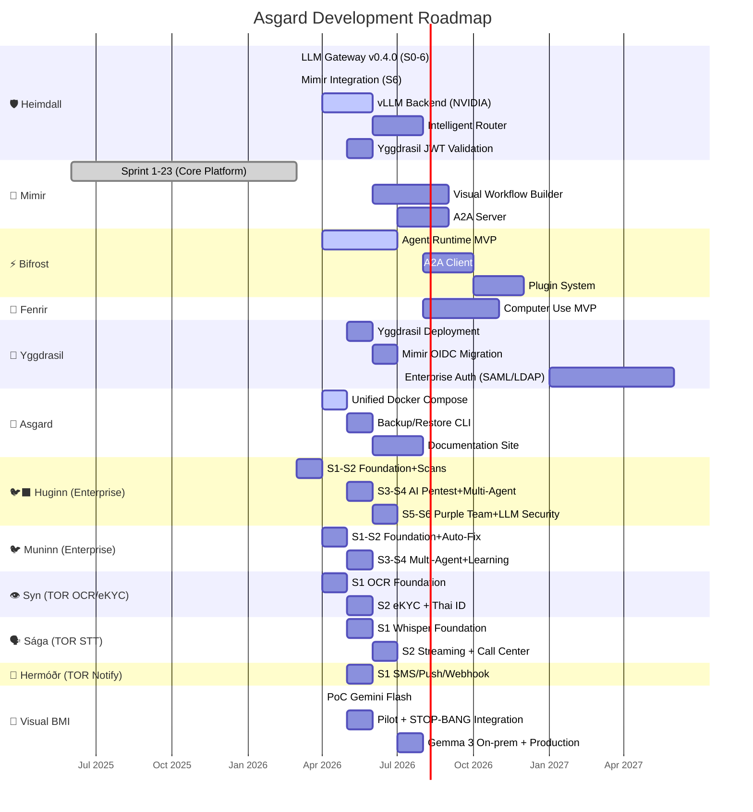

# 🗺️ Asgard — Development Roadmap

> Single source of truth for all milestones and timelines.
>
> Last updated: March 2026

---

## Roadmap Overview

---

## Now / Next / Later

### 🟢 Now (Q2 2026 — April-June)

| Milestone | Component | Status | Done Criteria |
|:--|:--|:--|:--|
| Bifrost MVP | ⚡ Bifrost | 🚧 | ReAct loop works, calls tools via MCP |
| Unified Docker Compose | 🏰 Asgard | 📋 | Single `docker compose up` starts all services |
| Backup CLI | 🏰 Asgard | 📋 | `scripts/backup.sh` backs up MariaDB + Qdrant |
| **Huginn S1-S2** | 🐦‍⬛ **Huginn** | 🚧 | Foundation + DAST/SAST scan orchestration |
| **Muninn S1** | 🐦 **Muninn** | 📋 | Foundation + GitHub issue watching |
| 🆕 **Visual BMI PoC** | 📸 **FR-UW-BMI-01** | 📋 | Gemini 2.5 Flash PoC (1-2 days) + Digital Scale eval |
| 🆕 **Syn S1** | 👁️ **Syn** | 📋 | OCR Foundation (PaddleOCR + Thai ID parser) |

### 🔵 Next (Q3 2026 — July-September)

| Milestone | Component |
|:--|:--|
| Visual Workflow Builder | 🧠 Mimir |
| A2A Server + Client | 🧠 Mimir + ⚡ Bifrost |
| Fenrir MVP | 🐺 Fenrir |
| Documentation Site | 🏰 Asgard (asgardai.dev) |
| Intelligent Router | 🛡️ Heimdall |
| **Huginn S3-S5** | 🐦‍⬛ **Huginn** (AI Pentest + Multi-Agent + Purple Team) |
| **Muninn S2-S3** | 🐦 **Muninn** (AI Fix + Multi-Agent Pipeline) |
| 🆕 Visual BMI Pilot | 📸 Pilot + STOP-BANG integration + Gemma 3 on-prem |
| 🆕 Syn S2 | 👁️ eKYC + Face match |
| 🆕 Sága S1-S2 | 🗣️ STT Foundation + Streaming |
| 🆕 Hermóðr S1 | 📨 Notification Foundation (SMS/Push/Webhook) |

### 🟣 Later (Q4 2026 — October-December)

| Milestone | Component |
|:--|:--|
| Plugin System | ⚡ Bifrost |
| Agent Marketplace | 🧠 Mimir |
| Community v1.0 Launch | 🏰 All |
| **Huginn S6 + Polish** | 🐦‍⬛ **Huginn** (LLM Security + Compliance) |
| **Muninn S4** | 🐦 **Muninn** (Continuous Learning) |

> ℹ️ Knowledge Graph (Neo4j) already done in Mimir Sprint 17 (Mar 2026)

### 🔮 Future (2027+)

| Milestone | Component |
|:--|:--|
| Enterprise Edition v2.0 | 🏰 All |
| SSO / Advanced RBAC | 🌳 Yggdrasil |
| HA Clustering | 🏰 Asgard |
| White-Label | 🏰 Asgard |

---

## Release Milestones

| Version | Codename | Target | Key Deliverables |
|:--|:--|:--|:--|
| **v0.5** | Foundation | Q2 2026 | Unified Docker Compose, Bifrost MVP, Yggdrasil, **Huginn S1-S2**, 🆕 Visual BMI PoC, 🆕 Syn S1 |
| **v0.8** | Growth | Q3 2026 | Workflow Builder, A2A, Fenrir MVP, **Huginn S3-S5, Muninn S1-S3**, 🆕 Sága S1-S2, 🆕 Hermóðr S1, 🆕 Visual BMI Pilot |
| **v1.0** | Community Launch | Q4 2026 | Full platform, docs site, marketplace, **Huginn S6, Muninn S4** |
| **v2.0** | Enterprise | 2027 | SSO, HA, Analytics, White-Label, **Odin's Ravens Commercial** |

---

*📅 Last updated: March 2026*
